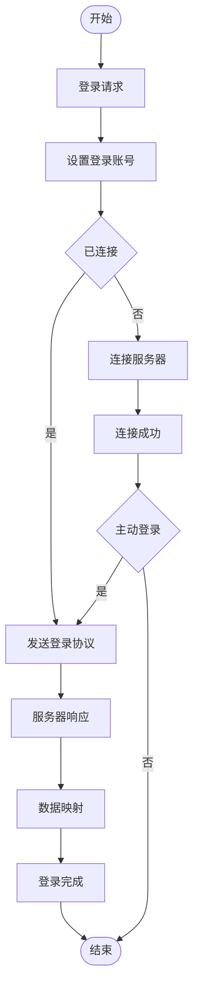
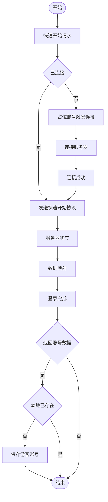
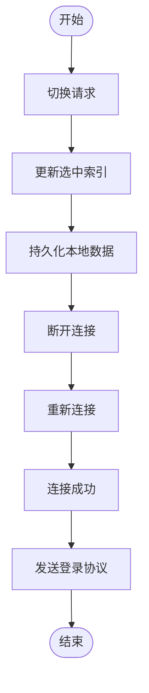

# 认证系统（Authentication）

**认证**（Authentication）是客户端登录流程、游客快速开始与账号切换的业务逻辑系统。Presentation 层通过 `Authentication` 静态方法发起操作，`Authentication` 通过 `DataManager.after` 事件驱动流程。在 `Gate.Entrance` 中调用 **Init** 完成初始化。

## 传统登录（Login）

### 流程

### 名词解释

**登录请求**（Login）是 Presentation 层调用的登录入口方法，设置 **_pendingLogin** 标志并写入 `DataManager.LoginAccount`。

**设置登录账号**（OnAfterLoginAccountChanged）是监听 **LoginAccount** 变更的事件处理器，根据连接状态决定连接服务器还是直接发送登录协议。

**主动登录**（OnAfterOnlineChanged）是监听连接状态变更的事件处理器，仅在 **_pendingLogin** 为 true 时发送登录协议，区分用户主动登录与自动重连。

**_pendingLogin** 是区分用户主动操作与 NetManager 自动重连的标志，由 Login / QuickStart / SwitchAccount 设置为 true，收到 LoginResponse 后重置。

**数据映射**（Protocol.LoginResponse.Processed）是将服务器响应写入 DataManager 的协议处理方法，不含业务逻辑。

**登录完成**（OnAfterLoginResponseChanged）是监听 **LoginResponse** 变更的事件处理器，重置 **_pendingLogin** 并处理游客账号持久化。

---

## 游客快速开始（QuickStart）

### 流程

### 名词解释

**快速开始请求**（QuickStart）是游客登录入口方法，若未连接则使用 `__QuickStart__` 占位账号触发连接，连接成功后发送快速开始协议。

**发送快速开始协议**（SendQuickStartRequest）是构造并发送 `QuickStartRequest` 的内部方法，携带 device、version、platform、language 四个字段。

**保存游客账号**（OnAfterLoginResponseChanged）是在收到成功响应后，将 **LoginResponseAccountData** 中的游客账号持久化到本地 `UserData.pb` 的逻辑。同一设备再次 QuickStart 时，服务器返回已有账号而非创建新账号。

**LoginResponseAccountData** 是 Net 层向 Logic 层传递游客账号数据的临时容器，Logic 层消费后置为 null。

---

## 账号切换（SwitchAccount）

### 流程

### 名词解释

**切换请求**（SwitchAccount）是账号切换入口方法，更新 `User.SelectedAccountIndex` 并持久化到本地，然后断开重连以触发登录流程。
