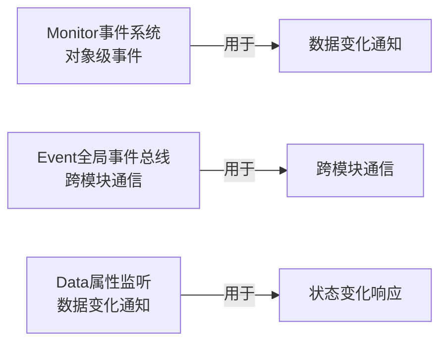

# 事件通信机制

LOA客户端采用事件驱动架构，管理器之间通过事件系统通信。本文档详细说明三种事件通信机制的使用方法和最佳实践。

## 事件系统总览

客户端提供三种事件通信机制：



---

## Monitor 事件系统（对象级事件）

### 概述

**Monitor** 是对象级的事件系统，每个对象可以拥有自己的 Monitor 实例，用于触发和监听事件。

**位置**：`Assets/HotScript/Basic/Monitor.cs`

**特点**：
- 对象级别：事件绑定在特定对象上
- 支持条件触发：可以设置条件决定是否触发
- 轻量高效：直接委托调用

### 核心API

#### Monitor 类定义

```csharp
public class Monitor
{
    public delegate void Function(params object[] args);
    public delegate bool Condtion(params object[] args);
    
    public Dictionary<Enum, Function> function = new Dictionary<Enum, Function>();
    public Dictionary<Enum, Condtion> condition = new Dictionary<Enum, Condtion>();
    
    // 注册事件
    public void Register(Enum key, Function e);
    
    // 取消注册
    public void Unregister(Enum key, Function e);
    
    // 触发事件
    public void Fire(Enum key, params object[] args);
}
```

### 使用示例

#### 1. 创建 Monitor 实例

```csharp
public partial class Data : Singleton<Data>
{
    public Monitor befor = new Monitor();  // 数据变化前事件
    public Monitor after = new Monitor();  // 数据变化后事件
}
```

#### 2. 注册监听

```csharp
// Net 管理器监听 Data 变化
void Awake()
{
    Data.Instance.after.Register(Data.Type.LoginAccount, OnAfterLoginAccountChanged);
    Data.Instance.after.Register(Data.Type.Online, OnAfterOnlineChanged);
}

private void OnAfterLoginAccountChanged(params object[] args)
{
    if (Data.Instance.Online)
        Send(new Login(Data.Instance.SelectedAccount));
}

private void OnAfterOnlineChanged(params object[] args)
{
    bool online = (bool)args[0];
    if (online)
    {
        StartHeartbeat();
    }
    else
    {
        StopHeartbeat();
    }
}
```

#### 3. 触发事件

```csharp
// Data 管理器触发事件
private Account _selectedAccount;
public Account SelectedAccount
{
    get => _selectedAccount;
    set
    {
        // 变化前事件
        befor.Fire(Data.Type.LoginAccount, value);
        
        _selectedAccount = value;
        
        // 变化后事件
        after.Fire(Data.Type.LoginAccount, value);
    }
}
```

#### 4. 取消监听

```csharp
void OnDestroy()
{
    Data.Instance.after.Unregister(Data.Type.LoginAccount, OnAfterLoginAccountChanged);
    Data.Instance.after.Unregister(Data.Type.Online, OnAfterOnlineChanged);
}
```

### 条件触发

Monitor 支持设置条件，只有条件满足时才触发事件：

```csharp
// 注册条件
monitor.condition[Data.Type.X] = (args) => {
    return Data.Instance.IsReady;  // 只有IsReady为true时才触发
};

// 触发事件时会检查条件
monitor.Fire(Data.Type.X, args);  // 如果条件不满足，不会触发
```

---

## Event 全局事件总线

### 概述

**Event** 是全局事件总线，用于跨模块通信。所有模块可以通过 `Game.Basic.Event.Instance` 访问。

**位置**：`Assets/HotScript/Basic/Event.cs`

**特点**：
- 全局单例：整个应用只有一个实例
- 支持动态注册：可以在任何时候注册和移除
- 线程安全：支持在事件回调中注册/移除事件

### 核心API

```csharp
public class Event
{
    private static Event instance;
    public static Event Instance => instance ??= new Event();

    // 注册事件（返回是否成功）
    public bool Add(object key, Action<object[]> handler);
    
    // 移除事件
    public void Remove(object key, Action<object[]> handler);
    
    // 触发事件
    public void Fire(object key, params object[] args);
}
```

### 使用示例

#### 1. 注册监听

```csharp
// Data 管理器监听 UI 点击事件
void Init()
{
    Game.Basic.Event.Instance.Add(UI.Event.Click, OnUIClick);
    Game.Basic.Event.Instance.Add(Start.Event.ServerSelect, OnStartServerSelect);
    Game.Basic.Event.Instance.Add(Game.Initialize.Click.Random, OnInitializeRandomClick);
    Game.Basic.Event.Instance.Add(Game.Initialize.Click.Confirm, OnInitializeConfirmClick);
}

private void OnUIClick(params object[] args)
{
    Audio.Instance.Play(Config.Audio.Click);
}

private void OnStartServerSelect(params object[] args)
{
    Server server = (Server)args[0];
    Data.Instance.SelectedServer = server;
}
```

#### 2. 触发事件

```csharp
// UI 层触发点击事件
button.onClick.AddListener(() => {
    Game.Basic.Event.Instance.Fire(UI.Event.Click);
    Game.Basic.Event.Instance.Fire(Start.Event.ServerSelect, selectedServer);
});
```

#### 3. 移除监听

```csharp
void OnDestroy()
{
    Game.Basic.Event.Instance.Remove(UI.Event.Click, OnUIClick);
    Game.Basic.Event.Instance.Remove(Start.Event.ServerSelect, OnStartServerSelect);
}
```

### 事件Key定义

建议使用枚举或静态类定义事件Key：

```csharp
// 使用枚举
public enum UIEvent
{
    Click,
    Close,
    Open
}

// 使用静态类
public static class GameEvent
{
    public static readonly string Initialize = "Game.Initialize";
    public static readonly string Login = "Game.Login";
}
```

---

## Data 属性监听

### 概述

**Data 属性监听**是基于 Monitor 的特殊应用，专门用于监听 Data 管理器的属性变化。

**特点**：
- `befor`：属性变化前触发，可以拦截修改
- `after`：属性变化后触发，用于响应变化
- 类型安全：使用枚举定义属性类型

### Data.Type 定义

```csharp
public partial class Data : Singleton<Data>
{
    public enum Type
    {
        Ping,
        LoginAccount,
        Online,
        LoginResponse,
        LoginResponseMessage,
        Initialize,
        InitialResponse,
        InitialResponseMessage,
        Home,
        SceneScale,
        // ...更多属性类型
    }
    
    public Monitor befor = new Monitor();
    public Monitor after = new Monitor();
}
```

### 使用示例

#### 1. 监听属性变化（after）

```csharp
// Net 管理器监听 Online 状态变化
void Awake()
{
    Data.Instance.after.Register(Data.Type.Online, OnAfterOnlineChanged);
}

private void OnAfterOnlineChanged(params object[] args)
{
    bool online = (bool)args[0];
    if (online)
    {
        Debug.Log("[Net] Connected to server");
        StartHeartbeat();
    }
    else
    {
        Debug.Log("[Net] Disconnected from server");
        StopHeartbeat();
    }
}
```

#### 2. 拦截属性变化（befor）

```csharp
// 在属性变化前拦截，可以取消修改
void Awake()
{
    Data.Instance.befor.Register(Data.Type.SocketMissedHeartbeats, OnBeforeMissedHeartbeatsChanged);
}

private void OnBeforeMissedHeartbeatsChanged(params object[] args)
{
    int missedCount = (int)args[0];
    if (missedCount >= Config.Net.MaxMissedHeartbeats)
    {
        Debug.LogWarning($"[Net] Missed {missedCount} heartbeats, disconnecting...");
        Disconnect();
    }
}
```

#### 3. 触发属性监听

```csharp
// Data 管理器中触发属性监听
private bool _online;
public bool Online
{
    get => _online;
    set
    {
        if (_online == value) return;  // 值未变化，不触发
        
        befor.Fire(Type.Online, value);  // 变化前事件
        _online = value;
        after.Fire(Type.Online, value);  // 变化后事件
    }
}
```

---

## 三种机制对比

| 特性 | Monitor | Event | Data监听 |
|------|---------|-------|---------|
| **作用域** | 对象级 | 全局 | Data对象级 |
| **用途** | 对象间通信 | 跨模块通信 | 数据变化响应 |
| **Key类型** | Enum | object | Data.Type枚举 |
| **条件触发** | ✅ 支持 | ❌ 不支持 | ✅ 支持 |
| **拦截变化** | ✅ 支持（befor） | ❌ 不支持 | ✅ 支持（befor） |
| **典型场景** | 管理器间通信 | UI事件传递 | 游戏状态响应 |

---

## 使用场景

### 场景一：管理器响应数据变化

**需求**：Net 管理器需要在玩家登录后自动发送登录协议

**方案**：使用 Data 属性监听

```csharp
// Net.cs
void Awake()
{
    Data.Instance.after.Register(Data.Type.LoginAccount, OnAfterLoginAccountChanged);
    Data.Instance.after.Register(Data.Type.Online, OnAfterOnlineChanged);
}

private void OnAfterLoginAccountChanged(params object[] args)
{
    if (Data.Instance.Online)
        Send(new Login(Data.Instance.SelectedAccount));
}
```

### 场景二：跨模块UI事件

**需求**：UI 点击按钮后播放音效

**方案**：使用 Event 全局事件总线

```csharp
// UI层
button.onClick.AddListener(() => {
    Game.Basic.Event.Instance.Fire(UI.Event.Click);
});

// Data层
Game.Basic.Event.Instance.Add(UI.Event.Click, (args) => {
    Audio.Instance.Play(Config.Audio.Click);
});
```

### 场景三：拦截非法操作

**需求**：防止网络断开时发送协议

**方案**：使用 Monitor 条件触发

```csharp
// Net.cs
void Init()
{
    // 设置发送协议的条件：必须在线
    monitor.condition[NetEvent.Send] = (args) => {
        return Data.Instance.Online;
    };
}

public void Send(Protocol protocol)
{
    monitor.Fire(NetEvent.Send, protocol);  // 只有Online为true时才会触发
}
```

---

## 最佳实践

### 1. 事件Key命名规范

```csharp
// 推荐：使用枚举定义事件Key
public enum UIEvent
{
    Click,          // UI.Event.Click
    Close,          // UI.Event.Close
    Open            // UI.Event.Open
}

// 推荐：使用命名空间区分模块
public static class GameEvent
{
    public const string Initialize = "Game.Initialize";
    public const string Login = "Game.Login";
}

// 不推荐：使用字符串字面量
Game.Basic.Event.Instance.Fire("click");  // ❌ 容易拼写错误
```

### 2. 在 Awake 中注册，OnDestroy 中移除

```csharp
void Awake()
{
    // 注册监听
    Data.Instance.after.Register(Data.Type.Online, OnAfterOnlineChanged);
    Game.Basic.Event.Instance.Add(UI.Event.Click, OnUIClick);
}

void OnDestroy()
{
    // 移除监听，避免内存泄漏
    Data.Instance.after.Unregister(Data.Type.Online, OnAfterOnlineChanged);
    Game.Basic.Event.Instance.Remove(UI.Event.Click, OnUIClick);
}
```

### 3. 参数类型检查

```csharp
private void OnAfterOnlineChanged(params object[] args)
{
    // 参数类型检查，避免运行时错误
    if (args.Length > 0 && args[0] is bool online)
    {
        if (online)
        {
            StartHeartbeat();
        }
    }
}
```

### 4. 避免在事件回调中触发大量事件

```csharp
// ❌ 不推荐：可能导致事件风暴
private void OnDataChanged(params object[] args)
{
    for (int i = 0; i < 100; i++)
    {
        Game.Basic.Event.Instance.Fire(SomeEvent, i);  // 触发100次事件
    }
}

// ✅ 推荐：批量处理后触发一次
private void OnDataChanged(params object[] args)
{
    var results = ProcessBatch();
    Game.Basic.Event.Instance.Fire(SomeEvent, results);  // 触发一次
}
```

### 5. 使用 befor 事件拦截非法操作

```csharp
// 在数据变化前检查合法性
Data.Instance.befor.Register(Data.Type.Gold, (args) => {
    int newGold = (int)args[0];
    if (newGold < 0)
    {
        Debug.LogError("[Data] Gold cannot be negative!");
        // 可以通过返回false或抛出异常来阻止修改
    }
});
```

---

## 性能优化

### 1. 减少事件监听数量

```csharp
// ❌ 不推荐：监听过多事件
for (int i = 0; i < 100; i++)
{
    Game.Basic.Event.Instance.Add($"Event{i}", handler);
}

// ✅ 推荐：合并事件
Game.Basic.Event.Instance.Add("BatchEvent", (args) => {
    int eventId = (int)args[0];
    HandleEvent(eventId);
});
```

### 2. 及时移除不用的监听

```csharp
// 在对象销毁或功能禁用时移除监听
void OnDisable()
{
    Game.Basic.Event.Instance.Remove(UI.Event.Click, OnUIClick);
}

void OnEnable()
{
    Game.Basic.Event.Instance.Add(UI.Event.Click, OnUIClick);
}
```

### 3. 避免在事件回调中执行耗时操作

```csharp
// ❌ 不推荐：直接执行耗时操作
private void OnDataChanged(params object[] args)
{
    LoadLargeFile();  // 耗时操作
}

// ✅ 推荐：使用协程或异步
private void OnDataChanged(params object[] args)
{
    StartCoroutine(LoadLargeFileAsync());
}
```

---

## 调试技巧

### 1. 打印事件触发日志

```csharp
// Monitor 触发时打印日志
public void Fire(Enum key, params object[] args)
{
    Debug.Log($"[Monitor] Firing event: {key}");
    // ...原有逻辑
}

// Event 触发时打印日志
public void Fire(object key, params object[] args)
{
    Debug.Log($"[Event] Firing event: {key}");
    // ...原有逻辑
}
```

### 2. 统计事件监听数量

```csharp
// 查看某个事件有多少监听者
int listenerCount = monitor.function[Data.Type.Online]?.GetInvocationList().Length ?? 0;
Debug.Log($"[Monitor] {Data.Type.Online} has {listenerCount} listeners");
```

### 3. 检测事件循环

```csharp
// 添加递归深度检查
private int eventDepth = 0;
private const int MaxEventDepth = 10;

public void Fire(Enum key, params object[] args)
{
    eventDepth++;
    if (eventDepth > MaxEventDepth)
    {
        Debug.LogError($"[Monitor] Event recursion detected! Key: {key}");
        eventDepth--;
        return;
    }
    
    // ...触发事件
    
    eventDepth--;
}
```

---

## 总结

LOA客户端提供三种事件通信机制：

1. **Monitor**：对象级事件，用于管理器间通信，支持条件触发
2. **Event**：全局事件总线，用于跨模块通信，灵活易用
3. **Data监听**：专门用于监听数据变化，支持拦截修改

**选择建议**：
- 管理器响应数据变化 → 使用 Data 监听
- 跨模块UI事件 → 使用 Event 全局事件总线
- 需要条件触发或拦截 → 使用 Monitor

遵循最佳实践，合理使用事件系统，可以构建解耦、灵活、易维护的客户端架构。
