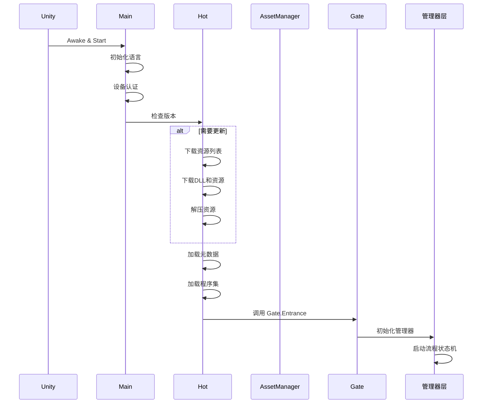
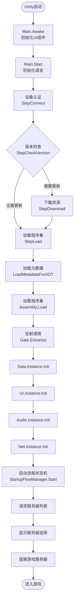

# 启动流程详解

LOA客户端从Unity启动到进入游戏，经历了完整的热更新流程。本文档详细说明整个启动过程。

## 启动流程总览



---

## 阶段一：Unity 启动（Main.cs）

### Main.Awake

**位置**：`Assets/Launcher/Main.cs`

```csharp
void Awake()
{
    Screen.sleepTimeout = SleepTimeout.NeverSleep;
    _footer = transform.Find("Footer").GetComponent<Text>();
    _description = transform.Find("Description").GetComponent<Text>();
    _progressFill = transform.Find("Progress/Fill").GetComponent<Image>();
    
    PlayerPrefs.SetString("APP_VERSION", config.appVersion);
    PlayerPrefs.Save();
}
```

**职责**：
- 设置屏幕常亮
- 获取UI组件引用
- 保存应用版本号

### Main.Start

```csharp
void Start()
{
    string language = LanguageDetector.DetermineLanguage();
    InitLanguage(language);
    _footer.text = _lang.Get("footer", config.appVersion, Device.Split('-').Last());
    
    LanguageDetector.DetectFromServer(config.Gateway, serverLanguage =>
    {
        StepConnect();
    });
}
```

**职责**：
1. 检测系统语言
2. 初始化本地化系统
3. 从服务器获取语言配置
4. 进入连接阶段

---

## 阶段二：设备认证（StepConnect）

### 设备认证流程

```csharp
void StepConnect()
{
    SetDescription(_lang.Get("connecting_auth"));
    Http.Instance.AcceptLanguage = _lang.StandardLanguageCode;
    Http.Instance.RequestPost($"{BaseUrl}/api/authentication/device", 
        $"{{\"deviceId\":\"{Device}\",\"platform\":\"{Application.platform}\"}}",
        (success, response) =>
        {
            if (success)
            {
                Hot.Instance.Init(BaseUrl, config.hotVersion);
                Hot.Instance.OnStatusChanged = SetDescription;
                StepCheckVersion();
            }
            else
            {
                Debug.LogError($"[Main] Device auth failed: {response}");
                SetDescription(_lang.Get("auth_failed", ...));
            }
        });
}
```

**职责**：
1. 发送设备ID和平台信息到认证服务器
2. 认证成功后初始化热更新管理器
3. 进入版本检查阶段

**设备ID生成**：
```csharp
string Device
{
    get
    {
        if (!PlayerPrefs.HasKey("DEVICE"))
        {
            PlayerPrefs.SetString("DEVICE", Guid.NewGuid().ToString());
            PlayerPrefs.Save();
        }
        return PlayerPrefs.GetString("DEVICE");
    }
}
```

---

## 阶段三：版本检查（StepCheckVersion）

### 版本检查流程

```csharp
void StepCheckVersion()
{
    SetDescription(_lang.Get("checking_version"));
    Hot.Instance.Begin((needUpdate, error, texts) =>
    {
        if (!string.IsNullOrEmpty(error))
        {
            SetDescription(_lang.Get(error));
            return;
        }

        if (needUpdate)
        {
            StepDownload();  // 需要更新，进入下载阶段
        }
        else
        {
            StepLoad();  // 无需更新，直接加载
        }
    });
}
```

### Hot.Begin 实现

**位置**：`Assets/Framework/Hot.cs`

```csharp
public void Begin(Action<bool, string, Dictionary<string, string>> callback)
{
    string versionUrl = $"{Url}/api/hot/version";
    Http.Instance.RequestGet(versionUrl, (success, content) =>
    {
        if (!success)
        {
            callback(false, "network_error", null);
            return;
        }

        try
        {
            var data = JsonUtility.FromJson<VersionResponse>(content);
            
            // 保存服务器版本
            PlayerPrefs.SetString("HOT_VERSION", data.version);
            PlayerPrefs.Save();
            
            // 对比本地版本
            callback(LocalVersion != data.version, null, texts);
        }
        catch (System.Exception ex)
        {
            Debug.LogError($"[Hot] Failed to parse version response: {ex.Message}");
            callback(false, "parse_error", null);
        }
    });
}
```

**职责**：
1. 请求服务器版本号
2. 对比本地版本和服务器版本
3. 返回是否需要更新

---

## 阶段四：资源下载（StepDownload）

### 下载流程

```csharp
void StepDownload()
{
    Hot.Instance.Download((success, error, progress) =>
    {
        if (progress != null)
        {
            Progress(progress.downloaded, progress.total);
        }
        else if (success)
        {
            StepLoad();  // 下载完成，进入加载阶段
        }
        else
        {
            SetDescription(_lang.Get(error));
        }
    });
}
```

### Hot.Download 实现

**职责**：
1. 下载资源列表（res.txt）
2. 对比本地和服务器资源
3. 下载缺失或不匹配的资源
4. 解压资源到本地目录

**下载内容**：
- `game.dll.bytes`：热更新程序集
- `game.dll.pdb.bytes`：调试信息（可选）
- 其他资源文件（AssetBundle等）

---

## 阶段五：程序集加载（StepLoad）

### 加载流程

```csharp
void StepLoad()
{
    SetDescription(_lang.Get("loading_game"));
    Hot.Instance.Load(config.Gateway, (success, error) =>
    {
        if (!success)
        {
            SetDescription(_lang.Get(error));
            return;
        }
        
        SetDescription(_lang.Get("initializing_game"));
        gameObject.SetActive(false);  // 隐藏启动界面
    });
}
```

### Hot.Load 实现

**步骤**：

#### 1. 加载元数据（Metadata）

```csharp
// 补充元数据，支持HybridCLR泛型和反射
LoadMetadataForAOTAssembly("mscorlib.dll");
LoadMetadataForAOTAssembly("System.dll");
LoadMetadataForAOTAssembly("System.Core.dll");
// ...其他元数据DLL
```

#### 2. 加载热更新程序集

```csharp
// 加载 game.dll.bytes
byte[] dllBytes = File.ReadAllBytes(Path.Combine(Application.persistentDataPath, "game.dll.bytes"));
var assembly = System.Reflection.Assembly.Load(dllBytes);
```

#### 3. 反射调用 Gate.Entrance

```csharp
// 获取 Gate 类型
var gateType = assembly.GetType("Game.Gate");
var entranceMethod = gateType.GetMethod("Entrance", 
    System.Reflection.BindingFlags.Public | System.Reflection.BindingFlags.Static);

// 调用 Gate.Entrance，传入网关地址
entranceMethod.Invoke(null, new object[] { gateway });
```

---

## 阶段六：热更新入口（Gate.Entrance）

### Gate.Entrance 实现

**位置**：`Assets/Game/Scripts/Basic/Gate.cs`（热更新代码）

```csharp
public static void Entrance(string gateway)
{
    Data.Instance.Gateway = gateway;
    
    // 设置语言
    string languageStr = UnityEngine.PlayerPrefs.GetString("LANGUAGE", "ChineseSimplified");
    if (Enum.TryParse(languageStr, out Data.Languages language))
    {
        Data.Instance.Language = language;
    }
    
    // 初始化管理器
    Data.Instance.Init();      // 1. 数据管理器
    UI.Instance.Init(9f, 16f); // 2. UI管理器
    Audio.Instance.Init();     // 3. 音频管理器
    Net.Instance.Init();       // 4. 网络管理器
    
    // 启动流程状态机
    StartupFlowManager.Start();
}
```

**职责**：
1. 设置网关地址和语言
2. 按顺序初始化所有管理器
3. 启动游戏流程状态机

---

## 阶段七：启动流程状态机（StartupFlowManager）

### 流程状态机实现

**位置**：`Assets/Game/Scripts/Basic/Gate.cs`

```csharp
public static class StartupFlowManager
{
    private static Flow<StartStep> flow = new();
    
    public static void Start()
    {
        RegisterSteps();
        flow.Start(StartStep.RequestGateway);
    }

    private static void RegisterSteps()
    {
        flow.Register(StartStep.RequestGateway, OnRequestGateway);
        // 注册其他启动步骤...
    }

    private static void OnRequestGateway()
    {
        string gatewayUrl = $"http://{Data.Instance.Gateway}:8880";
        Http.Instance.AcceptLanguage = Data.Instance.Language.ToString();
        string url = $"{gatewayUrl}/api/authentication/ips";
        
        UI.Instance.Open(Config.UI.Dark, Localization.Instance.Get("loading"));
        Http.Instance.RequestGet(url, OnGatewayResponse);
    }
}
```

**职责**：
1. 请求服务器列表
2. 显示服务器选择界面
3. 连接游戏服务器
4. 进入游戏主界面

---

## 完整流程图



---

## 关键时间节点

| 阶段 | 时间点 | 说明 |
|------|--------|------|
| Unity启动 | T0 | Main.Awake 执行 |
| 语言初始化 | T0 + 100ms | 加载本地化文件 |
| 设备认证 | T0 + 500ms | HTTP请求认证服务器 |
| 版本检查 | T0 + 1s | 获取服务器版本号 |
| 资源下载 | T0 + 2s（可选） | 下载DLL和资源 |
| 程序集加载 | T0 + 3s | 加载game.dll.bytes |
| 管理器初始化 | T0 + 4s | 初始化所有管理器 |
| 进入游戏 | T0 + 5s | 显示主界面 |

**注**：具体时间取决于网络状况和设备性能。

---

## 错误处理

### 认证失败

**原因**：
- 网络连接失败
- 认证服务器不可用
- 设备被封禁

**处理**：
- 显示错误提示
- 提供重试按钮

### 版本检查失败

**原因**：
- 网络连接失败
- 版本接口异常
- 解析JSON失败

**处理**：
- 显示错误提示
- 提供重试按钮

### 下载失败

**原因**：
- 网络连接中断
- 资源服务器不可用
- 磁盘空间不足

**处理**：
- 显示错误提示
- 支持断点续传
- 提供重试按钮

### 程序集加载失败

**原因**：
- DLL文件损坏
- 元数据缺失
- HybridCLR配置错误

**处理**：
- 显示错误提示
- 建议清除缓存重新下载
- 记录详细错误日志

---

## 调试技巧

### 1. 跳过热更新

在开发阶段，可以跳过热更新直接进入游戏：

```csharp
// Main.cs 中添加
#if UNITY_EDITOR
    Hot.Instance.LoadLocal();  // 直接加载本地DLL
#else
    StepCheckVersion();
#endif
```

### 2. 查看启动日志

启动过程中的关键日志：

```
[Main] Awake: Screen.sleepTimeout set to NeverSleep
[Main] Start: Language detected: ChineseSimplified
[Main] StepConnect: Authenticating device...
[Hot] Begin: Checking version...
[Hot] Download: Downloading resources...
[Hot] Load: Loading assembly...
[Gate] Entrance: Initializing managers...
```

### 3. 模拟慢速网络

```csharp
// 添加延迟模拟慢速网络
yield return new WaitForSeconds(2f);
```

---

## 优化建议

### 1. 并行下载

当前是串行下载资源，可以改为并行下载提升速度：

```csharp
// 使用协程并行下载多个文件
for (int i = 0; i < downloadList.Count; i += 5)
{
    var batch = downloadList.Skip(i).Take(5);
    yield return DownloadBatch(batch);
}
```

### 2. 压缩传输

对DLL和资源进行压缩，减少下载时间：

```csharp
// 使用gzip压缩
byte[] compressedData = GZip.Compress(dllBytes);
```

### 3. CDN加速

将热更新资源部署到CDN，提升全球访问速度。

---

## 总结

LOA客户端的启动流程分为7个阶段：

1. **Unity启动**：初始化UI和语言
2. **设备认证**：验证设备合法性
3. **版本检查**：对比本地和服务器版本
4. **资源下载**：下载DLL和资源（按需）
5. **程序集加载**：加载热更新代码
6. **热更新入口**：初始化管理器
7. **启动流程**：进入游戏

整个流程通过 **Main.cs → Hot.cs → Gate.cs → 管理器层** 完成从Unity启动到进入游戏的完整过渡。
