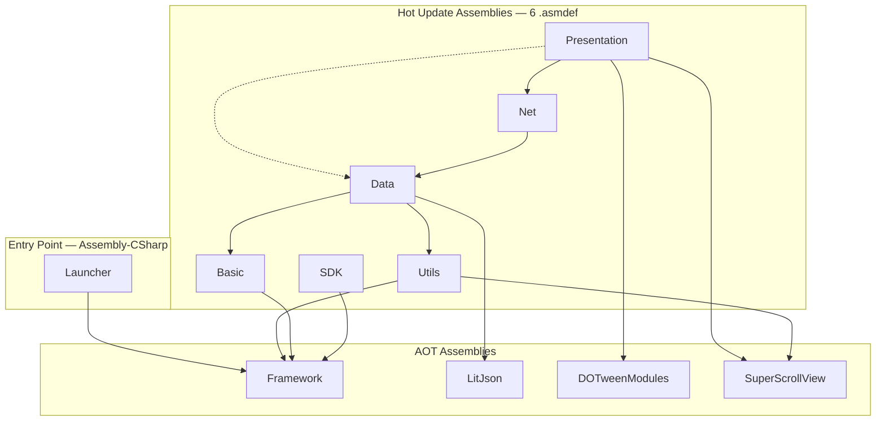
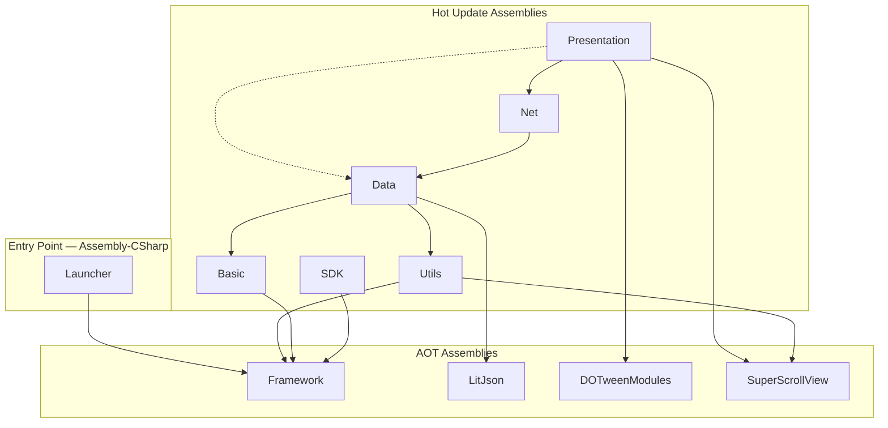
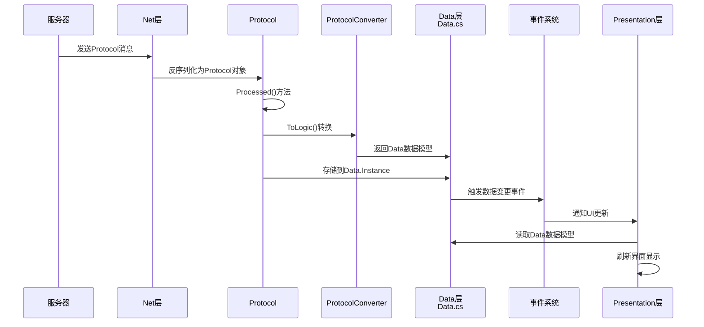
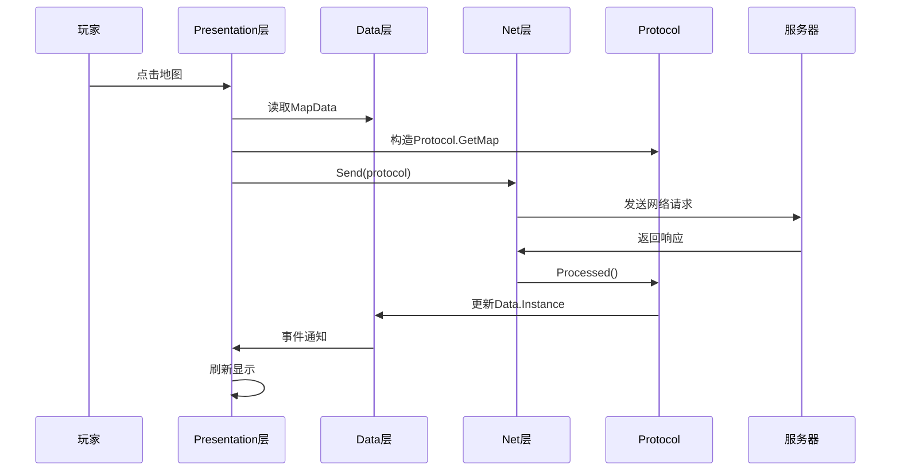
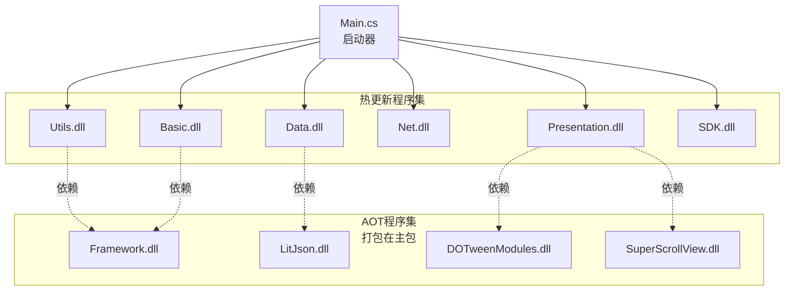
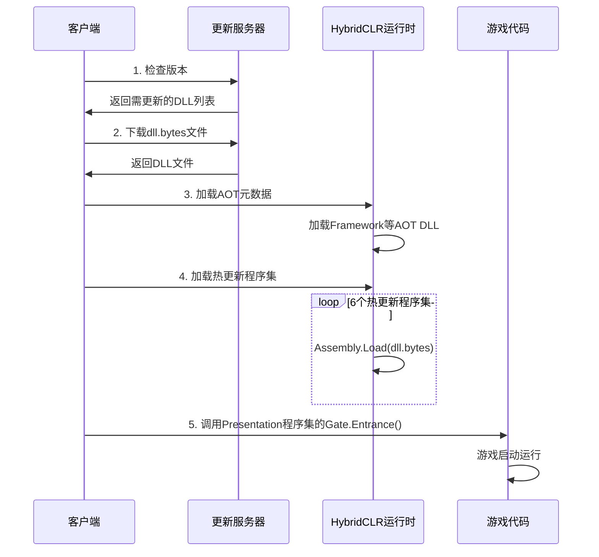

# 客户端分层架构




项目共 **11 个程序集**，按更新机制分为三类：

- **Entry Point（1 个）**：`Launcher/` 无独立 `.asmdef`，编译进 Unity 默认的 `Assembly-CSharp`。依赖 Framework 完成设备认证、热更新检查、程序集加载，最终反射调用 `Game.Presentation.Gate.Entrance()` 启动游戏。无任何程序集反向引用 Launcher。
- **Hot Update（6 个）**：每层一个 `.asmdef`，支持运行时增量更新。依赖方向从高层流向低层，反向通信使用事件机制。
- **AOT（4 个）**：编译进安装包。`Framework` 被全部 6 个热更新程序集引用，提供 `Singleton<T>`、`AssetManager`、`Http`、`Hot`、`Localization` 等基础服务；3 个第三方库因体积大且稳定，不纳入热更新。

> **Launcher 与 Framework 为何分离？** Framework 是**库**——被 7 个热更新程序集通过 `.asmdef` 显式引用，必须有独立程序集名称。Launcher 是**入口点**——无人引用它，留在 `Assembly-CSharp` 即可。二者依赖方向相反，职责不同，不应合并。

<pre style="page-break-inside: avoid;">
Assets/
├── <b>Framework/</b>
├── HotScript/
│   ├── Utils/
│   ├── Basic/
│   ├── Data/
│   ├── Net/
│   ├── Presentation/
│   ├── SDK/
│   └── <b>HybridCLRGenerate/</b>
├── HotBundle/
│   ├── Audio/
│   ├── Prefabs/
│   └── RawAssets/
├── <b>ThirdParty/</b>
├── <span style="color:#E5C07B">Editor/</span>
│   ├── Build/
│   ├── Proto/
│   ├── SVN/
│   ├── Tool/
│   ├── PlayerPrefs/
│   ├── ExcelToLua/
│   ├── CopyPath/
│   └── AutoAppend/
├── <b><span style="color:#E5C07B">Resources/</span></b>
├── <b><span style="color:#E06C75">Plugins/</span></b>
│   ├── Android/
│   └── libs/
├── <b><span style="color:#E06C75">StreamingAssets/</span></b>
</pre>

**加粗** AOT（编译进安装包，更新需重新提交商店）
<span style="color:#E06C75">**■**</span> Unity 强制目录（名称与路径均不可更改）
<span style="color:#E5C07B">**■**</span> Unity 强制名称（位置可更改）

| 目录 | 更新机制 | 职责 |
|------|----------|------|
| `Launcher/` | AOT | 应用入口（主场景、启动配置），详见[第九章](#九热更新机制hybridclr) |
| `Framework/` | AOT | 基础框架（资源管理、网络、热更新引擎、本地化、语言检测） |
| `HotScript/` | 热更新 | 游戏代码（6 个热更新程序集 + ThirdParty），详见[第二章](#二各层详细说明) |
| `HotBundle/` | 热更新 | 游戏资源（Prefabs、Audio、RawAssets），构建为 AssetBundle 后通过热更新分发 |
| `Editor/` | 编辑器 | 编辑器工具（构建、协议生成、SVN 等） |
| `Resources/` | AOT | Unity Resources（登录前多语言 JSON、IAP 配置） |
| `Plugins/` | AOT | 原生插件（Android SDK、第三方 .dll） |
| `StreamingAssets/` | AOT | 流式资源（AOT 补充元数据 DLL） |

### 1.2 AOT区补充说明

以下目录编译进安装包，更新需重新提交应用商店。Launcher 和 Framework 的详细文件清单见[第九章](#九热更新机制hybridclr)。

**Resources**（`Assets/Resources/`）

Unity 特殊目录，通过 `Resources.Load()` 加载。仅存放登录前需要的静态数据：`Localization_{Language}.json`（23 种语言）、IAP 配置。

**Plugins**（`Assets/Plugins/`）

原生平台插件和预编译 DLL。

| 子目录 | 内容 |
|--------|------|
| `Android/` | Android 平台原生插件 |
| `libs/` | 预编译 DLL |

**StreamingAssets**（`Assets/StreamingAssets/`）

AOT 补充元数据 DLL（`Framework.dll.bytes` 等），用于 HybridCLR 运行时元数据注册。

### 1.3 热更新资源（HotResources）

**路径：** `Assets/HotBundle/`

游戏资源的唯一存放目录。构建时由 `Build.SetBundleName()` 扫描并打包为 AssetBundle，运行时由 `AssetManager` 从热更新路径加载。

| 子目录 | 内容 |
|--------|------|
| `Audio/` | BGM、SFX 音频 |
| `Prefabs/` | UI Prefab、特效 Prefab |
| `RawAssets/` | 贴图、材质等原始资源 |

### 1.4 编辑器工具（Editor）

**路径：** `Assets/Editor/`

编辑器扩展工具，不编译进运行时包。

| 子目录 | 职责 |
|--------|------|
| `Build/` | 构建脚本（Build.cs） |
| `Proto/` | Protocol 代码生成工具 |
| `SVN/` | SVN 集成工具 |
| `Tool/` | 通用编辑器工具 |
| `PlayerPrefs/` | PlayerPrefs 编辑器 |
| `ExcelToLua/` | 策划表导出 |
| `CopyPath/` | 路径复制工具 |
| `AutoAppend/` | 自动追加工具 |

### 1.5 新增文件归属规则

新增文件或文件夹时，按以下规则判断归属：

| 问题 | 归属 |
|------|------|
| 是否为热更新游戏代码？ | `HotScript/{对应层}/` |
| 是否为可热更新的资源（Prefab/音频/贴图）？ | `HotBundle/` |
| 是否为编辑器工具？ | `Editor/` |
| 是否为登录前需要的静态数据？ | `Resources/` |
| 是否为原生平台插件？ | `Plugins/` |
| 是否为启动流程代码？ | `Launcher/`（极少修改） |
| 是否为框架基础设施？ | `Framework/`（极少修改） |

**禁止：**
- 在 `Assets/` 根目录下新建顶层文件夹（除非有架构级别的理由）
- 将游戏代码放在 `HotScript/` 以外的位置
- 将运行时资源放在 `Editor/` 下

---

## 二、各层详细说明

### 2.1 Utils层（工具层）

**位置：** `Assets/HotScript/Utils/`  
**程序集：** `Utils.asmdef`  
**命名空间：** `Game.Utils`

**职责：**
- 提供通用工具类
- 不依赖任何业务逻辑
- 可被所有上层使用

**依赖：**
- Framework（框架层）
- SuperScrollView（第三方UI组件）

**关键类：**
- `Utils.cs` - 日志、调试工具
- `InfiniWheel.cs` - UI滚轮组件

---

### 2.2 Basic层（基础设施层）

**位置：** `Assets/HotScript/Basic/`  
**程序集：** `Basic.asmdef`  
**命名空间：** `Game.Basic`

**职责：**
- 事件系统（Event.cs, Monitor.cs）
- 流程管理（Flow.cs）

**依赖：**
- Framework

**关键机制：**
```csharp
// 全局事件总线
Event.Instance.Fire("EventName", data);
Event.Instance.Add("EventName", callback);

// 属性监听（数据变更通知）
Data.Instance.after.Register(Data.Type.Home, OnHomeChanged);
```

**跨层通信：**
- 低层→高层：使用事件机制（Event/Monitor）
- 避免直接向上引用

---

### 2.3 Data层（数据层）

**位置：** `Assets/HotScript/Data/`  
**程序集：** `Data.asmdef`  
**命名空间：** `Game.Data`

**职责：**
- 管理业务数据状态（Data.cs - 单例）
- 定义Data数据模型（与Protocol解耦）
- 数据持久化（PBLocal.cs）

**依赖：**
- Utils
- Basic
- Framework
- LitJson

**关键数据模型：** `Data/Models/GameData.cs`
```csharp
namespace Game.Data
{
    public class MapData              // 地图块数据
    public class SceneData            // 场景数据
    public class HomeData             // 主页数据
    public class CharacterData        // 角色数据
    public class InitializeData       // 初始化数据
    public class OptionData           // 选项面板数据
    public class OptionItemData       // 选项项数据
    public class WorldMapData         // 世界地图数据
    public class UILockData           // UI锁定数据
    public class TutorialData         // 教程数据
    public class DialogueData         // 对话数据
    public class InformationData      // 消息数据
}
```

**字段命名规则：**
- **使用camelCase**（与Protocol保持一致）
- 示例：`pos`, `name`, `scene`, `characters`

**核心类：** `Data.cs`
```csharp
namespace Game.Data
{
    public class Data : Singleton<Data>
    {
        // 数据访问
        public HomeData Home { get; set; }
        public InitializeData Initialize { get; set; }
        public List<MapData> Maps { get; set; }
        public List<CharacterData> Characters { get; set; }
        
        // 数据变更通知
        public Monitor after = new Monitor();
        public void Change(Type type, object value);
    }
}
```

---

### 2.4 Net层（网络通信层）

**位置：** `Assets/HotScript/Net/`  
**程序集：** `Net.asmdef`  
**命名空间：** `Game.Net`

**职责：**
- 网络通信（Net.cs）
- **Protocol协议定义**（Protocol/Protocol.cs）
- Protocol→Data转换（ProtocolConverter.cs）

**依赖：**
- Data
- Basic
- Framework
- Utils

**内部命名空间：Protocol**
- **位置：** `Assets/HotScript/Net/Protocol/`
- **命名空间：** `Game.Net.Protocol`
- Protocol代码编译在Net程序集内部，不作为独立子程序集

**Protocol定义示例：**
```csharp
namespace Game.Net.Protocol
{
    public class Map : Base          // 地图协议
    public class Scene : Base        // 场景协议
    public class Home : Base         // 主页协议
    public class Initialize : Base   // 初始化协议
    public class Option : Base       // 选项协议
    // ... 更多Protocol类
}
```

**转换器：** `ProtocolConverter.cs`
```csharp
namespace Game.Net
{
    public static class ProtocolConverter
    {
        // 扩展方法：Protocol → Data
        public static MapData ToLogic(this Protocol.Map protocol);
        public static HomeData ToLogic(this Protocol.Home protocol);
        // ... 更多转换方法
    }
}
```

**数据流向：**
```
服务器 → Protocol (Net层) → ProtocolConverter → Data数据模型 → 应用使用
```

**核心类：** `Net.cs`
```csharp
namespace Game.Net
{
    public class Net : Singleton<Net>
    {
        // 发送Protocol消息
        public void Send(Protocol.Base message);
        
        // 接收并处理Protocol消息
        private void Decode(Protocol.Base message);
    }
}
```

**Protocol.Processed()方法：**
- 在Net层执行
- 调用ProtocolConverter转换为Data数据
- 更新Data.Instance
- 触发事件通知上层

---

### 2.5 Presentation层（UI表示层）

**位置：** `Assets/HotScript/Presentation/`  
**程序集：** `Presentation.asmdef`  
**命名空间：** `Game.Presentation`

**职责：**
- 所有UI界面和交互
- UI动画
- 用户输入处理
- 热更新代码入口（Gate.Entrance）

**依赖：**
- Data
- Utils
- Basic
- Framework
- Net
- LitJson
- DOTweenModules（UI动画扩展）
- SuperScrollView
- Unity.Addressables
- UnityEngine.Purchasing

**precompiled DLL：**
- DOTween.dll
- Newtonsoft.Json.dll
- Google.Protobuf.dll

**关键UI组件：**
- `Gate.cs` - 热更新入口（管理器初始化 + 启动流程）
- `UI.cs` - UI管理器
- `Home.cs` - 主页界面
- `Start.cs` - 启动界面
- `Initialize.cs` - 初始化界面
- `Option.cs` - 选项面板
- `Tutorial.cs` - 教程系统
- `Story.cs` - 剧情对话

**数据访问规则：**
- ✓ 使用Data数据模型（MapData, HomeData等）
- ✗ 不直接访问Protocol类型（除DataPair, Chat等特殊情况）

---

### 2.6 SDK层

**位置：** `Assets/HotScript/SDK/`  
**程序集：** `SDK.asmdef`  
**命名空间：** `Game.SDK`

**职责：**
- 平台SDK集成
- 设备功能封装（剪贴板、电量等）
- 平台差异化适配（Android / iOS / Windows）

**依赖：**
- Framework

**关键类：**
- `SDKManager.cs` - SDK管理器（单例）
- `BaseSdk.cs` - 平台SDK抽象基类
- `AndroidSdk.cs` / `IOSSdk.cs` / `WindowsSdk.cs` - 各平台实现

---

## 三、关键技术点

### 3.1 数据类型系统

#### Protocol类型（网络层专用）
```csharp
namespace Game.Net.Protocol
{
    public class Home : Base
    {
        public Scene scene;
        public Characters characters;
        public Dictionary<string, Resource> resouse;
        public List<int[]> area;
        // ... Protocol字段（camelCase，Protobuf生成）
    }
}
```

#### Data数据模型（应用层通用）
```csharp
namespace Game.Data
{
    public class HomeData
    {
        public SceneData scene { get; set; }
        public List<CharacterData> characters { get; set; }
        public Dictionary<string, ResourceInfo> resouse { get; set; }
        public List<int[]> area { get; set; }
        // ... Data字段（camelCase，手动定义）
    }
}
```

#### 为什么要分离？
- **解耦**：应用逻辑不依赖网络协议
- **灵活**：Protocol变更不影响应用层
- **清晰**：职责明确，Protocol仅用于序列化/反序列化

### 3.2 跨层通信机制

#### 低层→高层：事件机制
```csharp
// Basic层触发事件
Event.Instance.Fire("UI.Event.Click", buttonData);

// Presentation层监听事件
Event.Instance.Add("UI.Event.Click", OnButtonClick);
```

#### 数据变更通知
```csharp
// Data层触发
Data.Instance.after.Fire(Data.Type.Home, newHomeData);

// Presentation层监听
Data.Instance.after.Register(Data.Type.Home, OnHomeChanged);
```

### 3.3 命名规范

| 类型 | 命名规则 | 示例 |
|------|----------|------|
| Protocol类 | PascalCase类名 | `Protocol.Home`, `Protocol.Map` |
| Protocol字段 | camelCase | `scene`, `characters`, `pos` |
| Data数据模型 | PascalCase类名 + Data后缀 | `HomeData`, `MapData` |
| Data字段 | camelCase | `scene`, `characters`, `pos` |
| UI组件 | PascalCase | `Home`, `Start`, `OptionButton` |

**特殊情况：**
- `OptionItemData` - 数据模型（避免与UI组件`OptionItem`冲突）

---

## 四、程序集依赖配置

### 4.1 依赖关系图

下图仅展示**本质依赖**（去除可通过传递链到达的冗余边）。实线为主链依赖，虚线为跨层依赖。



**图例说明：**
- **实线**：本质依赖（无法通过其他路径传递到达）
- **虚线**：跨层依赖（架构上可通过主链传递到达，但代码中直接使用了该层的类型）
  - `Presentation -.-> Data`：直接访问 `Data.Instance`

**关于 .asmdef 与架构图的区别：**

Unity的程序集定义（.asmdef）**不支持传递依赖**——如果 A 引用 B、B 引用 C，A 并不会自动获得对 C 的访问权。因此 .asmdef 的 `references` 中必须显式声明所有直接使用的程序集，数量多于架构图中的边数。完整的 .asmdef 配置见 [4.2 各层.asmdef配置](#42-各层asmdef配置)。

### 4.2 各层.asmdef配置

#### Utils.asmdef
```json
{
    "name": "Utils",
    "references": ["Framework", "SuperScrollView"]
}
```

#### Basic.asmdef
```json
{
    "name": "Basic",
    "references": ["Framework"]
}
```

#### Data.asmdef
```json
{
    "name": "Data",
    "references": ["Utils", "Basic", "Framework", "LitJson"],
    "precompiledReferences": ["Google.Protobuf.dll", "Newtonsoft.Json.dll"]
}
```

#### Net.asmdef

Protocol代码（`Network/Protocol/Protocol.cs`，命名空间 `Game.Net.Protocol`）编译在Net程序集内部，不作为独立子程序集存在。

```json
{
    "name": "Net",
    "references": ["Data", "Basic", "Framework", "Utils"],
    "precompiledReferences": ["Google.Protobuf.dll", "Newtonsoft.Json.dll"]
}
```

#### Presentation.asmdef
```json
{
    "name": "Presentation",
    "references": [
        "Data", "Utils", "Basic", "Framework", "Net",
        "LitJson", "DOTweenModules", "SuperScrollView",
        "Unity.Addressables", "UnityEngine.Purchasing"
    ],
    "precompiledReferences": [
        "DOTween.dll", "Newtonsoft.Json.dll", "Google.Protobuf.dll"
    ]
}
```

#### SDK.asmdef
```json
{
    "name": "SDK",
    "references": ["Framework"]
}
```

---

## 五、数据流示例

### 5.1 网络消息接收流程



### 5.2 用户操作流程



---

## 六、关键文件索引

### 6.1 架构核心文件

| 文件路径 | 说明 |
|----------|------|
| `Data/Data.cs` | 业务数据管理器（单例） |
| `Data/Models/GameData.cs` | Data数据模型定义 |
| `Network/Net.cs` | 网络通信管理器 |
| `Network/Protocol/Protocol.cs` | Protocol协议定义（约3000行） |
| `Network/ProtocolConverter.cs` | Protocol→Data转换器 |
| `Basic/Event.cs` | 全局事件总线 |
| `Basic/Monitor.cs` | 属性监听器 |
| `UI/UI.cs` | UI管理器 |

### 6.2 程序集定义文件

| asmdef文件 | 层次 |
|------------|------|
| `Utils/Utils.asmdef` | Utils层 |
| `Basic/Basic.asmdef` | Basic层 |
| `Data/Data.asmdef` | Data层 |
| `Network/Net.asmdef` | Net层（含Protocol代码） |
| `UI/Presentation.asmdef` | Presentation层 |

### 6.3 第三方库程序集

| asmdef文件 | 说明 |
|------------|------|
| `ThirdParty/Json/LitJson.asmdef` | LitJson源代码程序集 |
| `ThirdParty/Demigiant/DOTween/Modules/DOTweenModules.asmdef` | DOTween扩展方法 |
| `ThirdParty/SuperScrollView/Scripts/SuperScrollView.asmdef` | 滚动视图组件 |

---

## 七、架构改造历史

### 改造前（v1.0）
- **架构模式**：扁平化管理器协作
- **Protocol位置**：独立层
- **Data层**：直接使用Protocol类型
- **程序集**：无.asmdef，所有代码在默认程序集

### 改造后（v2.0）
- **架构模式**：严格分层架构（对齐服务端）
- **Protocol位置**：归属Net层
- **Data层**：独立数据模型，与Protocol解耦
- **程序集**：每层独立.asmdef，依赖显式声明

### 主要变更（SVN版本149）
1. Protocol从独立层→Net层
2. Data层重构（扁平→分层）
3. 创建11个Data数据模型
4. 创建ProtocolConverter转换器
5. UI层60+文件类型迁移
6. 6个.asmdef配置
7. 3个第三方库程序集

---

## 八、开发规范

### 8.1 添加新Protocol

1. 在`Network/Protocol/Protocol.cs`中定义Protocol类
2. 在`Data/Models/GameData.cs`中定义对应的Data数据模型
3. 在`Network/ProtocolConverter.cs`中添加转换方法
4. 在Protocol的`Processed()`中调用转换器
5. 在`Data/Data.cs`中添加属性和Type枚举

### 8.2 添加新UI界面

1. 继承`UI.Core`基类
2. 在`Game.Presentation`命名空间中
3. 只访问Data数据模型，不直接用Protocol
4. 使用事件机制与低层通信

### 8.3 跨层调用规则

**✓ 允许：**
- 高层→低层：直接调用
- 低层→高层：通过事件机制

**✗ 禁止：**
- 低层直接调用高层
- 跨程序集访问未在references中声明的类型

---

## 九、热更新机制（HybridCLR）

### 9.1 多程序集热更新架构

LOA客户端采用**HybridCLR多程序集热更新**方案，将游戏代码拆分为6个独立的热更新程序集：



### 9.2 程序集分类策略

#### 热更新程序集（支持运行时更新）
| 程序集 | 说明 | 原因 |
|--------|------|------|
| Utils.dll | 工具层 | 业务工具频繁迭代 |
| Basic.dll | 基础设施层 | 事件系统可能优化 |
| Data.dll | 数据层 | 数据模型经常变更 |
| Net.dll | 网络通信层 | 协议处理逻辑更新 |
| Presentation.dll | UI表示层 + 启动入口 | UI最频繁更新 |
| SDK.dll | SDK集成层 | 第三方SDK对接 |

#### AOT程序集（打包在主包，不热更新）
| 程序集 | 说明 | 原因 |
|--------|------|------|
| Framework | 基础框架 | 稳定，很少变更 |
| LitJson | JSON库 | 第三方库，体积大 |
| DOTweenModules | 动画库 | 第三方库，稳定 |
| SuperScrollView | 滚动组件 | 第三方库，稳定 |

**策略原则：**
- 业务代码 → 热更新程序集（灵活更新）
- 第三方库 → AOT程序集（减小热更新包体积）
- 稳定框架 → AOT程序集（减少加载时间）

### 9.3 加载机制

#### Editor模式
```csharp
// Main.cs中的实现
System.Reflection.Assembly[] LoadHotUpdateAssemblies()
{
    string[] hotUpdateAssemblyNames = new string[] 
    {
        "Utils", "Basic", "Data", "Net", 
        "Presentation", "SDK"
    };
    
    var assemblies = new List<System.Reflection.Assembly>();
    foreach (var name in hotUpdateAssemblyNames)
    {
        var assembly = AppDomain.CurrentDomain.GetAssemblies()
            .FirstOrDefault(a => a.GetName().Name == name);
        assemblies.Add(assembly);
    }
    return assemblies.ToArray();
}
```

**特点：**
- 直接从AppDomain获取已编译的程序集
- 无需生成DLL文件
- 快速迭代开发

#### 运行时模式
```csharp
// Main.cs中的实现
string[] hotUpdateDlls = new string[] 
{
    "utils.dll.bytes", "basic.dll.bytes", "data.dll.bytes",
    "net.dll.bytes", "presentation.dll.bytes",
    "sdk.dll.bytes"
};

foreach (var dllFile in hotUpdateDlls)
{
    string dllPath = $"{FrameworkPath.Scripts}/{dllFile}";
    var assembly = System.Reflection.Assembly.Load(
        System.IO.File.ReadAllBytes(dllPath)
    );
}
```

**特点：**
- 从服务器下载的dll.bytes文件加载
- 支持增量更新（只更新变化的DLL）
- HybridCLR运行时解释执行

### 9.4 加载顺序

程序集按**依赖关系从低到高**加载：
```
Utils → Basic → Data → Net → Presentation → SDK
```

**原因：**
- 确保被依赖的程序集先加载
- 避免类型未找到错误
- 提高加载成功率

### 9.5 热更新流程



### 9.6 构建流程

#### 步骤1：HybridCLR编译
```bash
Unity菜单 → HybridCLR → Generate → All
```

**生成内容：**
- 热更新DLL：`HybridCLRData/HotUpdateDlls/{Platform}/`
  - `Utils.dll`
  - `Basic.dll`
  - `Data.dll`
  - `Net.dll`
  - `Presentation.dll`
  - `SDK.dll`

- AOT元数据：`HybridCLRData/AssembliesPostIl2CppStrip/{Platform}/`
  - `Framework.dll`
  - `System.Core.dll`
  - `mscorlib.dll`

#### 步骤2：打包热更新包
```bash
Unity菜单 → Pack → BuildAllHotUpdate
```

**输出目录：** `Artifacts/ALLOUT/HotUpdate/{Platform}/scripts/`

**生成文件：**
```
utils.dll.bytes
basic.dll.bytes
data.dll.bytes
net.dll.bytes
presentation.dll.bytes
sdk.dll.bytes
```

**构建脚本：** `Assets/Editor/Build/Build.cs`
```csharp
// 自动读取HybridCLR配置
foreach (var dll in HybridCLR.Editor.SettingsUtil.HotUpdateAssemblyFilesExcludePreserved)
{
    string dllPath = $"{hotfixDllSrcDir}/{dll}";
    string dllBytesPath = $"{allOutPath}/scripts/{dll.ToLower()}.bytes";
    System.IO.File.Copy(dllPath, dllBytesPath, true);
}
```

### 9.7 HybridCLR配置

**文件：** `ProjectSettings/HybridCLRSettings.asset`

**关键配置：**
```yaml
hotUpdateAssemblyDefinitions:
  - Utils.asmdef
  - Basic.asmdef
  - Data.asmdef
  - Net.asmdef
  - Presentation.asmdef
  - SDK.asmdef

patchAOTAssemblies:
  - Framework
  - System.Core
  - mscorlib
```

**配置方式：**
1. 打开Unity → `HybridCLR` → `Settings`
2. 在`Hot Update Assembly Definitions`中添加6个asmdef文件
3. 保存设置

### 9.8 热更新优势

#### 与单一程序集对比

| 维度 | 单一Game.dll | 多程序集（当前方案） |
|------|-------------|---------------------|
| 更新粒度 | 整体更新 | 按层更新 |
| 更新包大小 | 大（全量） | 小（增量） |
| 架构清晰度 | 低 | 高 |
| 依赖管理 | 混乱 | 显式约束 |
| 编译速度 | 慢 | 快（并行编译） |
| 热更新时间 | 长 | 短 |

#### 实际收益
- **包体缩减：** UI层更新时，无需下载Data/Net等层（约减少60%下载量）
- **灵活性：** 可针对性修复某一层的bug
- **开发效率：** 修改Utils层时，仅重新编译Utils.dll（编译时间从30s→5s）

### 9.9 注意事项

#### ⚠️ 避免的操作
1. **不要在AOT程序集中引用热更新程序集**
   - ❌ Framework引用Utils → 编译错误
   - ✅ Utils引用Framework → 正常

2. **不要在热更新代码中使用未补充的泛型**
   - 需在`AOTGenericReferences.cs`中补充
   - HybridCLR会自动生成常见泛型

3. **不要删除已加载的DLL文件**
   - Assembly.Load后内部已复制
   - 但为安全起见，仍保留文件

#### ✅ 最佳实践
1. **按依赖顺序加载程序集**（当前已实现）
2. **加载前验证文件完整性**（MD5校验）
3. **失败时提供降级策略**（回退到上一版本）
4. **监控加载性能**（记录每个DLL加载时间）

### 9.10 常见问题

**Q1: 为什么不把所有代码放在一个程序集？**
- 多程序集可减小热更新包大小（增量更新）
- 清晰的依赖关系更易维护
- 并行编译提升开发效率

**Q2: 热更新会影响性能吗？**
- HybridCLR采用AOT+解释执行混合模式
- 热路径代码经过优化，性能接近原生
- 实测性能损耗<5%

**Q3: 如何验证热更新是否成功？**
- 查看Console日志：`[Main] Loaded hot update assembly: XXX`
- 检查`HybridCLRData/HotUpdateDlls/`目录下的DLL文件
- 运行游戏，确认功能正常

**Q4: 热更新失败怎么办？**
- 检查HybridCLR配置是否正确
- 执行`HybridCLR → Generate → All`重新生成
- 清理`Library/ScriptAssemblies`后重新编译

---

## 十、架构常见问题

### Q1: Data数据模型和Protocol的区别？
**A:** 
- Protocol：网络传输格式，由Protobuf生成，字段不可控
- Data数据模型：应用内部数据，手动定义，可扩展

### Q2: 为什么字段用camelCase而非C#标准的PascalCase？
**A:** 
- 保持与Protocol字段命名一致
- 减少转换时的命名转换成本
- UI层代码可以平滑过渡

### Q3: UI层什么时候需要Protocol？
**A:**
- 仅在需要发送网络消息时：`Net.Instance.Send(new Game.Net.Protocol.XXX())`
- 或处理特殊Protocol类型（DataPair, Chat等）
- 其他情况都应使用Data数据模型

### Q4: 如何确保依赖不违反分层？
**A:**
- .asmdef的`references`强制约束
- 编译器会报错如果违反依赖规则
- 例如：Data层无法引用Net层（references中没有）

---

## 十一、后续优化建议

### 11.1 待完成功能
- [ ] CodelessIAPButton恢复（添加UnityEngine.Purchasing.Codeless引用）
- [ ] PlayerState功能恢复

### 11.2 架构优化
- [ ] 考虑引入中介者模式减少UI与Data的直接耦合
- [ ] 完善单元测试覆盖

### 11.3 性能优化
- [ ] ProtocolConverter转换器性能测试
- [ ] 大量数据场景下的内存占用分析
- [ ] 事件系统性能评估

---

## 附录：架构对比表

| 维度 | 改造前 | 改造后 |
|------|--------|--------|
| 架构风格 | 扁平化协作 | 严格分层 |
| Protocol位置 | 独立层 | Net层内部命名空间 |
| 数据模型 | 直接用Protocol | 独立Data模型 |
| 程序集数量 | 1个（默认） | 9个（6个热更新+3个AOT） |
| 热更新程序集 | 1个（Game） | 6个（分层独立） |
| 热更新粒度 | 全量更新 | 增量更新 |
| 依赖管理 | 无约束 | .asmdef强约束 |
| 与服务端一致性 | 低 | 高 |
| 可维护性 | 中 | 高 |
| 类型安全 | 中 | 高 |
| 编译速度 | 慢（单体） | 快（并行） |
| 热更新包大小 | 大（全量） | 小（按需） |

---

**文档版本：** 3.1  
**最后更新：** 2026-02-19  
**维护者：** 架构组
