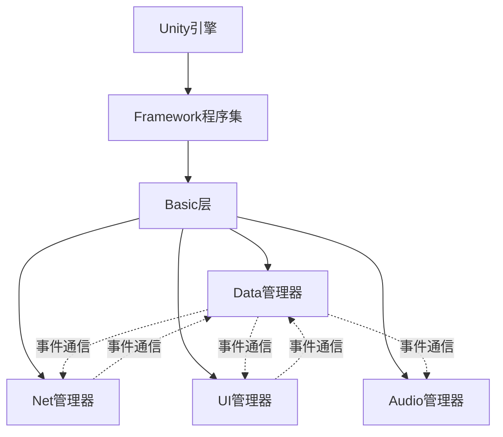

# 管理器协作架构

LOA客户端采用**管理器协作架构**（Manager Collaboration Architecture），这是一种基于Unity MonoBehaviour单例模式的扁平化架构，强调数据驱动和事件驱动。

## 架构模式

### 整体架构图



### 分层说明

#### 1. Framework 程序集（基础设施层）

- **位置**：`Assets/Framework/`
- **程序集**：Framework.asmdef（无外部依赖）
- **核心组件**：
  - `Singleton<T>`：MonoBehaviour 单例基类
  - `AssetManager`：AssetBundle 资源管理
  - `Http`：HTTP 请求封装
  - `Hot`：热更新管理
  - `Localization`：多语言支持
  - `File`、`Path`：文件工具

**设计理念**：Framework 提供与 Unity 相关的基础设施，不包含游戏逻辑，可独立测试和复用。

#### 2. Basic 层（游戏逻辑基础层）

- **位置**：`Assets/HotScript/Basic/`
- **核心组件**：
  - `Gate`：热更新代码入口
  - `Flow<T>`：通用流程状态机
  - `Monitor`：条件事件系统
  - `Event`：全局事件总线

**设计理念**：Basic 层提供游戏逻辑的基础设施，包括事件系统、流程管理和热更新入口。

#### 3. 管理器层（功能管理层）

- **位置**：`Assets/HotScript/Data/`、`Assets/HotScript/Net/`、`Assets/HotScript/Presentation/`
- **核心管理器**：
  - `Data.Instance`：数据管理器
  - `Net.Instance`：网络管理器
  - `UI.Instance`：UI管理器
  - `Audio.Instance`：音频管理器

**设计理念**：管理器之间平等协作，通过事件系统通信，避免直接依赖。

---

## Manager（管理器）定义

### 什么是 Manager？

**Manager**（管理器）是继承 `Singleton<T>` 的核心单例类，负责管理特定领域的数据和逻辑。

```csharp
// 示例：Data 管理器
public partial class Data : Singleton<Data>
{
    public Monitor befor = new Monitor();  // 数据变化前事件
    public Monitor after = new Monitor();  // 数据变化后事件
    
    public void Init()
    {
        // 初始化逻辑
    }
}
```

### Manager 的特征

1. **单例**：全局唯一实例，通过 `ManagerName.Instance` 访问
2. **MonoBehaviour**：继承 Unity 生命周期，支持 Awake、Update、Coroutine
3. **持久化**：DontDestroyOnLoad，跨场景存在
4. **事件驱动**：通过 Monitor/Event 与其他管理器通信

### 核心管理器职责

#### Data 管理器

- **职责**：数据存储和状态管理
- **核心功能**：
  - 游戏数据：玩家信息、账号、服务器列表
  - 配置数据：通过 Config 加载策划表
  - 本地存储：通过 Local 管理 PlayerPrefs
  - 数据监听：提供 befor/after 事件系统
- **文件**：`Assets/HotScript/Data/Data.cs`

#### Net 管理器

- **职责**：网络通信和协议处理
- **核心功能**：
  - 连接管理：TCP Socket 连接、断线重连
  - 消息收发：发送协议、接收服务端消息
  - 心跳机制：Ping/Pong 保活
  - 协议路由：将消息分发到对应处理逻辑
- **文件**：`Assets/HotScript/Net/Net.cs`

#### UI 管理器

- **职责**：界面显示和交互逻辑
- **核心功能**：
  - 界面管理：注册、打开、关闭、层级管理
  - 生命周期：OnShow、OnHide、OnUpdate
  - 通用组件：OptionButton、OptionDropdown 等
  - 界面模块：Start、Initialize、Home、Story 等
- **文件**：`Assets/HotScript/Presentation/`（待补充具体实现）

#### Audio 管理器

- **职责**：音频播放和控制
- **核心功能**：
  - 音效播放：UI 点击、游戏音效
  - 背景音乐：音乐播放、切换
  - 音量控制：音效/音乐音量调节
- **文件**：`Assets/HotScript/Data/Audio.cs`

---

## 协作模式

### 数据驱动

**Data 是唯一数据源**：

- 所有游戏状态存储在 `Data.Instance`
- 其他管理器不存储状态，仅响应数据变化
- 通过 Monitor 事件系统监听数据变化

**示例**：

```csharp
// Net 管理器监听 Data 变化，自动发送协议
void Awake()
{
    Data.Instance.after.Register(Data.Type.LoginAccount, OnAfterLoginAccountChanged);
    Data.Instance.after.Register(Data.Type.Online, OnAfterOnlineChanged);
}

private void OnAfterLoginAccountChanged(params object[] args)
{
    if (Data.Instance.Online)
        Send(new Login(Data.Instance.SelectedAccount));
}
```

### 事件驱动

**管理器通过事件系统通信**：

- 避免管理器之间的直接调用
- 通过 Monitor/Event 解耦
- 支持一对多通信

**通信方式**：

1. **Monitor 事件系统**：对象级事件
   ```csharp
   Data.Instance.after.Register(Data.Type.X, callback);
   Data.Instance.after.Fire(Data.Type.X, args);
   ```

2. **Event 全局事件总线**：跨模块通信
   ```csharp
   Game.Basic.Event.Instance.Add(eventKey, callback);
   Game.Basic.Event.Instance.Fire(eventKey, args);
   ```

### 响应式

**管理器响应数据变化自动执行**：

- Net 监听 Data 变化 → 自动发送协议
- UI 监听 Data 变化 → 自动更新界面
- 无需手动调用更新逻辑

**示例**：

```csharp
// UI 监听 Data 变化，自动更新界面
Data.Instance.after.Register(Data.Type.Home, (args) => {
    if (Data.Instance.Home != null)
    {
        ShowHomeUI();
    }
});
```

---

## 与服务端架构的对比

### 服务端架构（严格分层）

```
Utils → Basic → Logic → Net → Domain → Start
```

**特点**：
- 严格垂直分层
- 单向依赖（只能向下依赖）
- 反向通信通过 Monitor 事件系统
- 职责按层级划分

### 客户端架构（管理器协作）

```
Framework → Basic → 管理器层（Data/Net/UI/Audio）
```

**特点**：
- 扁平化管理器协作
- 管理器平等，通过事件通信
- 数据驱动 + 事件驱动
- 职责按领域划分

### 为什么不同？

#### 1. Unity MonoBehaviour 特性

- 需要 Awake、Update、StartCoroutine 等生命周期方法
- Singleton<T> 模式更符合 Unity 实践
- 资源管理需要 Unity 生命周期支持

#### 2. 客户端交互特点

- UI 交互频繁，需要响应式更新
- 网络协议与数据状态紧密关联
- 资源加载和释放需要精确控制

#### 3. 设计理念差异

- **服务端**：分层隔离，降低复杂度，支持大规模业务逻辑
- **客户端**：响应式设计，提升交互体验，适应 Unity 生态

---

## 初始化流程

### Gate.Entrance 统一初始化

所有管理器在 `Gate.Entrance` 中按顺序初始化：

```csharp
public static void Entrance(string gateway)
{
    Data.Instance.Gateway = gateway;
    
    // 设置语言
    string languageStr = UnityEngine.PlayerPrefs.GetString("LANGUAGE", "ChineseSimplified");
    if (Enum.TryParse(languageStr, out Data.Languages language))
    {
        Data.Instance.Language = language;
    }
    
    // 初始化管理器
    Data.Instance.Init();      // 1. 数据管理器
    UI.Instance.Init(9f, 16f); // 2. UI管理器（9:16 分辨率）
    Audio.Instance.Init();     // 3. 音频管理器
    Net.Instance.Init();       // 4. 网络管理器
    
    // 启动流程状态机
    StartupFlowManager.Start();
}
```

### 初始化顺序说明

1. **Data.Instance.Init()**：优先初始化，作为数据中心
2. **UI.Instance.Init()**：初始化 UI 系统，准备显示界面
3. **Audio.Instance.Init()**：初始化音频系统
4. **Net.Instance.Init()**：最后初始化网络，此时可以开始监听 Data 变化

**设计原则**：Data 优先，其他管理器依赖 Data 的初始化完成。

---

## 依赖规则

### 允许的依赖

- ✅ 管理器可依赖 Framework 程序集（Singleton、AssetManager、Http 等）
- ✅ 管理器可依赖 Basic 层（Flow、Monitor、Event）
- ✅ 管理器之间可互相依赖，但应通过事件系统解耦

### 禁止的依赖

- ❌ Basic 层不得依赖管理器
- ❌ Framework 程序集不得依赖 Game 程序集
- ❌ 管理器之间避免直接调用，优先使用事件系统

### 依赖示例

**正确**：通过事件系统通信
```csharp
// Net 监听 Data 变化
Data.Instance.after.Register(Data.Type.Online, OnAfterOnlineChanged);
```

**不推荐**：直接调用
```csharp
// Data 直接调用 Net（不推荐）
Net.Instance.Send(new Protocol());
```

---

## 最佳实践

### 1. 管理器职责清晰

- **Data**：只管理数据，不处理 UI 逻辑
- **Net**：只管理网络，不操作 UI
- **UI**：只管理界面，不存储数据
- **Audio**：只管理音频，不处理业务逻辑

### 2. 优先使用事件通信

- 避免管理器之间的直接调用
- 通过 Monitor/Event 解耦
- 支持一对多通信

### 3. 数据集中管理

- 状态统一存储在 Data.Instance
- 其他管理器响应数据变化
- 避免数据分散在多个管理器

### 4. 初始化统一管理

- 所有管理器在 Gate.Entrance 中初始化
- 事件监听在 Awake 中注册
- 按依赖顺序初始化

### 5. 生命周期管理

- 使用 Awake 注册事件
- 使用 Update 处理帧逻辑
- 使用 StartCoroutine 处理异步
- 使用 OnDestroy 清理资源

---

## 总结

LOA客户端的管理器协作架构是基于Unity特性设计的扁平化架构，强调：

1. **数据驱动**：Data 是唯一数据源
2. **事件驱动**：管理器通过事件系统通信
3. **响应式**：管理器响应数据变化自动执行
4. **Unity友好**：充分利用 MonoBehaviour 生命周期

这种架构与服务端的严格分层架构不同，但都遵循解耦、职责清晰的设计原则。
