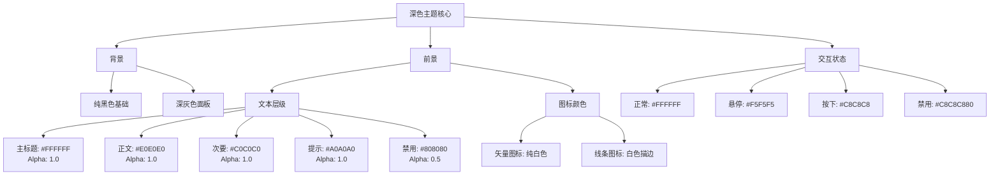
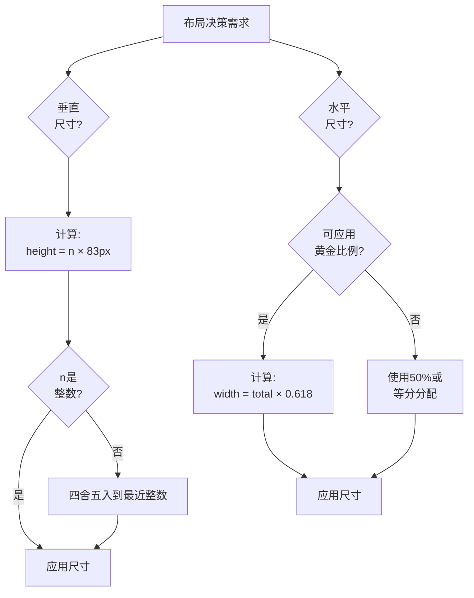

# 界面设计

本项目采用系统化的界面设计方法，优先一致性、可复现性和数学和谐性：极简主义几何形状，深色主题配色，83px单位高度网格，黄金比例布局，所有UI图标使用白色矢量图形配透明背景。

---

## 一、视觉风格定义

### 1. 极简主义（Minimalism）

拒绝装饰性元素，采用纯粹几何形状和纯色填充，通过颜色叠加单一基础资源（如RectangleSolid.png）实现不同色调，避免为每个颜色变体创建单独图片。

**代表性资源：**

| 图片预览 | 图片名称 | 视觉特征 |
|---------|---------|---------|
|  | **RectangleSolid.png** | 纯黑色圆角矩形（80x40），无渐变、无纹理 |
|  | **Sprite.png** | 纯白色矩形，用于进度条填充 |
|  | **Ring.png** | 简洁的圆环形状，透明背景 |
|  | **Radar.png** | 径向渐变黑色圆形，复杂度最低 |

### 2. 矢量图标设计

极简矢量风格，白色图标配透明背景，保持简洁明快的现代美学，增强科技感和清晰度。

**代表性资源：**

| 图片预览 | 图片名称 | 视觉特征 |
|---------|---------|---------|
|  | **Increase.png** | 加号图标，双层轮廓十字，纯白色矢量设计 |
|  | **Decrease.png** | 减号图标，双层轮廓横线，纯白色矢量设计 |
|  | **Edit.png** | 铅笔图标，极简矢量风格，清晰功能表达 |
|  | **Focus.png** | 焦点指示器/准星图标，高对比度白色 |

**详细制作规范：** 参见 [图标制作规范](#图标制作规范)

### 3. 线条艺术技法（Line Art）

使用一致的描边粗细定义形状，避免实心填充，适合动画效果（旋转、脉冲），在不同分辨率下缩放良好。

**代表性资源：**

| 图片预览 | 图片名称 | 视觉特征 |
|---------|---------|---------|
|  | **Settings.png** | 齿轮图标，多层同心线条营造深度感，高对比度 |
|  | **RadiativeRing.png** | 辐射环效果，渐变光晕，装饰性背景元素 |

---

## 二、图标设计语言

### 功能图标

包括 Increase、Decrease、Edit、Focus 等操作类图标。

**设计规范：** 参见 [一、视觉风格定义 → 矢量图标设计](#2-矢量图标设计)

**核心要求：**
- 1024x1024标准尺寸
- 纯白色（#FFFFFF）+ 完全透明背景
- 双层轮廓增强对比度

### 线条艺术图标

包括 Settings、RadiativeRing 等装饰类图标。

**设计规范：** 参见 [一、视觉风格定义 → 线条艺术技法](#3-线条艺术技法line-art)

### 功能性图标

**风格特征：**
- 清晰的符号意义
- 高对比度可见性
- 最小视觉复杂度

**图标清单：**

| 预览 | 图标 | 文件 | 用途 | 风格注释 |
|------|------|------|------|---------|
|  | 对勾 | True.png | 确认标记 | 简单对勾，白色透明背景 |
|  | 错误 | False.png | 账号系统图标 | 符号表示 |
|  | 雷达 | Radar.png | 雷达可视化 | 径向渐变圆形 |

### 装饰性元素

**风格特征：**
- 支持视觉层级
- 非交互
- 增强空间感知

**元素清单：**

| 预览 | 元素 | 文件 | 用途 | 风格注释 |
|------|------|------|------|---------|
|  | 圆环 | Ring.png | 点击效果、遮罩动画 | 简单圆环，用于动态点击效果 |
|  | 边框 | Border.png | 边框装饰 | 用于视觉分隔的框架元素 |

---

## 三、色彩系统

### 深色主题调色板



### 透明度使用原则

| Alpha值 | 使用场景 | 示例 |
|---------|---------|------|
| `1.0` | 完全可见，主要元素 | 主文本、实心背景 |
| `0.7` | 半透明叠加层 | 圆环叠加层 |
| `0.5` | 禁用状态 | 禁用按钮文本、非交互UI |
| `0.0` | 完全透明 | 纯文本按钮背景 |

### 色彩设计原则

1. **文本颜色由层级决定** - 而非主观偏好
2. **背景使用统一色系** - 黑色和深灰色调
3. **颜色叠加实现变化** - 避免创建大量颜色变体资源
4. **维持对比度** - 最低4.5:1符合WCAG AA标准

---

## 四、布局数学

### 单位高度系统（83px量子化网格）

**起源：** iPhone 6/7/8标准屏幕高度（1334px）÷ 16 = 83.375px ≈ 83px

**核心规则：** 所有垂直尺寸必须是83px的整数倍。

**理论依据：**
- 强制量子化，消除任意像素值
- 通过一致的间距确保视觉和谐
- 简化响应式设计（缩放网格，而非单个元素）
- 减少布局设计中的决策疲劳

**高度计算公式：**
```
元素高度 = 83px × n（n为正整数）

示例：
标题栏高度 = 83px × 1 = 83px
内容区高度 = 83px × 4 = 332px
按钮高度 = 83px × 1 = 83px
全屏高度 = 83px × 16 = 1328px ≈ 1334px
```

**垂直布局示例：**

```
┌─────────────────────┐
│  标题栏 (1单位)      │  83px
├─────────────────────┤
│                     │
│  内容区域            │  
│  (8单位)            │  664px
│                     │
│                     │
├─────────────────────┤
│  按钮 (1单位)        │  83px
└─────────────────────┘
总计: 10单位 = 830px
```

### 黄金比例（φ ≈ 0.618）

**应用领域：**
- 水平面板宽度分配
- 边距比例
- 嵌套布局递归

**比例常量：**
- 主要部分：φ = 0.618（61.8%）
- 次要部分：1-φ = 0.382（38.2%）

**水平布局示例：**

```
┌───────────────────────┬──────────────┐
│                       │              │
│   主内容面板           │   侧边栏      │
│   (φ = 0.618)         │ (1-φ = 0.382)│
│                       │              │
└───────────────────────┴──────────────┘
    屏幕宽度的61.8%         屏幕宽度的38.2%
```

**递归分割原则：**
- 主面板可进一步按黄金比例分割
- 左侧区域：主面板 × 0.618 = 屏幕的38.2%
- 右侧区域：主面板 × 0.382 = 屏幕的23.6%

### 数学化设计决策树



---

## 五、动画与特效风格

### 淡入淡出过渡

**标准时长：** 0.1秒（100毫秒）

**理论依据：**
- 足够快以感觉响应迅速
- 足够慢以可感知（不突兀）
- 所有UI交互保持一致

**应用场景：**
- 按钮状态变化（正常 → 高亮 → 按下）
- 面板显示/隐藏过渡
- 文本颜色变化

### 点击反馈系统

**视觉反馈流程：**

1. **即时反馈：** 按钮颜色变为按下状态（0ms）
2. **动态效果：** Ring.png叠加层在点击位置生成
3. **淡出动画：** Ring叠加层在0.3-0.5秒内淡出
4. **状态恢复：** 按钮恢复正常状态（0.1s过渡）

**叠加层效果规范：**
- 使用Ring.png作为叠加纹理
- 白色，70%不透明度
- 不阻挡后续点击交互
- 径向扩张并淡出

### 粒子效果

**ClickEffect（点击特效）：**
- 使用Ring.png作为粒子纹理
- 径向扩张并淡出
- 出现在遮罩层和交互元素中
- 为用户操作创建触觉反馈

**RadiativeRing（辐射环效果）：**
- Login/Initialize中的静态背景装饰
- 缓慢旋转动画（如果有动画）
- 增强空间深度感知
- 非交互，纯美学

---

## 六、设计资源管理原则

### 资源复用策略

**优先级层次：**

1. **引擎内置基础图形**（最高优先级）
   - 白色方块
   - 对勾图标
   - 滑块背景
   - 圆形旋钮
   - 输入框背景

2. **自定义资源 + 颜色变化**
   - RectangleSolid.png通过颜色叠加
   - 单一资源实现多种颜色效果

3. **独特自定义资源**（最低优先级，谨慎使用）
   - 仅当基础图形无法满足时使用
   - 示例：Settings齿轮图标、像素艺术UI元素

### 资源管理优势

**包体积控制：**
- 当前：21个PNG文件，16个在使用
- 引擎内置资源占用0字节
- 减少资源下载体积

**性能优化：**
- 引擎内置图形经过优化
- 自定义资源使用单一图集
- 通过批处理减少绘制调用

**可维护性提升：**
- 颜色变化无需重新导出资源
- 跨所有实例一致的视觉更新
- 简化美术与开发协作流程

### 资源创建决策

**决策规则：** 仅当引擎内置图形无法实现所需形状时，才创建自定义资源（例如圆角、特定图标、像素艺术）。

**创建新资源前的检查清单：**
1. 引擎内置图形能否满足需求？
2. 现有资源通过颜色变化能否实现？
3. 该资源是否会在多个地方复用？
4. 文件大小是否合理（建议<100KB）？

---

## 七、设计风格总结

### 核心关键词

1. **极简主义（Minimalism）** - 拒绝不必要的装饰
2. **矢量图标（Vector Icons）** - 清晰的现代美学
3. **数学化（Mathematical）** - 基于数学规则、可复现的决策
4. **深色主题（Dark Theme）** - 现代、护眼的界面
5. **系统化（Systematic）** - 通过约束实现一致性

### 风格标签

**现代极简主义风格**（Modern Minimalism）

- **极简（Minimalism）：** 纯粹几何形状，无装饰细节
- **现代（Modern）：** 深色主题，简洁矢量图标
- **系统化（Systematic）：** 精确的布局系统和比例
- **数学化（Mathematical）：** 基于网格和黄金比例的设计

### 与现代设计趋势的比较

| 方面 | 本项目 | Material Design | iOS Human Interface |
|------|--------|-----------------|---------------------|
| 色彩系统 | 颜色叠加变化 | 预定义调色板 | 动态颜色提取 |
| 布局 | 数学化（83px, φ） | 8dp网格 | 灵活间距 |
| 图标 | 矢量图标 + 线条艺术 | Material Icons（填充/轮廓） | SF Symbols（权重变体） |
| 主题 | 仅深色 | 明暗支持 | 自适应（自动切换） |
| 动画 | 快速（0.1s） | 中速（0.2-0.3s） | 上下文相关 |
| 哲学 | "数学证明" | "Material隐喻" | "清晰、尊重、深度" |

### 与游戏UI设计趋势的关系

**相似之处：**
- 深色主题在现代游戏中常见（尤其是RPG、策略游戏）
- 极简矢量风格在现代独立游戏中流行
- HUD极简主义增强玩家沉浸感

**差异之处：**
- 游戏UI通常使用拟物化元素（皮革、金属纹理）
- 本项目完全避免纹理
- 无diegetic UI元素（世界内屏幕）

---

## 八、未来设计方向建议

### 优化机会

1. **整合未使用资源**
   - 当前5个未使用的PNG文件：Circle.png、CircleOutline.png、Author.png、ICON.png、wheelgradient.png
   - 需要决策：删除或记录未来使用场景

2. **消除重复资源**
   - 存在重复的资源文件
   - 统一引用原始资源

3. **图标视觉一致性优化**
   - 确保所有图标使用统一的白色+透明背景规范
   - 保持矢量图标和线条艺术风格的明确区分

### 潜在扩展

1. **色彩主题变体**
   - 当前：仅深色主题
   - 未来：浅色主题选项（反转文本/背景颜色）
   - 保持相同的对比度和层级结构

2. **无障碍增强**
   - 高对比度模式（增加颜色差异）
   - 更大文字尺寸选项（字号乘以1.25x）
   - 色盲友好调色板（避免仅用红绿指示）

3. **动画丰富度**
   - 当前：简单淡入淡出和颜色过渡
   - 未来：按钮弹性缓动、视差背景
   - 注意：保持性能预算

4. **粒子系统扩展**
   - 当前：基础ClickEffect
   - 未来：上下文粒子（成功=绿色火花，错误=红色闪光）
   - 使用现有Ring.png配合颜色着色

### 需避免的风格一致性陷阱

1. **不要不一致地引入渐变**
   - 当前：仅RadiativeRing和Radar使用渐变（仅装饰）
   - 如在其他地方添加渐变，需建立清晰使用规则

2. **不要违反单位高度系统**
   - 避免使用任意像素值（如100px）
   - 始终使用83px的整数倍

3. **不要添加高分辨率照片纹理**
   - 会与矢量/极简美学冲突
   - 如需纹理，使用程序化图案（点、线）

4. **不要引入过多自定义资源**
   - 每个新PNG增加包体积
   - 始终检查：引擎内置图形 + 颜色变化能实现吗？

---

## 九、附录：视觉参考

### 色彩速查

**文本色：**

| 色块 | 十六进制 | RGB |
|------|---------|-----|
| <span style="display:inline-block;width:50px;height:20px;background-color:#FFFFFF;border:1px solid #000;"></span> | `#FFFFFF` | (255, 255, 255, 1.0) |
| <span style="display:inline-block;width:50px;height:20px;background-color:#E0E0E0;border:1px solid #000;"></span> | `#E0E0E0` | (224, 224, 224, 1.0) |
| <span style="display:inline-block;width:50px;height:20px;background-color:#C0C0C0;border:1px solid #000;"></span> | `#C0C0C0` | (192, 192, 192, 1.0) |
| <span style="display:inline-block;width:50px;height:20px;background-color:#A0A0A0;border:1px solid #000;"></span> | `#A0A0A0` | (160, 160, 160, 1.0) |
| <span style="display:inline-block;width:50px;height:20px;background-color:#808080;border:1px solid #000;"></span> | `#808080` | (128, 128, 128, 0.5) |

**交互色：**

| 色块 | 十六进制 | RGB |
|------|---------|-----|
| <span style="display:inline-block;width:50px;height:20px;background-color:#FFFFFF;border:1px solid #000;"></span> | `#FFFFFF` | (255, 255, 255, 1.0) |
| <span style="display:inline-block;width:50px;height:20px;background-color:#F5F5F5;border:1px solid #000;"></span> | `#F5F5F5` | (245, 245, 245, 1.0) |
| <span style="display:inline-block;width:50px;height:20px;background-color:#C8C8C8;border:1px solid #000;"></span> | `#C8C8C8` | (200, 200, 200, 1.0) |
| <span style="display:inline-block;width:50px;height:20px;background-color:rgba(200,200,200,0.5);border:1px solid #000;"></span> | `#C8C8C880` | (200, 200, 200, 0.5) |

**详细说明：** 参见 [三、色彩系统](#三色彩系统)

### 布局网格可视化

```
单位高度系统（83px网格）：

0px   ┬─────────────────────────┐
      │      标题栏              │
83px  ├─────────────────────────┤
      │                         │
      │                         │
      │    内容区域              │
      │     (8单位)             │
      │                         │
      │                         │
      │                         │
747px ├─────────────────────────┤
      │    按钮行                │
830px ┴─────────────────────────┘
```

### 黄金比例布局示例

```
水平分割：
┌───────────────────────┬──────────────┐
│                       │              │
│   主内容              │   侧边栏      │
│   (φ = 0.618)         │ (1-φ = 0.382)│
│                       │              │
└───────────────────────┴──────────────┘
    宽度的61.8%             宽度的38.2%
```

---

**文档版本：** 1.0  
**最后更新：** 2026-02-11  
**文档类型：** 美术设计规范
