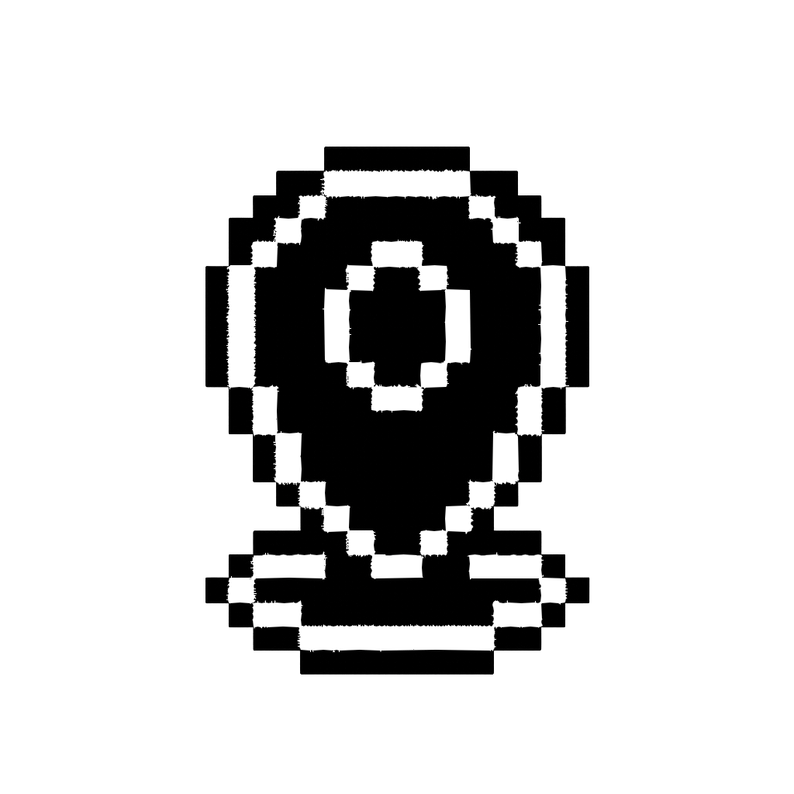
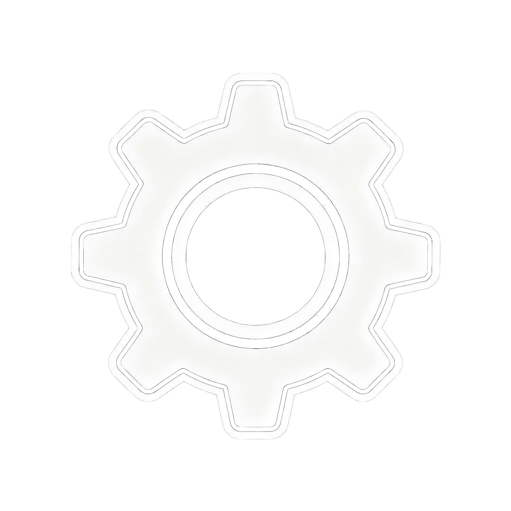
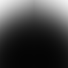
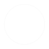
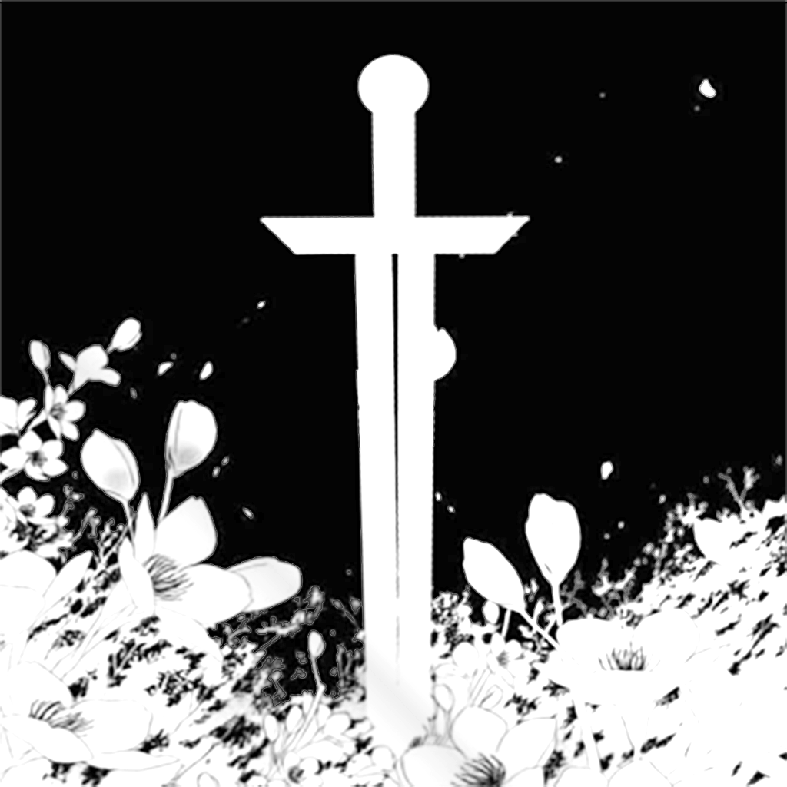

# 界面设计

本项目采用系统化的界面设计方法，通过数学化规则确保一致性与可复现性：视觉风格采用极简主义几何形状与矢量图标，色彩遵循深色主题与层级化原则，布局基于83px单位高度网格与黄金比例分割。

---

## 一、核心设计原则

### 1. 视觉风格

#### 1.1 极简主义（Minimalism）

拒绝装饰性元素，采用纯粹几何形状和纯色填充，通过颜色叠加单一基础资源（如RectangleSolid.png）实现不同色调，避免为每个颜色变体创建单独图片。

**[代表性资源](#二ui图片资源总表)：** RectangleSolid.png、Ring.png、Radar.png、Rectangle.png、Pixel.png

#### 1.2 矢量图标设计

极简矢量风格，白色图标配透明背景，保持简洁明快的现代美学，增强科技感和清晰度。

**[代表性资源](#二ui图片资源总表)：** Focus.png、True.png、False.png

#### 1.3 线条艺术技法（Line Art）

使用一致的描边粗细定义形状，避免实心填充，适合动画效果（旋转、脉冲），在不同分辨率下缩放良好。

**[代表性资源](#二ui图片资源总表)：** Settings.png、RadiativeRing.png

### 2. 色彩原则

色彩设计遵循四项原则：

1. **文本颜色由层级决定** - 而非主观偏好
2. **背景使用统一色系** - 黑色和深灰色调
3. **颜色叠加实现变化** - 避免创建大量颜色变体资源
4. **维持对比度** - 最低4.5:1符合WCAG AA标准

### 3. 布局原则

布局设计遵循数学化原则：

- **垂直尺寸：** 采用83px单位高度系统（iPhone标准屏高度1334px的1/16），所有元素高度必须是83px整数倍
- **水平布局：** 优先应用黄金比例（φ≈0.618）进行面板分割和边距分配

---

## 二、UI图片资源总表

本项目共使用13个PNG图片资源，按应用类型排序如下：

| 图片预览 | 图片名称 | 尺寸 | 应用 |
|---------|---------|------|----------------|
|  | **RectangleSolid.png** | 80×40 | 按钮、面板、输入框、对话框 |
|  | **Focus.png** | 1025×1025 | 按钮 |
|  | **Settings.png** | 2048×2048 | 按钮 |
|  | **Border.png** | 8×8 | 边框 |
|  | **RectangleSolid - 副本.png** | 80×40 | 重复文件 |
|  | **True.png** | 400×200 | 复选框 |
|  | **Radar.png** | 100×100 | 雷达图 |
|  | **Ring.png** | 100×100 | 粒子特效 |
|  | **False.png** | 400×200 | 未使用 |
|  | **ICON.png** | 1024×1024 | 未使用 |
|  | **Pixel.png** | 4×4 | 未使用 |
|  | **Rectangle.png** | 80×40 | 未使用 |
|  | **RadiativeRing.png** | 240×136 | 背景装饰 |

---

## 三、动画与特效风格

### 1. 淡入淡出过渡

**标准时长：** 0.1秒（100毫秒）

**理论依据：**
- 足够快以感觉响应迅速
- 足够慢以可感知（不突兀）
- 所有UI交互保持一致

**应用场景：**
- 按钮状态变化（正常 → 高亮 → 按下）
- 面板显示/隐藏过渡
- 文本颜色变化

### 2. 点击反馈系统

**视觉反馈流程：**

1. **即时反馈：** 按钮颜色变为按下状态（0ms）
2. **动态效果：** Ring.png叠加层在点击位置生成
3. **淡出动画：** Ring叠加层在0.3-0.5秒内淡出
4. **状态恢复：** 按钮恢复正常状态（0.1s过渡）

**叠加层效果规范：**
- 使用Ring.png作为叠加纹理
- 白色，70%不透明度
- 不阻挡后续点击交互
- 径向扩张并淡出

### 3. 粒子效果

**ClickEffect（点击特效）：**
- 使用Ring.png作为粒子纹理
- 径向扩张并淡出
- 出现在遮罩层和交互元素中
- 为用户操作创建触觉反馈

**RadiativeRing（辐射环效果）：**
- Login/Initialize中的静态背景装饰
- 缓慢旋转动画（如果有动画）
- 增强空间深度感知
- 非交互，纯美学

---

## 四、设计资源管理原则

### 1. 文本符号优先策略（Text-first Approach）

对于简单的符号（如加号、减号），优先使用文本而非图片资源：

**优势：**
- 零资源占用（无需图片文件）
- 任何分辨率下都清晰（矢量化）
- 易于调整样式（字体、大小、颜色）
- 低维护成本（无需设计师介入）

**适用范围：**
- 数学符号：`+`、`-`、`×`、`÷`、`=`
- 标点符号：`?`、`!`、`...`
- 箭头符号：`←`、`→`、`↑`、`↓`

**实施案例：**
- ✅ 已实施：加减号按钮使用文本符号 "+" 和 "-"（节省 5.85 MB）
- ✅ 已移除：Edit.png（未实际使用，节省 5.06 MB）

### 2. 资源复用策略

**优先级层次：**

0. **文本符号**（最高优先级）
   - 加减号、数学符号、箭头
   - Unicode 字符集覆盖大部分常用符号
   - 零资源占用，无限缩放

1. **引擎内置基础图形**
   - 白色方块
   - 对勾图标
   - 滑块背景
   - 圆形旋钮
   - 输入框背景

2. **自定义资源 + 颜色变化**
   - RectangleSolid.png通过颜色叠加
   - 单一资源实现多种颜色效果

3. **独特自定义资源**（最低优先级，谨慎使用）
   - 仅当基础图形无法满足时使用
   - 示例：Settings齿轮图标、像素艺术UI元素

### 2. 资源管理优势

**包体积控制：**
- 当前：21个PNG文件，16个在使用
- 引擎内置资源占用0字节
- 减少资源下载体积

**性能优化：**
- 引擎内置图形经过优化
- 自定义资源使用单一图集
- 通过批处理减少绘制调用

**可维护性提升：**
- 颜色变化无需重新导出资源
- 跨所有实例一致的视觉更新
- 简化美术与开发协作流程

### 3. 资源创建决策

**决策规则：** 仅当引擎内置图形无法实现所需形状时，才创建自定义资源（例如圆角、特定图标、像素艺术）。

**创建新资源前的检查清单：**
1. 引擎内置图形能否满足需求？
2. 现有资源通过颜色变化能否实现？
3. 该资源是否会在多个地方复用？
4. 文件大小是否合理（建议<100KB）？

---

## 五、设计风格总结

### 1. 核心关键词

1. **极简主义（Minimalism）** - 拒绝不必要的装饰
2. **矢量图标（Vector Icons）** - 清晰的现代美学
3. **数学化（Mathematical）** - 基于数学规则、可复现的决策
4. **深色主题（Dark Theme）** - 现代、护眼的界面
5. **系统化（Systematic）** - 通过约束实现一致性

### 2. 风格标签

**现代极简主义风格**（Modern Minimalism）

- **极简（Minimalism）：** 纯粹几何形状，无装饰细节
- **现代（Modern）：** 深色主题，简洁矢量图标
- **系统化（Systematic）：** 精确的布局系统和比例
- **数学化（Mathematical）：** 基于网格和黄金比例的设计

### 3. 与现代设计趋势的比较

| 方面 | 本项目 | Material Design | iOS Human Interface |
|------|--------|-----------------|---------------------|
| 色彩系统 | 颜色叠加变化 | 预定义调色板 | 动态颜色提取 |
| 布局 | 数学化（83px, φ） | 8dp网格 | 灵活间距 |
| 图标 | 矢量图标 + 线条艺术 | Material Icons（填充/轮廓） | SF Symbols（权重变体） |
| 主题 | 仅深色 | 明暗支持 | 自适应（自动切换） |
| 动画 | 快速（0.1s） | 中速（0.2-0.3s） | 上下文相关 |
| 哲学 | "数学证明" | "Material隐喻" | "清晰、尊重、深度" |

### 4. 与游戏UI设计趋势的关系

**相似之处：**
- 深色主题在现代游戏中常见（尤其是RPG、策略游戏）
- 极简矢量风格在现代独立游戏中流行
- HUD极简主义增强玩家沉浸感

**差异之处：**
- 游戏UI通常使用拟物化元素（皮革、金属纹理）
- 本项目完全避免纹理
- 无diegetic UI元素（世界内屏幕）

---

## 六、未来设计方向建议

### 1. 优化机会

1. **整合未使用资源**
   - 当前5个未使用的PNG文件（详见 [二、UI图片资源总表](#二ui图片资源总表) 中"未使用"分类）
   - 需要决策：删除或记录未来使用场景

2. **消除重复资源**
   - 存在重复的资源文件（详见 [二、UI图片资源总表](#二ui图片资源总表) 中"重复文件"分类）
   - 统一引用原始资源

3. **图标视觉一致性优化**
   - 确保所有图标使用统一的白色+透明背景规范
   - 保持矢量图标和线条艺术风格的明确区分

### 2. 潜在扩展

1. **色彩主题变体**
   - 当前：仅深色主题
   - 未来：浅色主题选项（反转文本/背景颜色）
   - 保持相同的对比度和层级结构

2. **无障碍增强**
   - 高对比度模式（增加颜色差异）
   - 更大文字尺寸选项（字号乘以1.25x）
   - 色盲友好调色板（避免仅用红绿指示）

3. **动画丰富度**
   - 当前：简单淡入淡出和颜色过渡
   - 未来：按钮弹性缓动、视差背景
   - 注意：保持性能预算

4. **粒子系统扩展**
   - 当前：基础ClickEffect
   - 未来：上下文粒子（成功=绿色火花，错误=红色闪光）
   - 使用现有Ring.png配合颜色着色

### 3. 需避免的风格一致性陷阱

1. **不要不一致地引入渐变**
   - 当前：仅RadiativeRing和Radar使用渐变（仅装饰）
   - 如在其他地方添加渐变，需建立清晰使用规则

2. **不要违反单位高度系统**
   - 避免使用任意像素值（如100px）
   - 始终使用83px的整数倍

3. **不要添加高分辨率照片纹理**
   - 会与矢量/极简美学冲突
   - 如需纹理，使用程序化图案（点、线）

4. **不要引入过多自定义资源**
   - 每个新PNG增加包体积
   - 始终检查：引擎内置图形 + 颜色变化能实现吗？

---

## 七、附录：视觉参考

### 1. 色彩速查

**文本色：**

| 色块 | 十六进制 | RGB |
|------|---------|-----|
| <span style="display:inline-block;width:50px;height:20px;background-color:#FFFFFF;border:1px solid #000;"></span> | `#FFFFFF` | (255, 255, 255, 1.0) |
| <span style="display:inline-block;width:50px;height:20px;background-color:#E0E0E0;border:1px solid #000;"></span> | `#E0E0E0` | (224, 224, 224, 1.0) |
| <span style="display:inline-block;width:50px;height:20px;background-color:#C0C0C0;border:1px solid #000;"></span> | `#C0C0C0` | (192, 192, 192, 1.0) |
| <span style="display:inline-block;width:50px;height:20px;background-color:#A0A0A0;border:1px solid #000;"></span> | `#A0A0A0` | (160, 160, 160, 1.0) |
| <span style="display:inline-block;width:50px;height:20px;background-color:#808080;border:1px solid #000;"></span> | `#808080` | (128, 128, 128, 0.5) |

**交互色：**

| 色块 | 十六进制 | RGB |
|------|---------|-----|
| <span style="display:inline-block;width:50px;height:20px;background-color:#FFFFFF;border:1px solid #000;"></span> | `#FFFFFF` | (255, 255, 255, 1.0) |
| <span style="display:inline-block;width:50px;height:20px;background-color:#F5F5F5;border:1px solid #000;"></span> | `#F5F5F5` | (245, 245, 245, 1.0) |
| <span style="display:inline-block;width:50px;height:20px;background-color:#C8C8C8;border:1px solid #000;"></span> | `#C8C8C8` | (200, 200, 200, 1.0) |
| <span style="display:inline-block;width:50px;height:20px;background-color:rgba(200,200,200,0.5);border:1px solid #000;"></span> | `#C8C8C880` | (200, 200, 200, 0.5) |

### 2. 布局网格可视化

```
单位高度系统（83px网格）：

0px   ┬─────────────────────────┐
      │      标题栏              │
83px  ├─────────────────────────┤
      │                         │
      │                         │
      │    内容区域              │
      │     (8单位)             │
      │                         │
      │                         │
      │                         │
747px ├─────────────────────────┤
      │    按钮行                │
830px ┴─────────────────────────┘
```

### 3. 黄金比例布局示例

```
水平分割：
┌───────────────────────┬──────────────┐
│                       │              │
│   主内容              │   侧边栏      │
│   (φ = 0.618)         │ (1-φ = 0.382)│
│                       │              │
└───────────────────────┴──────────────┘
    宽度的61.8%             宽度的38.2%
```

---

**文档版本：** 1.3  
**最后更新：** 2026-02-12  
**更新内容：** 移除 Increase.png、Decrease.png、Edit.png 和 Author.png，改用文本符号或删除未使用资源  
**文档类型：** 美术设计规范
