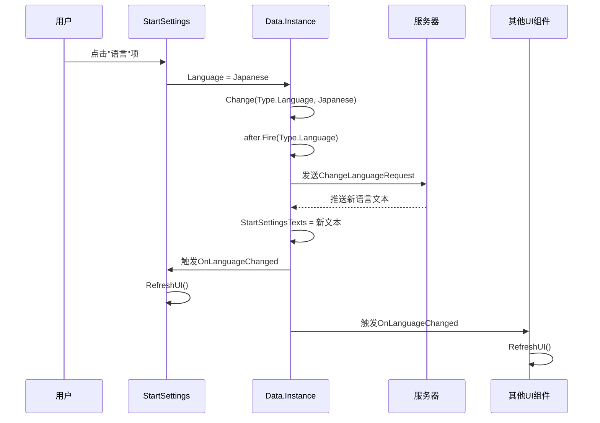

# 服务端驱动UI系统（SDUI）

LOA客户端的服务端驱动UI系统（Server-Driven UI，简称**SDUI**），通过将UI文本和配置数据从服务端推送到客户端，实现了零客户端更新的内容迭代能力，同时确保多语言文本的统一管理和实时更新。

## 设计理念

### 核心原则

1. **数据驱动**
   - UI表现层从数据层读取文本，不持有数据
   - 数据层（Data）作为唯一数据源（Single Source of Truth）
   - 符合项目的"管理器协作架构"原则

2. **最小化客户端本地化**
   - 客户端本地化仅保留5个技术必需键：`loading`、`connecting`、`connection_timeout`、`network_error`、`parse_error`
   - 所有其他UI文本由服务端推送
   - 减少客户端包体积，提升热更新效率

3. **0强更迭代**
   - UI文本修改、多语言内容更新无需客户端重新打包
   - 服务端修改后立即生效
   - 支持A/B测试和灰度发布

4. **语言切换响应式**
   - 用户切换语言时，客户端请求服务端推送新语言文本
   - 数据层触发事件，所有UI自动刷新
   - 无需重启应用或重新打开界面

### 技术必需的客户端本地化

**定义标准**：只有在"完全无法建立网络连接"时必须显示的文本，才保留在客户端。

| 键名 | 用途 | 使用场景 |
|-----|------|---------|
| `loading` | 正在加载... | Gate.OnRequestGateway |
| `connecting` | 连接中... | 热更新系统连接认证服务器 |
| `connection_timeout` | 连接超时 | Gate.OnGatewayResponse（超时） |
| `network_error` | 网络错误 | Gate.OnGatewayResponse（网络异常） |
| `parse_error` | 数据解析错误 | Gate.OnGatewayResponse（JSON解析失败） |

**使用方式**：
```csharp
UI.Instance.Open(Config.UI.Dark, Localization.Instance.Get("loading"));
```

---

## 数据层（Data）

### Data.StartTexts

**定义**：Start界面的UI文本数据

**数据结构**：`Dictionary<string, string>`

**来源**：Gateway响应（`GatewayResponse.UI.Data`）

**键值说明**：
- `title`：界面标题文本
- `tip`：提示文本
- `footer`：页脚模板（支持格式化参数：设备ID、应用版本、热更新版本）

**示例**：
```json
{
  "title": "Legend of Aurum",
  "tip": "Tap anywhere to start",
  "footer": "Device: {0}\\nApp: {1}\\nHot: {2}"
}
```

**更新时机**：
1. Gateway响应时由服务端推送
2. 语言切换时重新请求

---

### Data.StartSettingsTexts

**定义**：StartSettings界面的UI文本数据

**数据结构**：`Dictionary<string, string>`

**来源**：
- Gateway响应（初始推送）
- ChangeLanguage响应（语言切换时更新）

**键值说明**：

| 键名 | 说明 | 示例值 |
|-----|------|--------|
| `accounts` | 账号区域标题 | "账号" |
| `general` | 通用设置区域标题 | "通用设置" |
| `add_account` | 添加账号按钮 | "添加账号" |
| `edit` | 编辑按钮 | "编辑" |
| `delete` | 删除按钮 | "删除" |
| `edit_account` | 编辑账号对话框标题 | "编辑账号" |
| `account_id` | 账号ID标签 | "账号ID" |
| `password` | 密码标签 | "密码" |
| `note_optional` | 备注标签 | "备注（可选）" |
| `delete_confirm` | 删除确认提示 | "确定要删除账号 {0} 吗？" |
| `language` | 语言设置项 | "语言" |
| `font_size` | 字体大小设置项 | "字体大小" |
| `ui_sound` | 音效设置项 | "音效" |
| `font_size_small` | 小字体选项 | "小" |
| `font_size_medium` | 中字体选项 | "中" |
| `font_size_large` | 大字体选项 | "大" |
| `font_size_extra_large` | 特大字体选项 | "特大" |
| `confirm` | 确认按钮 | "确认" |
| `cancel` | 取消按钮 | "取消" |

**语言名称映射**（22种语言）：
```csharp
// 键格式：lang_{LanguageEnum}
"lang_ChineseSimplified" → "简体中文"
"lang_ChineseTraditional" → "繁體中文"
"lang_English" → "English"
"lang_Japanese" → "日本語"
// ... 其他18种语言
```

**更新时机**：
1. Gateway响应时初始推送（使用当前语言）
2. 用户切换语言时，客户端发送`ChangeLanguageRequest`，服务端推送新语言文本

---

### Data.AccountTexts

**定义**：AccountUI（账号编辑界面）的UI文本数据

**数据结构**：`Dictionary<string, string>`

**来源**：Gateway响应或服务端推送

**键值说明**：
- `accountIdPlaceholder`：账号ID输入框占位符
- `accountPasswordPlaceholder`：密码输入框占位符
- `accountNotePlaceholder`：备注输入框占位符
- `errorAccountEmpty`：账号为空错误提示
- `errorAccountFormat`：账号格式错误提示
- `errorPasswordEmpty`：密码为空错误提示
- `errorPasswordFormat`：密码格式错误提示

---

### Data.ErrorTexts

**定义**：游戏运行时网络错误文本数据

**数据结构**：`Dictionary<string, string>`

**来源**：Login响应（`LoginResponse.error_texts`）

**键值说明**：

| 键名 | 说明 | 格式化参数 |
|-----|------|-----------|
| `connection_failed` | 连接失败 | 无 |
| `connection_refused` | 连接被拒绝 | 无 |
| `server_disconnected` | 与服务器断开连接 | 无 |
| `network_communication_error` | 网络通信异常 | 无 |
| `send_failed` | 发送数据失败 | 无 |
| `rate_limit` | 操作频率过快 | 无 |
| `reconnecting_countdown` | 重连倒计时 | `{0}` = 尝试次数, `{1}` = 剩余秒数 |
| `reconnecting_attempt` | 正在重连 | `{0}` = 尝试次数 |
| `reconnect_success` | 重连成功 | 无 |
| `reconnect_cancel` | 重连已取消 | 无 |

**使用示例**：
```csharp
// Net.cs
string errorMessage = string.Format(
    Data.Instance.ErrorTexts["reconnecting_countdown"],
    attemptCount,
    secondsRemaining
);
```

**更新时机**：登录成功后由服务端推送

---

## 表现层（UI）

### Start.cs

**核心方法**：

**OnEnter**（OnEnter）是界面进入时的入口方法，接收服务端推送的UI文本并存储到数据层。

```csharp
public override void OnEnter(params object[] args)
{
    var texts = args[0] as Dictionary<string, string>;
    if (texts != null)
    {
        Data.Instance.StartTexts = texts;  // 存储到数据层
    }
    
    RefreshUI();  // 渲染UI
}
```

**RefreshUI**（RefreshUI）是UI刷新方法，从数据层读取文本并更新界面元素。

```csharp
private void RefreshUI()
{
    var texts = Data.Instance.StartTexts;
    if (texts == null) return;
    
    if (_titleText != null && texts.ContainsKey("title"))
    {
        _titleText.text = texts["title"];
    }
    
    if (_tipText != null && texts.ContainsKey("tip"))
    {
        _tipText.text = texts["tip"];
    }
    
    // 格式化页脚文本
    if (_footerText != null && texts.ContainsKey("footer"))
    {
        string footerTemplate = texts["footer"].Replace("\\n", "\n");
        _footerText.text = string.Format(
            footerTemplate,
            Data.Instance.Device.Split("-").Last(),  // 设备ID
            Data.Instance.AppVersion,                // 应用版本
            Data.Instance.HotVersion                 // 热更新版本
        );
    }
}
```

**设计原则**：
1. ✅ UI不持有数据（删除了`_uiTexts`字段）
2. ✅ 所有文本从`Data.Instance.StartTexts`读取
3. ✅ `RefreshUI`方法独立，便于语言切换时调用

---

### AccountUI.cs

**核心方法**：

**OnEnter**（OnEnter）接收并存储UI文本到数据层。

```csharp
public override void OnEnter(params object[] args)
{
    if (args.Length > 0)
    {
        var texts = args[0] as Dictionary<string, string>;
        if (texts != null)
        {
            Data.Instance.AccountTexts = texts;  // 存储到数据层
        }
    }
    
    RefreshUI();  // 渲染UI
    
    // ... 其他初始化逻辑
}
```

**RefreshUI**（RefreshUI）从数据层读取文本并更新占位符文本。

```csharp
private void RefreshUI()
{
    var texts = Data.Instance.AccountTexts;
    if (texts == null) return;
    
    var idPlaceholder = transform.Find("Id/Placeholder")?.GetComponent<Text>();
    if (idPlaceholder != null && texts.ContainsKey("accountIdPlaceholder"))
        idPlaceholder.text = texts["accountIdPlaceholder"];
    
    var passwordPlaceholder = transform.Find("Password/Placeholder")?.GetComponent<Text>();
    if (passwordPlaceholder != null && texts.ContainsKey("accountPasswordPlaceholder"))
        passwordPlaceholder.text = texts["accountPasswordPlaceholder"];
    
    var notePlaceholder = transform.Find("Note/Placeholder")?.GetComponent<Text>();
    if (notePlaceholder != null && texts.ContainsKey("accountNotePlaceholder"))
        notePlaceholder.text = texts["accountNotePlaceholder"];
}
```

**InputCheck**（InputCheck）是输入验证属性，从数据层读取错误提示文本。

```csharp
private string InputCheck
{
    get
    {
        string id = transform.Find("Id").GetComponent<InputField>().text;
        string password = transform.Find("Password").GetComponent<InputField>().text;
        var texts = Data.Instance.AccountTexts;
        
        if (string.IsNullOrEmpty(id))
            return texts?["errorAccountEmpty"] ?? "";
        
        if (!Regex.IsMatch(id, @"^[a-zA-Z0-9]{6,20}$"))
            return texts?["errorAccountFormat"] ?? "";
        
        // ... 其他验证逻辑
    }
}
```

---

### StartSettings.cs（待重构）

**当前状态**：使用`Localization.Instance.Get()`从客户端本地化文件读取

**目标架构**：改为从`Data.Instance.StartSettingsTexts`读取

**重构步骤**：
1. 删除所有`Localization.Instance.Get()`调用
2. 在`OnEnter`中接收服务端推送的文本
3. 实现`RefreshUI`方法
4. 注册`Data.Type.Language`事件监听，语言切换时自动刷新

**预期实现**：
```csharp
public override void OnEnter(params object[] args)
{
    var texts = args[0] as Dictionary<string, string>;
    if (texts != null)
    {
        Data.Instance.StartSettingsTexts = texts;
    }
    
    // 注册语言切换监听
    Data.Instance.after.Register(Data.Type.Language, OnLanguageChanged);
    
    RefreshUI();
}

private void RefreshUI()
{
    var texts = Data.Instance.StartSettingsTexts;
    if (texts == null) return;
    
    // 更新所有UI文本
    // ...
}

private void OnLanguageChanged(params object[] args)
{
    // 语言切换时，服务端已推送新文本到Data.Instance.StartSettingsTexts
    RefreshUI();
}
```

---

## 网络层（Net）

### 错误文本使用

**当前实现**：`Net.cs`使用`Localization.Instance.Get()`获取错误文本

**目标架构**：改为从`Data.Instance.ErrorTexts`读取

**重构方案**：

```csharp
// 修改前
UI.Instance.Open(Config.UI.Dark, Localization.Instance.Get("connection_failed"));

// 修改后
UI.Instance.Open(Config.UI.Dark, Data.Instance.ErrorTexts?["connection_failed"] ?? "");
```

**格式化示例**：

```csharp
// 重连倒计时
string message = string.Format(
    Data.Instance.ErrorTexts["reconnecting_countdown"],
    attemptCount,    // {0}
    secondsLeft      // {1}
);
```

---

## 服务端协议

### Gateway响应

**协议**：`GatewayResponse`

**新增字段**：
```protobuf
message GatewayResponse {
    repeated ServerInfo servers = 1;
    UIConfig ui = 2;
    StartSettingsUI start_settings_ui = 3;  // 新增
}
```

**推送内容**：
- `ui.data`：Start界面文本（`Data.Instance.StartTexts`）
- `start_settings_ui`：StartSettings界面文本（`Data.Instance.StartSettingsTexts`）

---

### Login响应

**协议**：`LoginResponse`

**新增字段**：
```protobuf
message LoginResponse {
    // ... 现有字段
    ErrorTexts error_texts = 100;  // 新增
}
```

**推送内容**：所有网络错误文本（`Data.Instance.ErrorTexts`）

---

### 语言切换协议

**请求**：`ChangeLanguageRequest`

```protobuf
message ChangeLanguageRequest {
    string language = 1;  // "Japanese", "Korean", "ChineseSimplified", etc.
}
```

**响应**：`ChangeLanguageResponse`

```protobuf
message ChangeLanguageResponse {
    bool success = 1;
    StartSettingsUI start_settings_ui = 2;  // 新语言的StartSettings文本
    ErrorTexts error_texts = 3;             // 新语言的错误文本
}
```

**客户端流程**：
1. 用户在StartSettings点击"语言"项切换语言
2. 客户端发送`ChangeLanguageRequest`
3. 服务端返回新语言的所有UI文本
4. 客户端更新`Data.Instance.StartSettingsTexts`和`Data.Instance.ErrorTexts`
5. 触发`Data.Type.Language`事件
6. 所有注册监听的UI组件自动调用`RefreshUI()`

---

## 语言切换机制

### 事件驱动更新

**架构**：观察者模式（Observer Pattern）

**核心流程**：



**实现细节**：

1. **注册监听**（在OnEnter中）：
```csharp
Data.Instance.after.Register(Data.Type.Language, OnLanguageChanged);
```

2. **取消监听**（在OnExit中）：
```csharp
Data.Instance.after.Unregister(Data.Type.Language, OnLanguageChanged);
```

3. **响应回调**：
```csharp
private void OnLanguageChanged(params object[] args)
{
    RefreshUI();  // 自动刷新UI
}
```

---

## 优势与限制

### 优势

1. **零客户端更新**
   - UI文本修改无需重新打包
   - 多语言内容迭代无需审核
   - 支持实时A/B测试

2. **数据驱动架构**
   - 符合项目"管理器协作架构"原则
   - UI与数据解耦，易于维护
   - 支持响应式更新

3. **集中管理**
   - 所有UI文本在服务端统一管理
   - 22种语言统一维护
   - 减少客户端包体积

4. **热切换语言**
   - 无需重启应用
   - 所有界面自动刷新
   - 用户体验流畅

### 限制

1. **依赖网络连接**
   - 首次启动必须联网才能显示完整UI
   - 离线状态下无法切换语言
   - 需要设计fallback机制

2. **服务端维护成本**
   - 需要管理22种语言的文本资源
   - Protocol版本兼容性管理
   - 服务端翻译工作量

3. **初始加载时间**
   - Gateway响应需携带UI文本
   - 首次启动网络传输量增加
   - 需优化Protocol大小

---

## 开发规范

### UI组件开发规范

1. **禁止硬编码文本**
   ```csharp
   // ❌ 错误
   titleText.text = "标题";
   titleText.text = "Title";
   
   // ✅ 正确
   titleText.text = Data.Instance.StartTexts["title"];
   ```

2. **禁止使用Localization（除5个必需键外）**
   ```csharp
   // ❌ 错误
   text.text = Localization.Instance.Get("start_settings_language");
   
   // ✅ 正确（必需键）
   UI.Instance.Open(Config.UI.Dark, Localization.Instance.Get("loading"));
   
   // ✅ 正确（SDUI）
   text.text = Data.Instance.StartSettingsTexts["language"];
   ```

3. **必须实现RefreshUI方法**
   ```csharp
   public override void OnEnter(params object[] args)
   {
       // 存储到数据层
       Data.Instance.XXXTexts = args[0] as Dictionary<string, string>;
       
       // 渲染UI
       RefreshUI();
   }
   
   private void RefreshUI()
   {
       var texts = Data.Instance.XXXTexts;
       if (texts == null) return;
       
       // 更新所有UI元素
   }
   ```

4. **注册语言切换监听（如需要）**
   ```csharp
   public override void OnEnter(params object[] args)
   {
       Data.Instance.after.Register(Data.Type.Language, OnLanguageChanged);
       RefreshUI();
   }
   
   public override void OnExit(params object[] args)
   {
       Data.Instance.after.Unregister(Data.Type.Language, OnLanguageChanged);
   }
   
   private void OnLanguageChanged(params object[] args)
   {
       RefreshUI();
   }
   ```

---

## 待完成工作

### 客户端

- [ ] 重构StartSettings.cs为SDUI架构
- [ ] 重构Net.cs使用`Data.Instance.ErrorTexts`
- [ ] 实现语言切换协议处理（`ChangeLanguageRequest/Response`）
- [ ] 添加fallback机制（服务端未就绪时的降级方案）
- [ ] 添加UI文本缓存机制（减少重复请求）

### 服务端

- [ ] 创建22种语言的文本资源文件
- [ ] 实现`StartSettingsUI` Protocol
- [ ] 实现`ErrorTexts` Protocol
- [ ] 实现`ChangeLanguageRequest/Response` Protocol
- [ ] 修改Gateway响应，添加`start_settings_ui`字段
- [ ] 修改Login响应，添加`error_texts`字段

---

## 相关文档

- [服务端SDUI需求文档](../../.cursor/server_sdui_requirements.md)
- [登录与启动系统](./登录与启动系统.md)
- [客户端本地化审计报告](../../.cursor/localization_audit.md)
