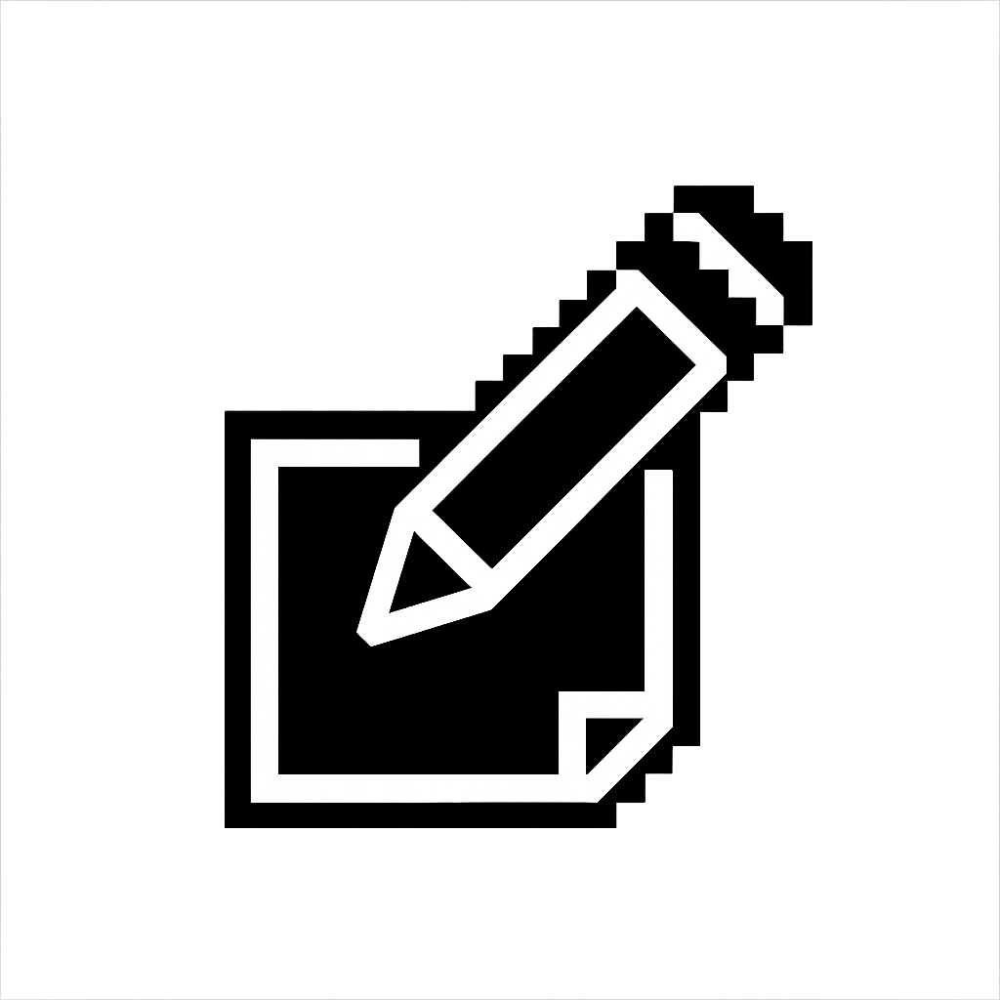
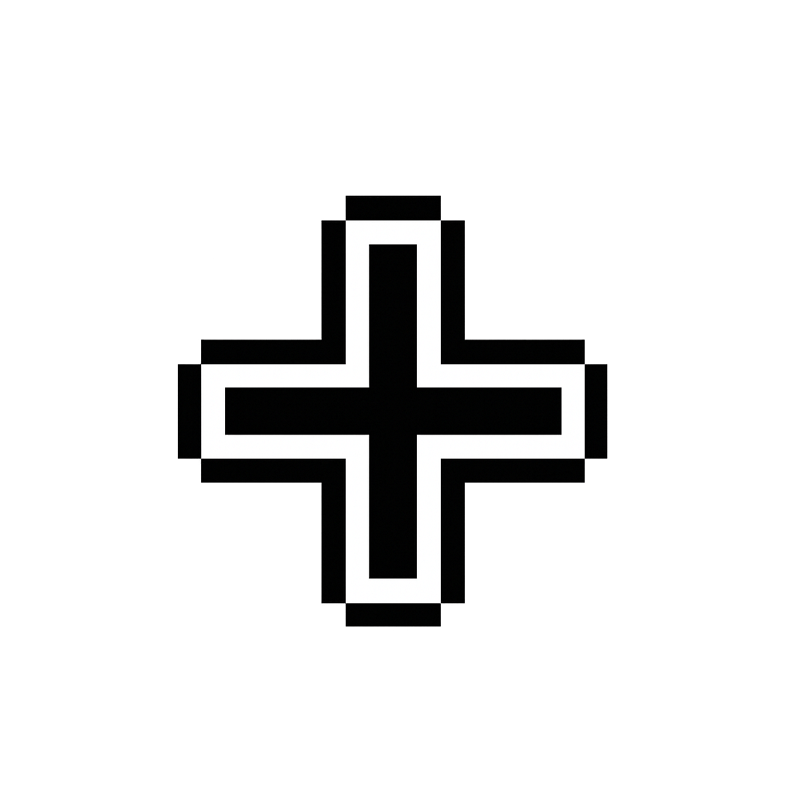
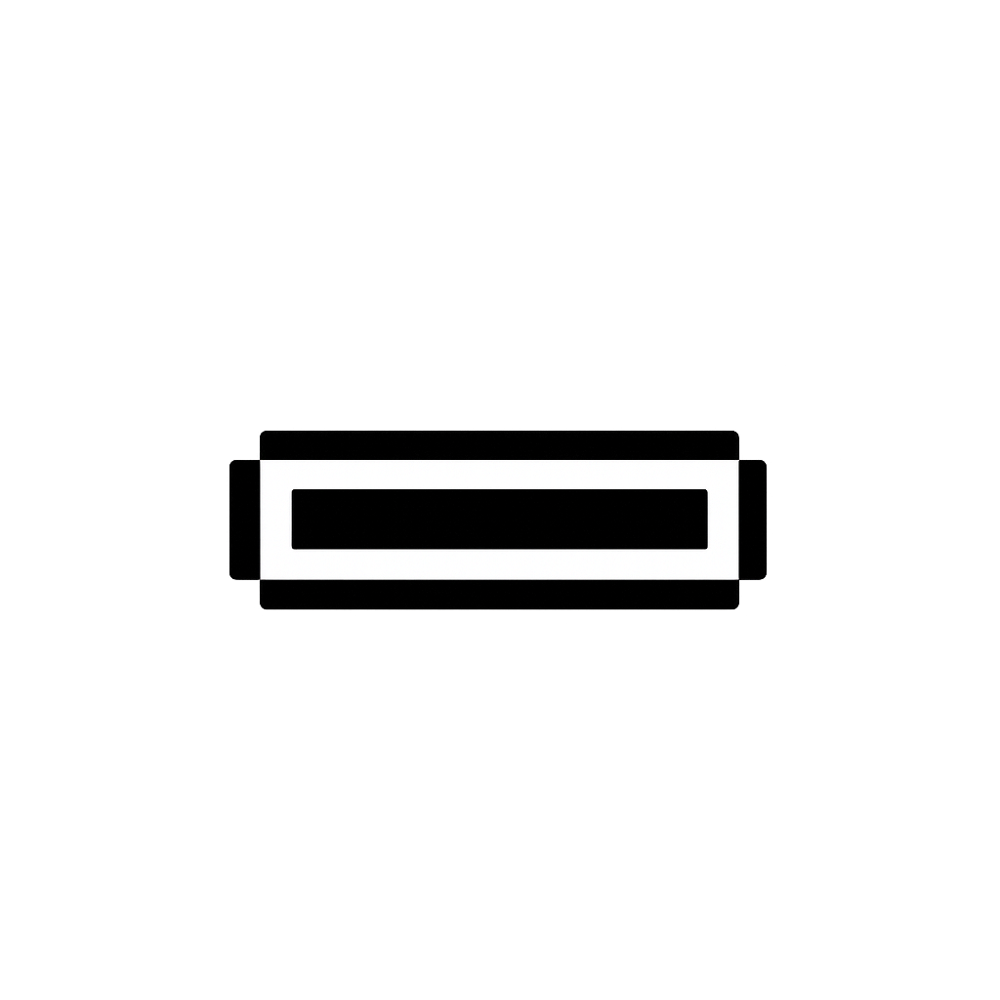
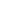
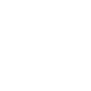
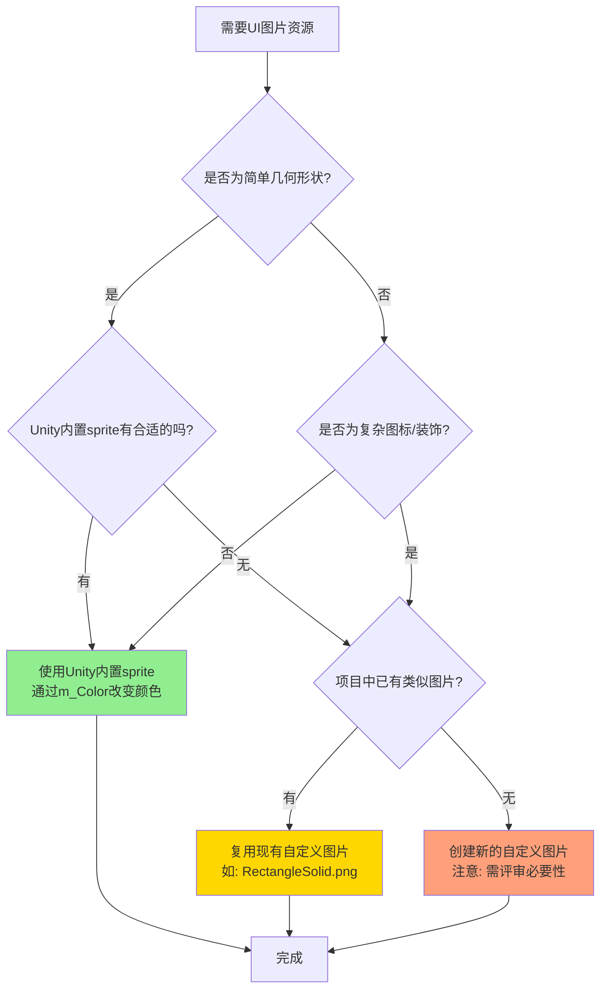

# UI图片资源使用规范

## 一、设计理念

### 单位高度系统

**单位高度（UnitHeight）= 83像素**

来源于iPhone 6/7/8标准屏幕高度（1334px）垂直16等分的设计基准：`1334 ÷ 16 = 83.375 ≈ 83px`

**核心约束：**
- 所有UI组件的垂直高度必须是单位高度的语义化倍数
- 禁止使用任意像素值或百分比作为垂直尺寸

**项目中的实现：**
```csharp
private const float UnitHeight = 83f;  // 所有UI类中统一定义
```

### 黄金比例美学

**黄金比例（Golden Ratio）≈ 0.618**

UI设计中优先使用黄金比例进行空间分割：
- 水平方向的面板宽度分配
- 边距的比例分配
- 嵌套布局的递归分割

**项目中的实现：**
```csharp
private const float GoldenRatio = 0.618f;       // 黄金比例
private const float GoldenRatioSmall = 0.382f;  // 黄金比例补数（1 - 0.618）
```

**示例应用：**
```csharp
float screenWidth = GetComponent<RectTransform>().rect.width;
float panelWidth = screenWidth * GoldenRatio;  // 面板宽度为屏幕宽度的0.618
```

### 核心理念

> **UI设计是数学证明，而非艺术创作。**

通过量子化网格系统（单位高度）和黄金比例，确保垂直布局的数学一致性和视觉和谐性。

---

## 二、Unity内置Sprite

项目大量使用Unity内置UI Sprite，而非自定义图片，以获得更好的性能和一致性。

### 常用内置Sprite清单

| Sprite ID | 名称 | 用途 | 使用示例 |
|-----------|------|------|----------|
| `10901` | Checkmark（对勾） | Toggle勾选图标 | OptionToggle, Home, Login |
| `10905` | UISprite（白色方块） | 按钮/面板背景 | OptionButton, OptionAmount, Home, Option |
| `10907` | Background（背景） | Slider背景 | OptionSlider |
| `10911` | Knob（圆形把手） | Slider把手、输入框 | OptionSlider, OptionAmount, OptionInput, OptionFilter, Home |
| `10913` | Background（背景2） | 进度条背景 | Start, OptionProgress |
| `10917` | InputFieldBackground | 遮罩/背景 | Story, Start, Root, Option, Login |

**YAML中的实现方式：**
```yaml
m_Sprite: {fileID: 10905, guid: 0000000000000000f000000000000000, type: 0}
```

**使用模式：**
- 通过修改 `m_Color` 属性改变背景颜色
- 无需外部图片文件
- 所有UI组件保持一致风格

---

## 三、自定义图片资源

存放位置：`Assets/Game/HotResources/RawAssets/Texture/`

### 完整图片使用情况一览

所有PNG图片的详细使用情况：

| 预览 | 图片名称 | 代码加载 | Prefab引用 | 使用详情 | 状态 |
|------|---------|---------|-----------|---------|------|
|  | **RectangleSolid.png** | ✅ StartSettings.cs:83 | ✅ 14个Prefab | 面板背景（Home, Login, Initialize, Option, OptionTitleButton等） | ✅ 高频使用 |
|  | **Settings.png** | ✅ Start.cs:484 | ❌ | 设置按钮图标 | ✅ 使用中 |
|  | **Edit.png** | ✅ StartSettings.cs:84 | ❌ | 编辑按钮图标（缓存复用） | ✅ 使用中 |
|  | **True.png** | ✅ StartSettings.cs:85 | ✅ 2个Prefab | Checkmark图标（Story, OptionConfirm） | ✅ 使用中 |
|  | **Increase.png** | ❌ | ✅ 2个Prefab | 增加按钮（Home, OptionAmount） | ✅ 使用中 |
|  | **Decrease.png** | ❌ | ✅ 2个Prefab | 减少按钮（Home, OptionAmount） | ✅ 使用中 |
|  | **Sprite.png** | ❌ | ✅ 1个Prefab | 进度条填充（OptionProgressWithValue） | ✅ 使用中 |
|  | **RadiativeRing.png** | ❌ | ✅ 3个Prefab | 装饰效果（Initialize, Login） | ✅ 使用中 |
|  | **Radar.png** | ❌ | ✅ 1个Prefab | 雷达可视化（OptionRadar） | ✅ 使用中 |
|  | **Ring.png** | ❌ | ✅ 7个Prefab | 点击特效、UI动画（Root, Home, Dark, Account, Accounts, ClickEffect） | ✅ 使用中 |
|  | **wheelgradient.png** | ❌ | ✅ 1个Prefab | 点击特效（ClickEffect） | ✅ 使用中 |
|  | **RectangleSolid - 副本.png** | ❌ | ✅ 1个Prefab | 重复文件（OptionRadar） | ⚠️ 待替换删除 |
|  | **False.png** | ❌ | ❌ | - | ❌ 未使用 |
|  | **Circle.png** | ❌ | ❌ | - | ❌ 未使用 |
|  | **CircleOutline.png** | ❌ | ❌ | - | ❌ 未使用 |
|  | **Border.png** | ❌ | ❌ | - | ❌ 未使用 |
|  | **Rectangle.png** | ❌ | ❌ | - | ❌ 未使用 |
|  | **Focus.png** | ❌ | ❌ | - | ❌ 未使用 |
|  | **Pixel.png** | ❌ | ❌ | - | ❌ 未使用 |
|  | **ICON.png** | ❌ | ❌ | 关联材质：ICON.mat | ⚠️ 材质可能使用 |
|  | **Author.png** | ❌ | ❌ | - | ❌ 未使用 |

**使用情况统计**：
- **总文件数**：21个PNG（已清理2个无效文件：abc.png、hrhr.png）
- **✅ 使用中**：11个（52.4%） - RectangleSolid, Settings, Edit, True, Increase, Decrease, Sprite, RadiativeRing, Radar, Ring, wheelgradient
- **❌ 未使用**：8个（38.1%） - False, Circle, CircleOutline, Border, Rectangle, Focus, Pixel, Author
- **⚠️ 待决策**：2个（9.5%） - ICON.png（材质可能使用）、RectangleSolid副本（待替换删除）

### 核心UI图片

| 文件名 | 尺寸 | GUID | 使用频率 | 用于 |
|--------|------|------|----------|------|
| **RectangleSolid.png** | 80×40 | `d7ef6b31ab55e354a9a21ff536ad24c4` | ⭐⭐⭐⭐⭐ | 14个Prefab + StartSettings代码加载（面板背景） |
| **Ring.png** | - | `639b7ad6f044b3a4da3752891d598836` | ⭐⭐⭐⭐ | 7个Prefab（Root, Home, Dark, Account, ClickEffect等点击特效/UI动画） |
| **RadiativeRing.png** | - | `7b84f5d88895ffa4ebc526b21542d185` | ⭐⭐⭐ | 3个Prefab（Initialize, Login, Account装饰元素） |
| **Sprite.png** | - | `a65d834b426c0df4985749fa99d1d465` | ⭐⭐ | OptionProgressWithValue（进度条填充） |
| **True.png** | - | `ae371a810b535f2459c56ff4c380dabc` | ⭐⭐ | 2个Prefab + StartSettings代码加载（确认图标） |
| **Increase.png** | 1024×1024 | `631ef34dc0593854cba947dce1f9ef4b` | ⭐⭐ | 2个Prefab（OptionAmount, Home增加按钮） |
| **Decrease.png** | 1024×1024 | `b79803a6321fa034ca1ff355740846c1` | ⭐⭐ | 2个Prefab（OptionAmount, Home减少按钮） |
| **Radar.png** | - | `de9bce3ad415b9a469b54786edaf9ef0` | ⭐ | OptionRadar（雷达可视化） |
| **wheelgradient.png** | - | `926e960b99b42884692b2bcdb480a5ac` | ⭐ | ClickEffect.prefab（点击特效渐变） |
| **RectangleSolid - 副本.png** | - | `bf270f8141102b34a896d7d90de11ab0` | ⭐ | OptionRadar（⚠️ 重复文件，待替换删除） |

### 功能图标

| 文件名 | 尺寸 | GUID | 用途 | 状态 |
|--------|------|------|------|------|
| `Settings.png` | 2048×2048 | `69c3b353ee9dc4bbab2bf9427a27fa0c` | 设置按钮（齿轮图标） | ✅ 使用中（Start.cs动态加载） |
| `Edit.png` | 1024×1024 | `f26ff36c4f4cb1b49a36c84bef5e14fd` | 编辑操作图标 | ✅ 使用中（StartSettings.cs动态加载） |
| `Ring.png` | - | `639b7ad6f044b3a4da3752891d598836` | 点击特效、UI动画 | ✅ 使用中（Root, Home, Dark, Account等7个Prefab） |
| `wheelgradient.png` | - | `926e960b99b42884692b2bcdb480a5ac` | 点击特效渐变 | ✅ 使用中（ClickEffect.prefab） |
| `False.png` | - | `60eb08970ce85964b8ce4b9cf3d70928` | 否定/关闭状态图标 | ⚠️ 可用但未使用 |
| `Circle.png` | - | `854f5a1a78ca36e4eb8e70d0bc0cfd53` | 圆形基础图形 | ⚠️ 可用但未使用 |
| `CircleOutline.png` | - | `473ec83ee9e8e9a4da868a1a257d93e7` | 圆形轮廓 | ⚠️ 可用但未使用 |
| `Border.png` | - | `be64b6d3c74b88c43959dac5b03334be` | 边框装饰 | ⚠️ 可用但未使用 |
| `Rectangle.png` | - | `147aa7121b9e52d498226eaf3cc9d606` | 矩形基础图形 | ⚠️ 可用但未使用 |
| `Focus.png` | - | `ca6722533be8f1b449f17a1e0110160f` | 焦点指示器 | ⚠️ 可用但未使用 |
| `Author.png` | - | `48127ddb8a302ca44bb8ad7e50c43ae4` | 特殊图标 | ⚠️ 可用但未使用 |
| `ICON.png` | - | `2a07a4d1c1f31d94eb19ee67ecf021c0` | 材质关联（ICON.mat） | ⚠️ 可用但未使用 |
| `Pixel.png` | - | `eaf53a854f957da4cb5a2d2c0694aabd` | 1x1像素工具图 | ⚠️ 可用但未使用 |

---

## 四、颜色规范

### 标准Button颜色配置

项目中所有按钮（Button）组件使用统一的颜色配置：

| 状态 | RGB值 | 说明 |
|------|-------|------|
| **Normal（正常）** | `rgb(255, 255, 255)` / `#FFFFFF` | 纯白色，完全不透明（a=1） |
| **Highlighted（高亮）** | `rgb(245, 245, 245)` / `#F5F5F5` | 浅灰色，鼠标悬停时 |
| **Pressed（按下）** | `rgb(200, 200, 200)` / `#C8C8C8` | 中灰色，点击按下时 |
| **Selected（选中）** | `rgb(245, 245, 245)` / `#F5F5F5` | 与Highlighted相同 |
| **Disabled（禁用）** | `rgb(200, 200, 200, 128)` / `#C8C8C880` | 中灰色，半透明（a=0.5） |

**YAML中的实现：**
```yaml
m_Colors:
  m_NormalColor: {r: 1, g: 1, b: 1, a: 1}
  m_HighlightedColor: {r: 0.9607843, g: 0.9607843, b: 0.9607843, a: 1}
  m_PressedColor: {r: 0.78431374, g: 0.78431374, b: 0.78431374, a: 1}
  m_SelectedColor: {r: 0.9607843, g: 0.9607843, b: 0.9607843, a: 1}
  m_DisabledColor: {r: 0.78431374, g: 0.78431374, b: 0.78431374, a: 0.5019608}
  m_ColorMultiplier: 1
  m_FadeDuration: 0.1
```

**使用原则：**
- 所有按钮默认使用上述配置
- 通过修改`m_TargetGraphic`的Image组件的`m_Color`来实现按钮背景色
- 特殊需求可以覆盖，但需保持视觉一致性

### 透明度使用

- **完全不透明（a=1）**：正常可见的UI元素
- **半透明（a=0.5）**：禁用状态
- **接近透明（a=0）**：OptionButton背景（透明按钮，只显示文字）

### 文本颜色规范

全项目统一深色主题。`RectangleSolid.png` 本身为黑色圆角矩形，`Image.color` 为乘法 tint（白色 tint 保持原色），因此所有面板背景均为深色，文本统一使用白色系。

#### 标准文本颜色（全项目统一）

覆盖所有 UI，包括 Prefab 体系（Home、Option、Story、Login、Initialize）和动态创建（StartSettings）。

| 角色 | RGBA | 说明 |
|------|------|------|
| **正文/标题/标签** | `(1, 1, 1, 1)` 白色 | 所有主要文本 |
| **次要文本** | `(1, 1, 1, 0.6)` 半透白 | 设置项值、辅助说明 |
| **分区标题** | `(1, 1, 1, 0.5)` 半透白 | Section Header |
| **强调/操作** | `(0.2, 0.5, 0.9, 1)` 蓝色 | 添加按钮、确认操作、选中项 |
| **危险操作** | `(1, 0.4, 0.4, 1)` 红色 | 删除等破坏性操作文字 |
| **输入框占位符** | `(1, 1, 1, 0.5)` 半透白 | InputField Placeholder |
| **正向数值提示** | `Color.yellow` | NumericalTip 正值 |
| **负向数值提示** | `Color.red` | NumericalTip 负值 |

#### 通用规则

- 标准字号 `38px`（全项目统一，Prefab 和动态创建均一致）
- 所有面板使用 `RectangleSolid.png`（黑色）+ `Image.color = Color.white` 的标准模式
- 文本颜色统一白色系，通过透明度区分层级
- 禁止在代码中使用魔法数字定义文字颜色，应使用命名常量

---

## 五、各类组件的使用模式

### 按钮（Option* 预制体）
- **背景**：Unity内置 `10905`（白色方块）+ 颜色着色
- **文本**：子GameObject，带Text组件
- **标准尺寸**：`UnitHeight = 83px`

### 开关（OptionToggle）
- **背景**：Unity内置 `10905`
- **勾选标记**：Unity内置 `10901`
- **标签**：Text组件作为兄弟节点

### 滑块（OptionSlider）
- **背景**：Unity内置 `10907` 或 `10913`
- **填充**：Unity内置 `10905`（带颜色）
- **把手**：Unity内置 `10911`

### 进度条
- **背景**：Unity内置 `10913`
- **填充**：`Sprite.png`（自定义，guid: a65d834b426c0df4985749fa99d1d465）
- **数值文本**：可选的覆盖层

### 输入框
- **背景**：Unity内置 `10911`
- **特殊输入框**：使用 `Radar.png` 实现特定样式

### 面板
- **主要背景**：`RectangleSolid.png`（最常用）
- **装饰效果**：`RadiativeRing.png` 用于视觉效果

---

## 六、资源选择决策流程



**决策优先级：**
1. ✅ **优先**：Unity内置sprite（10901, 10905, 10907, 10911, 10913, 10917）
2. ✅ **次选**：复用现有自定义图片（RectangleSolid.png, Increase.png等）
3. ⚠️ **慎用**：创建新的自定义图片（需团队评审）

---

## 七、加载方式

### 1. 预制体引用（静态）
在Prefab的YAML中定义：
```yaml
m_Sprite: {fileID: 21300000, guid: d7ef6b31ab55e354a9a21ff536ad24c4, type: 3}
```

### 2. 动态加载（运行时）
在C#脚本中使用：
```csharp
var sprite = AssetManager.Instance.LoadSprite("RawAssets/Texture", "Settings");
```

**当前使用情况：**
- `Start.cs`：动态加载 `Settings.png`（设置按钮）
- `StartSettings.cs`：动态加载 `RectangleSolid.png`、`Edit.png`、`True.png`（缓存复用）
- 其他所有UI均使用基于Prefab的静态引用

---

## 八、设计原则

### 1. 优先使用内置Sprite
- ✅ 尽可能使用Unity内置sprite
- ✅ 通过 `m_Color` 属性修改颜色
- ❌ 不要为简单形状创建自定义图片

### 2. 复用自定义资源
- ✅ `RectangleSolid.png` 是标准面板背景
- ✅ `Increase.png`/`Decrease.png` 用于所有增减操作
- ❌ 不要创建重复图片（注意：RectangleSolid副本.png应删除）

### 3. 保持一致尺寸
- 标准按钮高度：`83px`（1个单位高度）
- 图标应匹配容器尺寸（如：设置按钮为83x83px）

### 4. 基于颜色的变体
- 同一sprite，不同颜色表示不同状态（正常/高亮/按下/禁用）
- 在Button组件的 `m_Colors` 部分定义

---

## 九、StartSettings重构建议

基于现有模式和设计规范，StartSettings各组件的详细参数：

### 9.1 Tab按钮（StartSettingsTabButton）

| 属性 | 值 | 说明 |
|------|---|------|
| **背景图片** | `RectangleSolid.png` | 参考OptionTitleButton |
| **高度** | `0.5 × UnitHeight = 41.5px` | Tab按钮通常为半个单位高度 |
| **文本字号** | `38px` | 标准按钮文字大小 |
| **文本对齐** | 居中（Center） | 水平垂直居中 |
| **颜色配置** | 标准Button颜色 | 见"四、颜色规范" |

### 9.2 添加账号按钮（StartSettingsAddButton）

| 属性 | 值 | 说明 |
|------|---|------|
| **背景图片** | Unity内置 `10905` | 参考OptionButton |
| **背景透明度** | `a=0` | 透明背景，只显示文字 |
| **高度** | `1 × UnitHeight = 83px` | 标准按钮高度 |
| **文本字号** | `38px` | 与其他按钮一致 |
| **文本对齐** | 居中（Center） | - |

### 9.3 账号列表项（StartSettingsAccountItem）

| 属性 | 值 | 说明 |
|------|---|------|
| **背景图片** | `RectangleSolid.png` | 与Tab按钮风格统一 |
| **高度** | `1 × UnitHeight = 83px` | 标准列表项高度 |
| **内部间距** | 左右各 `10px` | 文字与边缘的距离 |
| **列表间距** | `5px` | 两个账号项之间的间隔 |
| **编辑按钮** | `Edit.png` 图标 | 1024×1024原图，缩放至约40×40px（StartSettings.cs已使用） |
| **删除按钮** | 纯文字 "Delete" | 与编辑按钮同一行，右对齐 |

### 9.4 语言设置项（StartSettingsLanguageItem）

| 属性 | 值 | 说明 |
|------|---|------|
| **高度** | `1 × UnitHeight = 83px` | - |
| **Dropdown箭头** | Unity内置 `10911` | 标准下拉箭头 |
| **文本字号** | `38px` | - |

### 9.5 音效设置项（StartSettingsSoundItem）

| 属性 | 值 | 说明 |
|------|---|------|
| **高度** | `1 × UnitHeight = 83px` | - |
| **Toggle背景** | Unity内置 `10905` | 参考OptionToggle |
| **Checkmark** | Unity内置 `10901` | 勾选标记 |
| **Toggle尺寸** | `50×50px` | 标准Toggle大小 |

### 9.6 面板整体布局

| 属性 | 值 | 说明 |
|------|---|------|
| **面板高度** | `12 × UnitHeight = 996px` | StartSettings.cs中定义 |
| **TabBar高度** | `1 × UnitHeight = 83px` | Tab按钮+分隔线 |
| **Content区域** | `11 × UnitHeight = 913px` | 面板高度 - TabBar高度 |
| **ScrollView间距** | 上下各 `20px` | 内容与边缘的padding |

**架构原则：**
- ✅ 所有组件必须为Prefab
- ✅ C#代码中使用 `AddPrefab("Prefabs/UI", "组件名")` 加载
- ✅ 遵循单位高度系统（83px倍数）
- ✅ 最小化自定义图片使用

---

## 十、文件引用对照表（GUID到文件名）

供开发者处理YAML时参考：

```
d7ef6b31ab55e354a9a21ff536ad24c4 → RectangleSolid.png
7b84f5d88895ffa4ebc526b21542d185 → RadiativeRing.png
a65d834b426c0df4985749fa99d1d465 → Sprite.png
631ef34dc0593854cba947dce1f9ef4b → Increase.png
b79803a6321fa034ca1ff355740846c1 → Decrease.png
de9bce3ad415b9a469b54786edaf9ef0 → Radar.png
bf270f8141102b34a896d7d90de11ab0 → RectangleSolid - 副本.png
ae371a810b535f2459c56ff4c380dabc → True.png
69c3b353ee9dc4bbab2bf9427a27fa0c → Settings.png
f26ff36c4f4cb1b49a36c84bef5e14fd → Edit.png
639b7ad6f044b3a4da3752891d598836 → Ring.png
926e960b99b42884692b2bcdb480a5ac → wheelgradient.png
```

---

## 十一、维护注意事项

### 未使用的资源（需团队评审）

共7个基础形状图片 + 2个特殊图标：

| 文件名 | 类型 | 建议 |
|--------|------|------|
| `False.png`, `Circle.png`, `CircleOutline.png` | 基础形状 | 预留或删除 |
| `Border.png`, `Rectangle.png`, `Focus.png`, `Pixel.png` | 基础形状 | 预留或删除 |
| `Author.png`, `ICON.png` | 特殊图标 | 确认用途或删除 |

**决策建议**：
- 如果预留未来使用，需在此文档中明确记录预期用途
- 如果确认不使用，可安全删除（可通过版本控制系统找回）

### 重复文件（待处理）
- `RectangleSolid - 副本.png`（GUID: bf270f8141102b34a896d7d90de11ab0）
- 被 `OptionRadar.prefab` 引用
- **处理方案**：在Unity编辑器中将引用替换为原文件后删除

### 资源命名规范
- ✅ 统一使用英文PascalCase命名（如：`RectangleSolid.png`, `Settings.png`）
- ❌ 避免中文命名（如：`RectangleSolid - 副本.png` 应为 `RectangleSolidCopy.png`）
- ❌ 禁止无意义命名（如：`abc.png`, `test.png`）

### 资源统计（截至最近更新）
- **总文件数**：21个PNG（已清理2个无效文件）
- **使用中**：11个（52.4%）
- **未使用**：9个（42.9%）
- **待处理**：1个副本文件（4.8%）