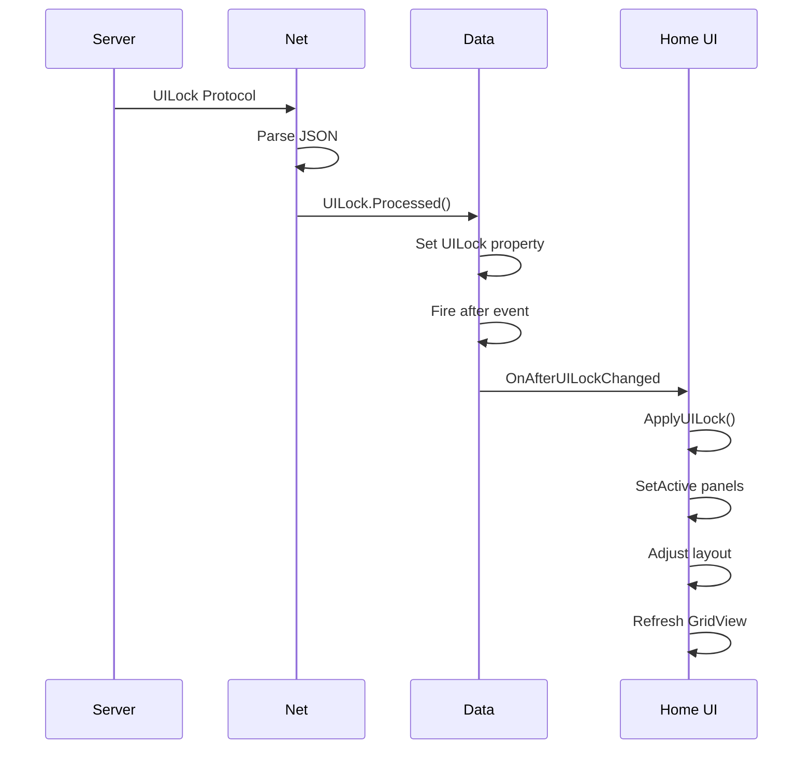
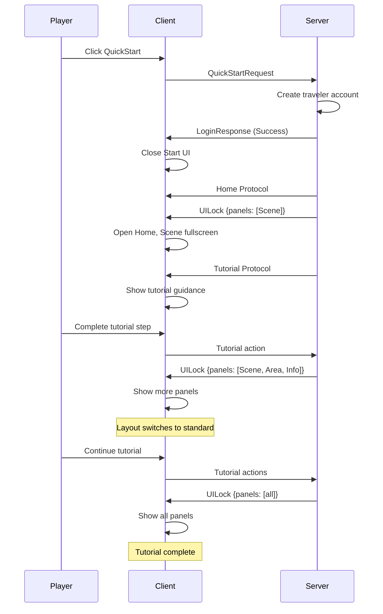

# UI渐进式显示系统（UILock）

支持Home界面子面板的渐进式显示，配合Tutorial系统实现新手教程的UI渐现体验。通过服务器推送UILock协议控制哪些面板可见，实现从"纯地图"到"完整UI"的平滑过渡。

## 设计理念

**核心思路**：新手初次进入游戏时，只显示地图面板（全屏），随着教程推进，逐步解锁其他UI面板。

**设计目标**：
1. 降低新手认知负担（避免一次性展示所有UI）
2. 情境化引导（在需要时才显示对应功能）
3. 平滑过渡体验（布局动态调整）

---

## UILock协议

### 协议定义

**位置**：`Assets/Game/Scripts/Network/Protocol.cs`

```csharp
public class UILock : Base
{
    public List<string> unlockedPanels;
    
    public override void Processed()
    {
        Game.Data.Instance.UILock = this;
    }
}
```

### 协议格式

```json
{
  "unlockedPanels": [
    "Home.Scene",
    "Home.Area",
    "Home.Information",
    "Home.Resource",
    "Home.Chat"
  ]
}
```

### 面板命名规范

**格式**：`{界面名}.{子面板名}`

**当前支持的面板**（Home界面）：
- `Home.Scene` - 地图面板
- `Home.Area` - 角色列表面板
- `Home.Information` - 信息面板
- `Home.Resource` - 资源条面板
- `Home.Chat` - 聊天面板

**扩展性**：未来可支持其他界面，如 `Story.Skip`、`Initialize.Random` 等。

### 更新机制

**UILock采用全量更新**：
- 服务器每次推送完整的已解锁面板列表
- 客户端直接覆盖，无需维护状态
- 简化客户端实现，避免增量更新的复杂性

---

## Home界面子面板

### 面板布局

Home界面包含5个子面板，使用绝对布局（AbsoluteLayout）：

```csharp
private void ApplyAbsoluteLayout()
{
    const float GoldenRatio = 0.618f;
    
    float screenWidth = GetComponent<RectTransform>().rect.width;
    float screenHeight = GetComponent<RectTransform>().rect.height;
    float sceneSize = screenWidth * GoldenRatio;
    float resourceHeight = UnitHeight * 1.5f;
    float fixedHeight = UnitHeight * 3.5f + sceneSize;
    float informationHeight = screenHeight - fixedHeight;

    SetRect("Chat", 0, UnitHeight * 2, screenWidth);
    SetRect("Information", UnitHeight * 2, informationHeight, screenWidth);
    SetRect("Scene", UnitHeight * 2 + informationHeight, sceneSize, sceneSize);
    SetRect("Area", UnitHeight * 2 + informationHeight, sceneSize, screenWidth - sceneSize, sceneSize);
    SetRect("Resource", screenHeight - resourceHeight, resourceHeight, screenWidth);
}
```

### 标准布局说明

**Chat面板**：顶部，占据2个单位高度
**Information面板**：Chat下方，动态高度（填充剩余空间）
**Scene面板**：正方形区域（宽度 * 0.618），左侧
**Area面板**：Scene右侧，与Scene同高
**Resource面板**：底部资源条，1.5个单位高度

### 全屏Scene布局

当只解锁Scene面板时，使用全屏布局：

```csharp
private void ApplyFullScreenSceneLayout()
{
    float screenWidth = GetComponent<RectTransform>().rect.width;
    float screenHeight = GetComponent<RectTransform>().rect.height;
    
    // Scene全屏
    SetRect("Scene", 0, screenHeight, screenWidth, 0);
    
    // 更新Scene的GridView
    var sceneGridView = transform.Find("Scene").GetComponent<LoopGridView>();
    if (sceneGridView != null)
    {
        sceneGridView.ItemSize = CalculateFillLayout();
        sceneGridView.RefreshAllShownItem();
    }
}
```

---

## ApplyUILock实现

### 核心逻辑

**位置**：`Assets/Game/Scripts/UI/Home.cs`

```csharp
private void ApplyUILock()
{
    var uiLock = Data.Instance.UILock;
    
    // If no UILock or empty list, show all panels (compatible with old players)
    if (uiLock == null || uiLock.unlockedPanels == null || uiLock.unlockedPanels.Count == 0)
    {
        SetAllPanelsVisible(true);
        ApplyAbsoluteLayout();
        return;
    }
    
    // Check which panels are unlocked
    bool sceneUnlocked = uiLock.unlockedPanels.Contains("Home.Scene");
    bool areaUnlocked = uiLock.unlockedPanels.Contains("Home.Area");
    bool infoUnlocked = uiLock.unlockedPanels.Contains("Home.Information");
    bool resourceUnlocked = uiLock.unlockedPanels.Contains("Home.Resource");
    bool chatUnlocked = uiLock.unlockedPanels.Contains("Home.Chat");
    
    // Set panel visibility
    transform.Find("Scene").gameObject.SetActive(sceneUnlocked);
    transform.Find("Area").gameObject.SetActive(areaUnlocked);
    transform.Find("Information").gameObject.SetActive(infoUnlocked);
    transform.Find("Resource").gameObject.SetActive(resourceUnlocked);
    transform.Find("Chat").gameObject.SetActive(chatUnlocked);
    
    // Adjust layout based on unlocked state
    if (sceneUnlocked && !areaUnlocked && !infoUnlocked && !resourceUnlocked && !chatUnlocked)
    {
        // Only Scene: fullscreen layout
        ApplyFullScreenSceneLayout();
    }
    else
    {
        // Other cases: standard layout
        ApplyAbsoluteLayout();
    }
}
```

### 向后兼容

**兼容策略**：UILock为null或空列表时，显示所有面板

**适用场景**：
- 老玩家登录（服务器不推送UILock）
- 教程已完成的玩家
- 开发测试模式

**实现**：
```csharp
if (uiLock == null || uiLock.unlockedPanels == null || uiLock.unlockedPanels.Count == 0)
{
    SetAllPanelsVisible(true);
    ApplyAbsoluteLayout();
    return;
}
```

### 运行时响应

**监听机制**：Home界面监听UILock变化，自动刷新

```csharp
// 在OnCreate中注册监听
Data.Instance.after.Register(Data.Type.UILock, OnAfterUILockChanged);

// 在OnClose中移除监听
Data.Instance.after.Unregister(Data.Type.UILock, OnAfterUILockChanged);

// 响应UILock变化
private void OnAfterUILockChanged(params object[] args)
{
    ApplyUILock();
}
```

**特点**：
- 教程推进时，服务器推送新的UILock
- 客户端自动响应，动态显示/隐藏面板
- 布局自动调整（全屏 ↔ 标准）

---

## 教程阶段示例

### 阶段1：纯地图体验

**服务器推送**：
```json
{
  "unlockedPanels": ["Home.Scene"]
}
```

**客户端表现**：
- Scene面板全屏显示
- 其他面板隐藏
- 玩家专注于探索地图

### 阶段2：解锁角色和信息

**服务器推送**：
```json
{
  "unlockedPanels": [
    "Home.Scene",
    "Home.Area",
    "Home.Information"
  ]
}
```

**客户端表现**：
- Scene缩小到标准尺寸（黄金比例）
- Area面板出现在右侧
- Information面板出现在上方
- Resource和Chat仍隐藏

### 阶段3：教程完成

**服务器推送**：
```json
{
  "unlockedPanels": [
    "Home.Scene",
    "Home.Area",
    "Home.Information",
    "Home.Resource",
    "Home.Chat"
  ]
}
```

**客户端表现**：
- 所有面板显示
- 标准布局
- 完整功能可用

---

## 与Tutorial系统配合

### Tutorial推送时机

**Tutorial系统**（`Assets/Game/Scripts/UI/Tutorial.cs`）负责教程引导，服务器在教程关键节点推送UILock：

1. **教程开始**：推送只有Scene的UILock
2. **完成地图探索**：推送解锁Area和Information
3. **学会交互**：推送解锁Resource
4. **学会聊天**：推送解锁Chat
5. **教程完成**：推送完整列表

### 推送策略

**推荐策略**：
- 在教程步骤完成时推送UILock
- 配合Tutorial高亮引导玩家注意新面板
- 避免频繁推送（影响性能）

**示例流程**：
```
服务器 → Tutorial（高亮地图） → 玩家探索
       ↓
服务器 → UILock（解锁Area） → Tutorial（引导查看角色）
       ↓
玩家点击角色 → 学会交互
       ↓
服务器 → UILock（解锁Resource） → Tutorial（引导查看资源）
       ↓
...继续教程
```

---

## 布局切换逻辑

### 切换条件

**全屏Scene布局触发条件**：
```csharp
if (sceneUnlocked && !areaUnlocked && !infoUnlocked && !resourceUnlocked && !chatUnlocked)
{
    ApplyFullScreenSceneLayout();
}
```

**标准布局触发条件**：
- UILock为null（老玩家）
- 解锁了Scene以外的任意面板

### 布局参数对比

| 面板 | 全屏布局 | 标准布局 |
|------|---------|---------|
| Scene | (0, 0, screenWidth, screenHeight) | (x, y, sceneSize, sceneSize) |
| Area | 隐藏 | Scene右侧 |
| Information | 隐藏 | Scene上方 |
| Resource | 隐藏 | 底部 |
| Chat | 隐藏 | 顶部 |

### GridView刷新

**关键点**：布局切换时必须刷新GridView

```csharp
var sceneGridView = transform.Find("Scene").GetComponent<LoopGridView>();
sceneGridView.ItemSize = CalculateFillLayout();
sceneGridView.RefreshAllShownItem();
```

**原因**：
- CalculateFillLayout根据Scene面板尺寸计算网格大小
- 全屏时网格更大，需要重新计算

---

## 数据流

### 完整数据流程图



### 关键步骤

1. **服务器推送**：Tutorial系统决定推送时机
2. **协议解析**：Net.HandlePacket解析UILock协议
3. **数据更新**：UILock.Processed设置Data.Instance.UILock
4. **触发事件**：Data触发after事件
5. **UI响应**：Home.OnAfterUILockChanged调用ApplyUILock
6. **面板控制**：SetActive显示/隐藏面板
7. **布局调整**：根据解锁状态选择布局
8. **视图刷新**：刷新GridView适应新布局

---

## 实现细节

### 面板显示控制

**SetActive方法**：
```csharp
transform.Find("Scene").gameObject.SetActive(sceneUnlocked);
transform.Find("Area").gameObject.SetActive(areaUnlocked);
transform.Find("Information").gameObject.SetActive(infoUnlocked);
transform.Find("Resource").gameObject.SetActive(resourceUnlocked);
transform.Find("Chat").gameObject.SetActive(chatUnlocked);
```

**原理**：
- `SetActive(true)` - 显示面板
- `SetActive(false)` - 隐藏面板（不销毁，性能更好）

### 布局计算

**SetRect方法**（Home.cs第96-104行）：
```csharp
private void SetRect(string name, float y, float height, float width, float x = 0)
{
    var rect = transform.Find(name).GetComponent<RectTransform>();
    rect.anchorMin = Vector2.zero;
    rect.anchorMax = Vector2.zero;
    rect.pivot = Vector2.zero;
    rect.anchoredPosition = new Vector2(x, y);
    rect.sizeDelta = new Vector2(width, height);
}
```

**参数说明**：
- `name` - 子面板名称
- `y` - 垂直位置（从底部开始）
- `height` - 面板高度
- `width` - 面板宽度
- `x` - 水平位置（默认0，从左侧开始）

### 黄金比例应用

**Scene尺寸计算**：
```csharp
float sceneSize = screenWidth * 0.618f;  // 黄金比例
```

**布局分割**：
- Scene占据屏幕宽度的61.8%（黄金比例）
- Area占据剩余的38.2%

**设计理念**：遵循 `client-ui-layout-mathematics.mdc` 规则，使用黄金比例实现视觉和谐。

---

## 使用场景

### 场景1：新手教程

**流程**：
```
QuickStart登录 
  → UILock: [Home.Scene] 
  → 全屏地图，探索
  → Tutorial: 引导移动
  → UILock: [Home.Scene, Home.Area, Home.Information]
  → 标准布局，学习角色交互
  → ...继续教程
  → UILock: [完整列表]
  → 所有功能解锁
```

### 场景2：老玩家登录

**流程**：
```
传统登录
  → 服务器不推送UILock（或推送完整列表）
  → 客户端显示所有面板
  → 标准布局，直接游戏
```

### 场景3：中途断线重连

**流程**：
```
教程进行中断线
  → 重新连接
  → 服务器推送当前教程阶段的UILock
  → 客户端恢复正确的UI状态
```

---

## 性能考虑

### 优化措施

1. **SetActive vs Destroy**：
   - 使用SetActive隐藏（不销毁GameObject）
   - 避免频繁创建/销毁的开销
   - 快速切换面板显示

2. **GridView刷新**：
   - 仅在布局切换时刷新
   - 使用RefreshAllShownItem（只刷新可见项）

3. **避免频繁推送**：
   - 服务器在教程关键节点推送
   - 不要每个步骤都推送UILock

### 性能影响

**布局切换成本**：
- SetActive操作：~0.1ms
- GridView刷新：~1-2ms
- 总计：~2ms（可忽略）

**推荐推送频率**：每个教程大阶段推送一次（2-3次即可完成整个教程）

---

## 调试技巧

### 查看UILock状态

**方法1：Unity Inspector**
1. 运行时选择Data GameObject
2. 查看raw字典中的UILock条目
3. 展开unlockedPanels列表

**方法2：控制台日志**
```csharp
Utils.Debug.Log("Home", $"Applying UILock: {Data.Instance.UILock?.unlockedPanels?.Count ?? 0} panels unlocked");
```

### 手动测试UILock

在Unity编辑器运行时，可通过代码手动触发UILock：

```csharp
// 只显示Scene
var uiLock = new Game.Protocol.UILock { 
    unlockedPanels = new List<string> { "Home.Scene" } 
};
Game.Data.Instance.UILock = uiLock;

// 部分解锁
var uiLock2 = new Game.Protocol.UILock { 
    unlockedPanels = new List<string> { 
        "Home.Scene", "Home.Area", "Home.Information" 
    } 
};
Game.Data.Instance.UILock = uiLock2;

// 完全解锁（或测试老玩家）
Game.Data.Instance.UILock = null;
```

### 常见问题排查

**问题1：UILock不生效**
- 检查面板名称是否正确（必须是`Home.Scene`格式）
- 确认Home界面已注册UILock监听
- 查看控制台是否有错误

**问题2：布局错乱**
- 检查屏幕适配值
- 验证SetRect参数
- 尝试不同分辨率测试

**问题3：GridView显示异常**
- 确认在布局切换后调用了RefreshAllShownItem
- 检查ItemSize计算是否正确

---

## 扩展性设计

### 支持其他界面

UILock系统支持扩展到其他界面：

**示例：Story界面**
```json
{
  "unlockedPanels": [
    "Home.Scene",
    "Home.Area",
    "Story.Skip",       // 跳过按钮
    "Story.Auto"        // 自动播放按钮
  ]
}
```

**实现方式**：
1. 在对应界面（如Story.cs）中注册UILock监听
2. 实现ApplyUILock方法
3. 根据面板名称控制显示

### 命名规范

**格式**：`{界面名}.{功能名}`
- 界面名：Unity Hierarchy中的GameObject名称
- 功能名：功能的英文描述（简洁、语义化）

**示例**：
- `Home.Scene` - Home界面的Scene面板
- `Story.Skip` - Story界面的跳过按钮
- `Option.Shop` - Option面板的商店功能

---

## 与QuickStart的配合

### 完整流程



### 设计配合

**QuickStart**：解决"如何快速进入游戏"
**UILock**：解决"进入后如何降低认知负担"

两者配合实现：
1. 零门槛开始（QuickStart）
2. 渐进式学习（UILock + Tutorial）
3. 自然过渡到完整游戏

---

## 总结

UI渐进式显示系统通过以下机制实现新手友好体验：

1. **UILock协议**：服务器控制面板解锁
2. **动态显示**：SetActive控制面板可见性
3. **布局切换**：全屏Scene ↔ 标准布局
4. **运行时响应**：监听Data变化自动刷新
5. **向后兼容**：老玩家不受影响

**核心优势**：
- 降低新手认知负担
- 配合教程渐进式引导
- 服务器完全控制UI显示逻辑
- 客户端实现简单高效

这种设计符合客户端SDUI架构理念，服务器驱动UI，客户端只负责渲染。
