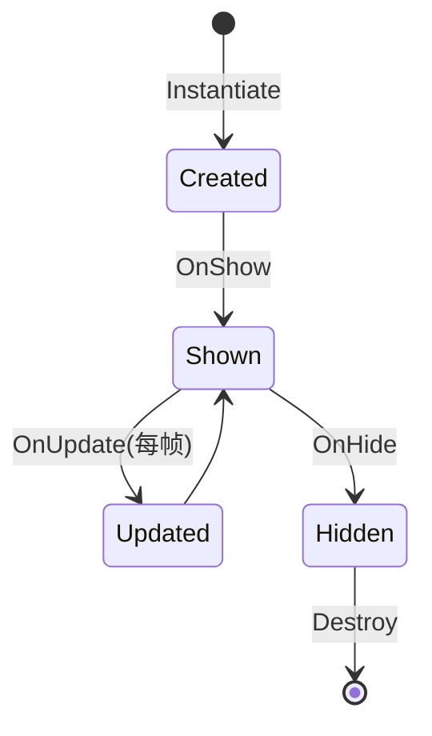

# UI系统（UI）

负责客户端所有界面的管理，包括界面注册、打开/关闭、层级管理、生命周期控制等功能。

## 系统概述

UI系统提供：
- **界面管理**：注册、打开、关闭、层级管理
- **生命周期**：OnShow、OnHide、OnUpdate回调
- **通用组件**：OptionButton、OptionDropdown等复用组件
- **布局系统**：基于单位高度的响应式布局

**核心文件**：
- `Assets/Game/Scripts/UI/Core/UI.cs`：UI管理器
- `Assets/Game/Scripts/UI/Common/`：通用组件
- `Assets/Game/Scripts/UI/[Module]/`：具体界面模块

---

## UI（管理器）

**UI** 是界面管理的单例类，负责统一管理所有界面。

### UI 管理器功能

```csharp
public partial class UI : Singleton<UI>
{
    // 初始化UI系统
    public void Init(float designWidth, float designHeight);
    
    // 打开界面
    public void Open((string, string, int, bool) config, object data = null);
    
    // 关闭界面
    public void Close((string, string, int, bool) config);
    
    // 获取界面实例
    public T Get<T>() where T : UIBase;
}
```

### 初始化（Init）

```csharp
public void Init(float designWidth, float designHeight)
{
    // 设置设计分辨率（9:16）
    this.designWidth = designWidth;
    this.designHeight = designHeight;
    
    // 初始化Canvas
    InitializeCanvas();
    
    // 注册Data监听
    RegisterDataListeners();
    
    Debug.Log($"[UI] Initialized: {designWidth}x{designHeight}");
}
```

### 打开界面（Open）

```csharp
public void Open((string, string, int, bool) config, object data = null)
{
    string name = config.Item1;
    string path = config.Item2;
    int sortingOrder = config.Item3;
    bool isOverlay = config.Item4;
    
    // 检查是否已打开
    if (openedUIs.ContainsKey(name))
    {
        Debug.LogWarning($"[UI] {name} is already opened");
        return;
    }
    
    // 加载预制体
    GameObject prefab = AssetManager.Instance.Load<GameObject>(path);
    GameObject instance = Instantiate(prefab, transform);
    
    // 获取UIBase组件
    UIBase uiBase = instance.GetComponent<UIBase>();
    if (uiBase == null)
    {
        Debug.LogError($"[UI] {name} does not have UIBase component");
        Destroy(instance);
        return;
    }
    
    // 设置层级
    Canvas canvas = instance.GetComponent<Canvas>();
    if (canvas != null)
    {
        canvas.sortingOrder = sortingOrder;
        canvas.overrideSorting = true;
    }
    
    // 记录已打开的界面
    openedUIs[name] = uiBase;
    
    // 调用OnShow
    uiBase.OnShow(data);
    
    Debug.Log($"[UI] Opened: {name}");
}
```

### 关闭界面（Close）

```csharp
public void Close((string, string, int, bool) config)
{
    string name = config.Item1;
    
    if (!openedUIs.TryGetValue(name, out UIBase uiBase))
    {
        Debug.LogWarning($"[UI] {name} is not opened");
        return;
    }
    
    // 调用OnHide
    uiBase.OnHide();
    
    // 销毁GameObject
    Destroy(uiBase.gameObject);
    
    // 移除记录
    openedUIs.Remove(name);
    
    Debug.Log($"[UI] Closed: {name}");
}
```

---

## UIBase（界面基类）

**UIBase** 是所有界面的基类，定义界面生命周期。

### UIBase 类定义

```csharp
public abstract class UIBase : MonoBehaviour
{
    // 界面显示时调用
    public virtual void OnShow(object data = null) { }
    
    // 界面隐藏时调用
    public virtual void OnHide() { }
    
    // 每帧更新（可选）
    public virtual void OnUpdate() { }
}
```

### 生命周期



### 界面实现示例

```csharp
public class Home : UIBase
{
    private Text playerName;
    private Text playerLevel;
    private Button settingsButton;
    
    void Awake()
    {
        // 获取组件引用
        playerName = transform.Find("PlayerInfo/Name").GetComponent<Text>();
        playerLevel = transform.Find("PlayerInfo/Level").GetComponent<Text>();
        settingsButton = transform.Find("Buttons/Settings").GetComponent<Button>();
        
        // 注册按钮事件
        settingsButton.onClick.AddListener(OnSettingsClick);
    }
    
    public override void OnShow(object data = null)
    {
        // 注册Data监听
        Data.Instance.after.Register(Data.Type.Home, OnHomeDataChanged);
        
        // 初始化显示
        UpdatePlayerInfo();
    }
    
    public override void OnHide()
    {
        // 移除Data监听
        Data.Instance.after.Unregister(Data.Type.Home, OnHomeDataChanged);
    }
    
    private void OnHomeDataChanged(params object[] args)
    {
        UpdatePlayerInfo();
    }
    
    private void UpdatePlayerInfo()
    {
        var home = Data.Instance.Home;
        if (home != null)
        {
            playerName.text = home.character.name;
            playerLevel.text = $"Lv.{home.character.level}";
        }
    }
    
    private void OnSettingsClick()
    {
        Game.Event.Instance.Fire(UI.Event.Click);
        UI.Instance.Open(Config.UI.Settings);
    }
}
```

---

## 通用组件（Option*）

**通用组件**是可复用的UI组件，位于 `Assets/Game/Scripts/UI/Common/`。

### OptionButton（按钮组件）

**OptionButton** 是通用按钮组件，支持点击音效、状态切换。

```csharp
public class OptionButton : MonoBehaviour
{
    private Button button;
    
    void Awake()
    {
        button = GetComponent<Button>();
        button.onClick.AddListener(OnClick);
    }
    
    private void OnClick()
    {
        // 触发点击音效
        Game.Event.Instance.Fire(UI.Event.Click);
        
        // 触发自定义事件
        OnButtonClick?.Invoke();
    }
    
    public System.Action OnButtonClick;
}
```

### OptionDropdown（下拉菜单组件）

**OptionDropdown** 是通用下拉菜单组件。

```csharp
public class OptionDropdown : MonoBehaviour
{
    private Dropdown dropdown;
    
    void Awake()
    {
        dropdown = GetComponent<Dropdown>();
        dropdown.onValueChanged.AddListener(OnValueChanged);
    }
    
    private void OnValueChanged(int value)
    {
        OnDropdownChanged?.Invoke(value);
    }
    
    public System.Action<int> OnDropdownChanged;
}
```

### 使用示例

```csharp
// 使用OptionButton
OptionButton confirmButton = GetComponent<OptionButton>();
confirmButton.OnButtonClick = () => {
    Debug.Log("Confirm clicked");
    ConfirmAction();
};

// 使用OptionDropdown
OptionDropdown languageDropdown = GetComponent<OptionDropdown>();
languageDropdown.OnDropdownChanged = (index) => {
    ChangeLanguage(index);
};
```

---

## 主要界面模块

### Start（启动界面）

**Start** 界面负责服务器选择和账号选择。

**位置**：`Assets/Game/Scripts/UI/Start/`

**功能**：
- 显示服务器列表
- 选择服务器
- 选择账号
- 进入游戏

### Initialize（初始化界面）

**Initialize** 界面负责角色创建。

**位置**：`Assets/Game/Scripts/UI/Initialize/`

**功能**：
- 输入角色名
- 随机名字
- 确认创建

### Home（主界面）

**Home** 界面是游戏的主界面。

**位置**：`Assets/Game/Scripts/UI/Home/`

**功能**：
- 显示玩家信息
- 显示地图
- 显示角色
- 交互按钮

### Story（剧情界面）

**Story** 界面负责显示剧情对话。

**位置**：`Assets/Game/Scripts/UI/Story/`

**功能**：
- 显示对话文本
- 角色立绘
- 选项按钮
- 自动播放

### Loading（加载界面）

**Loading** 界面显示加载进度。

**位置**：`Assets/Game/Scripts/UI/Loading/`

**功能**：
- 显示加载进度条
- 显示提示文本
- 旋转动画

---

## UI配置（Config.UI）

### UI配置格式

UI配置使用元组格式：`(name, path, sortingOrder, isOverlay)`

```csharp
public static class UI
{
    // (名称, 预制体路径, 层级顺序, 是否覆盖)
    public static readonly (string, string, int, bool) Dark = 
        ("Dark", "Prefabs/UI/Dark", 100, true);
    
    public static readonly (string, string, int, bool) Start = 
        ("Start", "Prefabs/UI/Start", 0, false);
    
    public static readonly (string, string, int, bool) Home = 
        ("Home", "Prefabs/UI/Home", 0, false);
    
    public static readonly (string, string, int, bool) Story = 
        ("Story", "Prefabs/UI/Story", 10, true);
    
    public static readonly (string, string, int, bool) Loading = 
        ("Loading", "Prefabs/UI/Loading", 90, true);
}
```

### 配置参数说明

- **name**：界面名称，用于标识界面
- **path**：预制体路径（相对于Assets/）
- **sortingOrder**：Canvas 层级顺序（数字越大越在上层）
- **isOverlay**：是否覆盖其他界面（true 表示弹窗类界面）

---

## 布局系统

### 单位高度系统

客户端采用单位高度系统，基于设计分辨率 9:16：

```csharp
public const float UnitHeight = 1f;  // 单位高度
public const float DesignWidth = 9f;   // 设计宽度（9个单位）
public const float DesignHeight = 16f;  // 设计高度（16个单位）
```

**单位换算**：
```csharp
// 屏幕高度对应16个单位
float pixelPerUnit = Screen.height / 16f;

// 1个单位 = Screen.height / 16 像素
// 例如：1920x1080屏幕，1个单位 = 120像素
```

### 黄金比例

UI元素布局遵循黄金比例（φ ≈ 1.618）：

```csharp
public const float GoldenRatio = 1.618f;

// 示例：按钮宽高比
float buttonWidth = 100f;
float buttonHeight = buttonWidth / GoldenRatio;  // ≈ 61.8
```

详见规则：[client-ui-layout-mathematics](/Users/zhangxi/LOA-Client/trunk/.cursor/rules/client-ui-layout-mathematics.mdc)

---

## 数据监听

### UI 监听 Data 变化

```csharp
void Awake()
{
    // 监听Home数据变化
    Data.Instance.after.Register(Data.Type.Home, OnHomeDataChanged);
    
    // 监听UI锁定状态
    Data.Instance.after.Register(Data.Type.UILock, OnUILockChanged);
    
    // 监听提示信息
    Data.Instance.after.Register(Data.Type.Tip, OnTipChanged);
}

private void OnHomeDataChanged(params object[] args)
{
    var home = Data.Instance.Home;
    UpdateUI(home);
}

private void OnUILockChanged(params object[] args)
{
    var locks = Data.Instance.UILock;
    UpdateLockState(locks);
}

private void OnTipChanged(params object[] args)
{
    var tip = Data.Instance.Tip;
    ShowTip(tip.type, tip.message);
}
```

---

## 最佳实践

### 1. 在OnShow中注册监听

```csharp
public override void OnShow(object data = null)
{
    // 注册监听
    Data.Instance.after.Register(Data.Type.Home, OnHomeDataChanged);
}

public override void OnHide()
{
    // 移除监听
    Data.Instance.after.Unregister(Data.Type.Home, OnHomeDataChanged);
}
```

### 2. 使用Config.UI打开界面

```csharp
// ✅ 推荐：使用配置
UI.Instance.Open(Config.UI.Home);

// ❌ 不推荐：硬编码
UI.Instance.Open(("Home", "Prefabs/UI/Home", 0, false));
```

### 3. 按钮点击触发事件

```csharp
button.onClick.AddListener(() => {
    Game.Event.Instance.Fire(UI.Event.Click);  // 触发点击音效
    OnButtonAction();
});
```

### 4. 使用通用组件

```csharp
// ✅ 推荐：使用通用组件
OptionButton button = GetComponent<OptionButton>();
button.OnButtonClick = OnConfirm;

// ❌ 不推荐：每个界面都实现一遍
Button rawButton = GetComponent<Button>();
rawButton.onClick.AddListener(() => {
    Audio.Instance.Play(Config.Audio.Click);
    OnConfirm();
});
```

---

## 调试技巧

### 1. 查看已打开的界面

```csharp
void Update()
{
    if (Input.GetKeyDown(KeyCode.F2))
    {
        Debug.Log($"[UI] Opened UIs: {string.Join(", ", openedUIs.Keys)}");
    }
}
```

### 2. UI层级检查

```csharp
foreach (var kvp in openedUIs)
{
    Canvas canvas = kvp.Value.GetComponent<Canvas>();
    Debug.Log($"[UI] {kvp.Key}: sortingOrder={canvas.sortingOrder}");
}
```

### 3. 强制刷新UI

```csharp
void Update()
{
    if (Input.GetKeyDown(KeyCode.F3))
    {
        RefreshAllUI();
    }
}
```

---

## 总结

UI系统通过以下模块实现完整的界面管理：

1. **UI管理器**：统一管理所有界面的打开/关闭
2. **UIBase基类**：定义界面生命周期
3. **通用组件**：提供可复用的UI组件
4. **配置系统**：集中管理UI配置

**核心特性**：
- 生命周期管理：OnShow/OnHide/OnUpdate
- 数据驱动：监听Data变化自动更新UI
- 层级管理：通过sortingOrder控制显示顺序
- 组件复用：通用组件提升开发效率

这种设计确保了UI的灵活性和可维护性。
