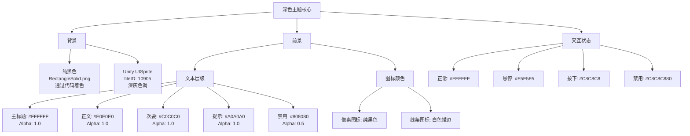
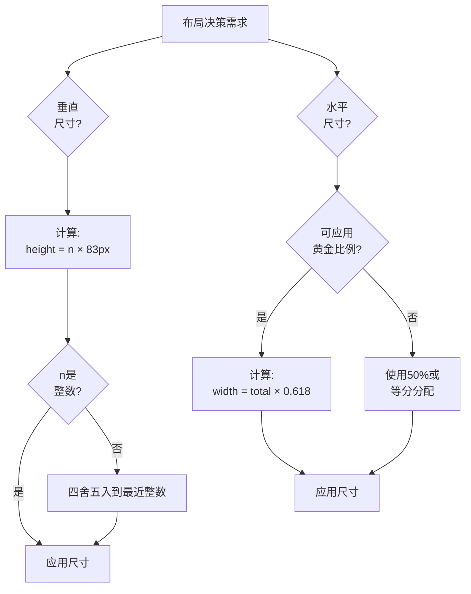

# UI设计风格分析

## 概述

本文档基于实际的视觉资源、代码实现和设计规范，分析LOA客户端项目的UI设计风格。

### 核心设计哲学

> **"UI设计是数学证明，而非艺术创作。"**

本项目采用系统化、数据驱动的界面设计方法，优先考虑一致性、可复现性和数学和谐性，而非主观美学。

### 设计目标

- **一致性**：数学约束确保所有屏幕的视觉连贯性
- **效率**：最小化自定义资源，减少包体积，提升热更新性能
- **可维护性**：程序化色彩系统支持快速迭代，无需重新制作资源
- **可访问性**：高对比度深色主题减少长时间使用的视觉疲劳
- **独特性**：复古像素艺术美学在竞争激烈的市场中脱颖而出

---

## 视觉风格定义

### 1. 极简主义（Minimalism）

**核心原则**：拒绝装饰性元素，采用纯粹的几何形状。

**代表性资源：**

| 图片预览 | 图片名称 | 视觉特征 |
|---------|---------|---------|
|  | **RectangleSolid.png** | 纯黑色圆角矩形（80x40），无渐变、无纹理 |
|  | **Sprite.png** | 纯白色矩形，用于进度条填充 |
|  | **Ring.png** | 简洁的圆环形状，透明背景 |
|  | **Radar.png** | 径向渐变黑色圆形，复杂度最低 |

**设计规则：**
- 无装饰性细节
- 仅使用纯色填充
- 几何形状保持简洁易识别
- 谨慎使用透明度进行图层叠加效果

**实现方式：**
```csharp
// 极简主义方法：单一资源 + 程序化着色
var background = AssetManager.Instance.LoadSprite("RawAssets/Texture", "RectangleSolid");
image.sprite = background;
image.color = new Color(0.2f, 0.2f, 0.2f, 1f); // 着色到所需颜色
```

### 2. 像素艺术美学（Pixel Art）

**核心原则**：拥抱低分辨率、网格对齐的艺术风格，致敬8-bit/16-bit时代游戏。

**代表性资源：**

<table>
<tr>
<td width="150" align="center">


**Increase.png**

</td>
<td width="150" align="center">


**Decrease.png**

</td>
<td width="150" align="center">


**Edit.png**

</td>
<td width="150" align="center">


**Focus.png**

</td>
</tr>
</table>

**Increase.png / Decrease.png**
- 加号/减号图标采用像素化设计
- 边缘锐利，具有可见的像素网格
- 纯黑白配色，无抗锯齿
- 双层轮廓增强视觉深度

**Edit.png**
- 铅笔图标，像素艺术风格
- 锯齿状边缘（齿轮装饰）
- 强烈的复古游戏美学

**Focus.png**
- 像素化的焦点指示器/准星图标
- 明显的8-bit游戏风格
- 高对比度黑白，无中间色调

**设计意图：**
- 向经典游戏美学致敬
- 增强科技感和数字感
- 降低制作成本，保持风格一致性
- 便于快速原型设计和迭代

**技术实现：**
- 所有像素艺术图标均为1024x1024以在高DPI下保持清晰边缘
- 无纹理过滤（Point模式）保持像素锐度
- 使用Alpha通道实现透明度，无渐变

### 3. 线条艺术技法（Line Art）

**核心原则**：使用一致的描边粗细定义形状，避免实心填充。

<table>
<tr>
<td width="200" align="center" style="background-color: #000000; padding: 20px;">


**Settings.png**

</td>
<td width="200" align="center" style="background-color: #000000; padding: 20px;">


**RadiativeRing.png**

</td>
</tr>
</table>

**Settings.png - 齿轮图标**
- 细线条勾勒齿轮形状
- 多层同心线条营造深度感
- 白色透明背景，黑色线条
- 高对比度，瞬间可识别

**RadiativeRing.png - 辐射效果**
- 辐射状圆环效果
- 渐变和透明度营造光晕/发光效果
- 适合作为装饰性背景元素
- 用于Login和Initialize界面

**特点：**
- 整体线条粗细一致
- 避免实心填充（仅使用描边）
- 适合动画效果（旋转、脉冲）
- 在不同分辨率下缩放良好

### 4. 深色主题系统（Dark Theme）

**核心原则**：深色背景搭配浅色文本，减少视觉疲劳，营造现代美学。

**配色方案（来自Unity YAML）：**

```yaml
# 按钮状态颜色
m_Colors:
  m_NormalColor: {r: 1, g: 1, b: 1, a: 1}              # 纯白色
  m_HighlightedColor: {r: 0.96, g: 0.96, b: 0.96, a: 1} # 浅灰色 (245, 245, 245)
  m_PressedColor: {r: 0.78, g: 0.78, b: 0.78, a: 1}     # 中灰色 (200, 200, 200)
  m_SelectedColor: {r: 0.96, g: 0.96, b: 0.96, a: 1}    # 同高亮色
  m_DisabledColor: {r: 0.78, g: 0.78, b: 0.78, a: 0.5}  # 半透明灰
  m_ColorMultiplier: 1
  m_FadeDuration: 0.1
```

**文本颜色层级（全局统一）：**

| 角色 | RGBA | 十六进制 | 使用场景 |
|------|------|---------|---------|
| 主标题 | `rgba(255, 255, 255, 1)` | `#FFFFFF` | 主标题、重要标签 |
| 正文文本 | `rgba(224, 224, 224, 1)` | `#E0E0E0` | 标准可读内容 |
| 次要信息 | `rgba(192, 192, 192, 1)` | `#C0C0C0` | 辅助信息 |
| 提示文本 | `rgba(160, 160, 160, 1)` | `#A0A0A0` | 占位符、工具提示 |
| 禁用状态 | `rgba(128, 128, 128, 0.5)` | `#80808080` | 非交互元素 |

**背景系统：**
- `RectangleSolid.png` 本身为黑色，通过 `Image.color` 着色实现变化
- Unity内置 `UISprite (fileID: 10905)` 用于深色面板背景
- 所有文本使用白色系确保可读性

**优势：**
- 降低屏幕功耗（OLED显示屏）
- 减少长时间使用的视觉疲劳
- 营造专业/科技感氛围
- 改善对交互元素的关注

---

## 图标设计语言

### 像素图标

**风格特征：**
- 网格对齐像素，无抗锯齿
- 纯黑白（或单色）
- 粗体、易识别的形状
- 复古游戏美学

**图标清单：**

| 预览 | 图标 | 文件 | 尺寸 | 用途 | 风格注释 |
|------|------|------|------|------|---------|
|  | 增加 | Increase.png | 1024x1024 | 加号按钮（Home, OptionAmount） | 双层轮廓十字 |
|  | 减少 | Decrease.png | 1024x1024 | 减号按钮（Home, OptionAmount） | 双层轮廓减号 |
|  | 编辑 | Edit.png | 1024x1024 | 编辑按钮（StartSettings） | 像素化铅笔，锯齿边缘 |
|  | 焦点 | Focus.png | - | 焦点指示器（Home） | 准星/目标图标，8-bit风格 |

**设计指南：**
- 在所有缩放级别保持像素网格对齐
- 使用双层轮廓增加深度和可见性
- 保持图标复杂度低（小尺寸下可读）
- 避免颜色填充（依赖轮廓）

### 线条艺术图标

**风格特征：**
- 平滑曲线和一致的描边粗细
- 轮廓形式，无实心填充
- 更高分辨率以保留细节
- 适合动画

**图标清单：**

| 预览 | 图标 | 文件 | 尺寸 | 用途 | 风格注释 |
|------|------|------|------|------|---------|
|  | 设置 | Settings.png | 2048x2048 | 设置按钮（Start） | 多层齿轮，细线条 |
|  | 辐射环 | RadiativeRing.png | - | 装饰效果（Login, Initialize） | 渐变光晕，带透明度 |

**设计指南：**
- 保持线条粗细一致（原生分辨率下2-3px）
- 使用透明度实现分层效果
- 避免缩放不佳的过于复杂的细节
- 适合旋转动画

### 功能性图标

**风格特征：**
- 清晰的符号意义
- 高对比度可见性
- 最小视觉复杂度

**图标清单：**

| 预览 | 图标 | 文件 | 用途 | 风格注释 |
|------|------|------|------|---------|
|  | 对勾 | True.png | 确认标记（Story, OptionConfirm, Accounts） | 简单对勾，白色透明背景 |
|  | 错误 | False.png | 账号系统图标（Accounts, Account） | 符号表示 |
|  | 雷达 | Radar.png | 雷达可视化（OptionInput, Initialize） | 径向渐变圆形 |

### 装饰性元素

**风格特征：**
- 支持视觉层级
- 非交互
- 增强空间感知

**元素清单：**

| 预览 | 元素 | 文件 | 用途 | 风格注释 |
|------|------|------|------|---------|
|  | 圆环 | Ring.png | 点击效果、遮罩动画（Dark, ClickEffect） | 简单圆环，在Utils.cs中用于动态效果 |
|  | 边框 | Border.png | 边框装饰（Home） | 用于视觉分隔的框架元素 |

---

## 色彩系统

### 深色主题调色板



### 透明度使用原则

| Alpha值 | 使用场景 | 示例 |
|---------|---------|------|
| `1.0` | 完全可见，主要元素 | 主文本、实心背景 |
| `0.7` | 半透明叠加层 | Utils.cs中Ring.png叠加层 |
| `0.5` | 禁用状态 | 禁用按钮文本、非交互UI |
| `0.0` | 完全透明 | OptionButton背景（纯文本按钮） |

### 色彩应用规则

1. **禁止在UI代码中使用RGB颜色字面量** - 始终引用集中式色彩系统
2. **文本颜色由层级决定** - 而非主观偏好
3. **背景通过程序着色** - `RectangleSolid.png` + `Image.color` 乘法
4. **维持对比度** - 最低4.5:1符合WCAG AA标准

---

## 布局数学

### 单位高度系统（83px量子化网格）

**起源：** iPhone 6/7/8标准屏幕高度（1334px）÷ 16 = 83.375px ≈ 83px

**核心规则：** 所有垂直尺寸必须是83px的整数倍。

**理论依据：**
- 强制量子化，消除任意像素值
- 通过一致的间距确保视觉和谐
- 简化响应式设计（缩放网格，而非单个元素）
- 减少布局设计中的决策疲劳

**实现方式：**

```csharp
// 理论单位高度常量
private const float UnitHeight = 83f;

// UI元素高度
float titleHeight = UnitHeight * 1;      // 83px
float contentHeight = UnitHeight * 4;    // 332px
float buttonHeight = UnitHeight * 1;     // 83px
float screenHeight = UnitHeight * 16;    // 1328px ≈ 1334px
```

**垂直布局示例：**

```
┌─────────────────────┐
│  标题栏 (1单位)      │  83px
├─────────────────────┤
│                     │
│  内容区域            │  
│  (8单位)            │  664px
│                     │
│                     │
├─────────────────────┤
│  按钮 (1单位)        │  83px
└─────────────────────┘
总计: 10单位 = 830px
```

### 黄金比例（φ ≈ 0.618）

**应用领域：**
- 水平面板宽度分配
- 边距比例
- 嵌套布局递归

**代码常量：**

```csharp
private const float GoldenRatio = 0.618f;        // φ
private const float GoldenRatioSmall = 0.382f;   // 1 - φ
```

**水平布局示例：**

```
┌───────────────────────┬──────────────┐
│                       │              │
│   主内容面板           │   侧边栏      │
│   (φ = 0.618)         │ (1-φ = 0.382)│
│                       │              │
└───────────────────────┴──────────────┘
    屏幕宽度的61.8%         屏幕宽度的38.2%
```

**递归应用：**

```csharp
float screenWidth = GetComponent<RectTransform>().rect.width;
float mainPanelWidth = screenWidth * GoldenRatio;      // 61.8%
float sidebarWidth = screenWidth * GoldenRatioSmall;   // 38.2%

// 进一步分割主面板
float leftSection = mainPanelWidth * GoldenRatio;      // 屏幕的38.2%
float rightSection = mainPanelWidth * GoldenRatioSmall; // 屏幕的23.6%
```

### 数学化设计决策树



---

## 动画与特效风格

### 淡入淡出过渡

**标准时长：** 0.1秒（100毫秒）

```yaml
m_FadeDuration: 0.1
```

**理论依据：**
- 足够快以感觉响应迅速
- 足够慢以可感知（不突兀）
- 所有UI交互保持一致

**应用场景：**
- 按钮状态变化（Normal → Highlighted → Pressed）
- 面板显示/隐藏过渡
- 文本颜色变化

### 点击反馈系统

**视觉反馈链：**

1. **即时：** 按钮颜色变为 `m_PressedColor`（0ms）
2. **动态：** Ring.png叠加层在点击位置生成（通过Utils.cs:94）
3. **淡出：** Ring叠加层在0.3-0.5秒内淡出
4. **完成：** 按钮恢复正常状态（0.1s淡入淡出）

**实现方式（Utils.cs）：**

```csharp
var img = obj.AddComponent<Image>();
img.sprite = AssetManager.Instance.LoadSprite("RawAssets/Texture", "Ring");
img.color = new Color(1, 1, 1, 0.7f);  // 白色，70%不透明度
img.raycastTarget = false;  // 不阻挡后续点击
```

### 粒子效果

**ClickEffect.prefab：**
- 使用 `Ring.png` 作为粒子纹理
- 径向扩张并淡出
- 出现在Dark叠加层和交互元素中
- 为用户操作创建触觉反馈

**RadiativeRing效果：**
- Login/Initialize中的静态背景装饰
- 缓慢旋转动画（如果有动画）
- 增强空间深度感知
- 非交互，纯美学

---

## 资源复用策略

### 优先级层次

1. **Unity内置Sprite**（最高优先级）
   - `UISprite (fileID: 10905)` - 白色方块
   - `Checkmark (fileID: 10901)` - 对勾图标
   - `Background (fileID: 10907)` - 滑块背景
   - `Knob (fileID: 10911)` - 圆形旋钮
   - `InputFieldBackground (fileID: 10917)` - 输入框背景

2. **自定义资源 + 程序化着色**
   - `RectangleSolid.png` 通过 `Image.color` 着色
   - 单一资源 → 无限颜色变化

3. **独特自定义资源**（最低优先级，谨慎使用）
   - 仅当Unity内置和颜色着色不足时使用
   - 示例：Settings齿轮图标、像素艺术UI元素

### 优势

**包体积：**
- 当前：21个PNG文件，16个在使用
- Unity内置：0字节（引擎提供）
- 热更新下载：仅修改的自定义资源

**性能：**
- Unity内置Sprite经过GPU优化
- 自定义资源单一图集
- 通过批处理减少绘制调用

**可维护性：**
- 颜色变化通过代码（无需重新导出资源）
- 跨所有实例一致的视觉更新
- 简化设计师/开发者协作

### 实现示例

```csharp
// Unity内置sprite（包中0字节）
image.sprite = Resources.GetBuiltinResource<Sprite>("UI/Skin/UISprite.psd");
image.color = new Color(0.2f, 0.2f, 0.2f, 1f);  // 深灰色

// vs

// 自定义sprite（增加包体积）
image.sprite = AssetManager.Instance.LoadSprite("RawAssets/Texture", "RectangleSolid");
image.color = new Color(0.2f, 0.2f, 0.2f, 1f);  // 相同视觉效果
```

**决策规则：** 仅当内置无法实现所需形状时使用自定义sprite（例如圆角、特定图标）。

---

## 设计风格总结

### 核心关键词

1. **极简主义（Minimalism）** - 拒绝不必要的装饰
2. **像素艺术（Pixel Art）** - 拥抱复古游戏美学
3. **数学化（Mathematical）** - 数据驱动、可复现的决策
4. **深色主题（Dark Theme）** - 现代、护眼的界面
5. **系统化（Systematic）** - 通过约束实现一致性

### 风格标签

**复古未来主义程序化极简风格**（Retro-Futuristic Procedural Minimalism）

- **复古（Retro）：** 像素艺术图标，8-bit美学
- **未来（Futuristic）：** 深色主题，简洁几何形状
- **程序化（Procedural）：** 颜色着色，数学化布局
- **极简（Minimalism）：** 无装饰细节，纯粹功能性

### 与现代设计趋势的比较

| 方面 | 本项目 | Material Design | iOS Human Interface |
|------|--------|-----------------|---------------------|
| 色彩系统 | 程序化着色 | 预定义调色板 | 动态颜色提取 |
| 布局 | 数学化（83px, φ） | 8dp网格 | 灵活间距 |
| 图标 | 像素艺术 + 线条艺术 | Material Icons（填充/轮廓） | SF Symbols（权重变体） |
| 主题 | 仅深色 | 明暗支持 | 自适应（自动切换） |
| 动画 | 快速（0.1s） | 中速（0.2-0.3s） | 上下文相关 |
| 哲学 | "数学证明" | "Material隐喻" | "清晰、尊重、深度" |

### 与游戏UI设计趋势的关系

**相似之处：**
- 深色主题在现代游戏中常见（尤其是RPG、策略游戏）
- 像素艺术在独立游戏中复兴
- HUD极简主义增强玩家沉浸感

**差异之处：**
- 游戏UI通常使用拟物化元素（皮革、金属纹理）
- 本项目完全避免纹理
- 无diegetic UI元素（世界内屏幕）

---

## 设计决策与技术约束

### 热更新资源限制

**约束：** 最小化热更新包体积以实现更快下载。

**对设计的影响：**
- 严格限制自定义PNG资源（当前共21个）
- 强烈偏好Unity内置sprite
- 通过代码实现颜色变化，而非分离资源
- 图标跨多个上下文复用（例如Ring.png用于点击效果、加载动画、叠加层）

**结果：** 资源使用率76.2%（16/21资源在使用，5个未使用）

### 性能优化

**约束：** 在中端移动设备上保持60fps。

**对设计的影响：**
- 无复杂的Alpha混合效果
- 粒子效果保持最小（ClickEffect使用单一sprite）
- 偏好静态背景而非动画渐变
- 颜色着色比纹理交换更高效

**结果：** UI渲染通常 < 每帧2ms

### 跨平台适配

**约束：** 用单一代码库支持iOS、Android和PC。

**对设计的影响：**
- 单位高度系统（83px）在不同分辨率间按比例缩放
- 黄金比例布局适应宽高比变化
- 触摸目标最小83px × 83px（1单位正方形）
- 无平台特定UI样式（统一外观）

**结果：** 所有平台上的一致体验

### 代码驱动的设计哲学

**约束：** UI必须可热更新，无需应用商店重新提交。

**对设计的影响：**
- 所有UI布局在代码/prefab中（无原生iOS/Android UI）
- 色彩方案在代码中定义，易于修改
- 文本本地化通过服务器驱动协议
- 登录后界面采用SDUI（Server-Driven UI）

**结果：** 上线后0次强制更新（所有变更通过热更新）

---

## 未来设计方向建议

### 优化机会

1. **整合未使用资源**
   - 当前5个未使用的PNG文件：Circle.png、CircleOutline.png、Author.png、ICON.png、wheelgradient.png
   - 需要决策：删除或记录未来使用场景

2. **消除重复资源**
   - `RectangleSolid - 副本.png` 在OptionRadar.prefab中使用
   - 替换为原始 `RectangleSolid.png` 引用

3. **图标统一**
   - 标准化为像素艺术或线条艺术（目前混用）
   - 建议：保留两者，但明确记录使用上下文

### 潜在扩展

1. **色彩主题变体**
   - 当前：仅深色主题
   - 未来：浅色主题选项（反转文本/背景颜色）
   - 实现：代码中单一布尔开关

2. **无障碍增强**
   - 高对比度模式（增加颜色差异）
   - 更大文字尺寸选项（字号乘以1.25x）
   - 色盲友好调色板（避免仅用红绿指示）

3. **动画丰富度**
   - 当前：简单淡入淡出和颜色过渡
   - 未来：按钮弹性缓动、视差背景
   - 约束：保持性能预算

4. **粒子系统扩展**
   - 当前：基础ClickEffect
   - 未来：上下文粒子（成功=绿色火花，错误=红色闪光）
   - 使用现有Ring.png配合颜色着色

### 需避免的风格一致性陷阱

1. **不要不一致地引入渐变**
   - 当前：仅RadiativeRing和Radar使用渐变（仅装饰）
   - 如在其他地方添加渐变，需建立清晰使用规则

2. **不要违反单位高度系统**
   - 容易在代码中手动设置 `height = 100px`
   - 始终使用 `UnitHeight * n` 公式

3. **不要添加高分辨率照片纹理**
   - 会与像素艺术/极简美学冲突
   - 如需纹理，使用程序化图案（点、线）

4. **不要引入过多自定义资源**
   - 每个新PNG增加热更新大小
   - 始终检查：Unity内置sprite + 颜色着色能实现吗？

---

## 附录：视觉参考

### 色彩调色板参考

**文本颜色（深色背景上）：**

| 色块 | 颜色代码 | 用途 | RGB值 |
|------|---------|------|-------|
| <span style="display:inline-block;width:50px;height:20px;background-color:#FFFFFF;border:1px solid #000;"></span> | `#FFFFFF` | 主标题 | (255, 255, 255, 1.0) |
| <span style="display:inline-block;width:50px;height:20px;background-color:#E0E0E0;border:1px solid #000;"></span> | `#E0E0E0` | 正文文本 | (224, 224, 224, 1.0) |
| <span style="display:inline-block;width:50px;height:20px;background-color:#C0C0C0;border:1px solid #000;"></span> | `#C0C0C0` | 次要信息 | (192, 192, 192, 1.0) |
| <span style="display:inline-block;width:50px;height:20px;background-color:#A0A0A0;border:1px solid #000;"></span> | `#A0A0A0` | 提示文本 | (160, 160, 160, 1.0) |
| <span style="display:inline-block;width:50px;height:20px;background-color:#808080;border:1px solid #000;"></span> | `#808080` | 禁用 | (128, 128, 128, 0.5) |

**交互状态：**

| 色块 | 颜色代码 | 状态 | RGB值 |
|------|---------|------|-------|
| <span style="display:inline-block;width:50px;height:20px;background-color:#FFFFFF;border:1px solid #000;"></span> | `#FFFFFF` | 正常 | (255, 255, 255, 1.0) |
| <span style="display:inline-block;width:50px;height:20px;background-color:#F5F5F5;border:1px solid #000;"></span> | `#F5F5F5` | 高亮 | (245, 245, 245, 1.0) |
| <span style="display:inline-block;width:50px;height:20px;background-color:#C8C8C8;border:1px solid #000;"></span> | `#C8C8C8` | 按下 | (200, 200, 200, 1.0) |
| <span style="display:inline-block;width:50px;height:20px;background-color:rgba(200,200,200,0.5);border:1px solid #000;"></span> | `#C8C8C880` | 禁用 | (200, 200, 200, 0.5) |

### 布局网格可视化

```
单位高度系统（83px网格）：

0px   ┬─────────────────────────┐
      │      标题栏              │
83px  ├─────────────────────────┤
      │                         │
      │                         │
      │    内容区域              │
      │     (8单位)             │
      │                         │
      │                         │
      │                         │
747px ├─────────────────────────┤
      │    按钮行                │
830px ┴─────────────────────────┘
```

### 黄金比例布局示例

```
水平分割：
┌───────────────────────┬──────────────┐
│                       │              │
│   主内容              │   侧边栏      │
│   (φ = 0.618)         │ (1-φ = 0.382)│
│                       │              │
└───────────────────────┴──────────────┘
    宽度的61.8%             宽度的38.2%
```

---

## 相关文档

- [UI图片资源使用规范](UI图片资源使用规范.md) - 详细的资源清单和使用跟踪
- [UI系统](UI系统.md) - UI管理器架构和生命周期
- [数据管理系统](数据管理系统.md) - SDUI数据流和状态管理
- [本地化系统](本地化系统.md) - 多语言文本渲染

---

**文档版本：** 1.0  
**最后更新：** 2026-02-11  
**作者：** 系统分析（基于代码库检查的AI生成）
