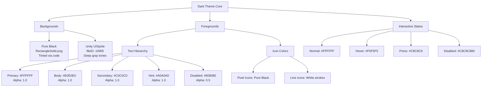
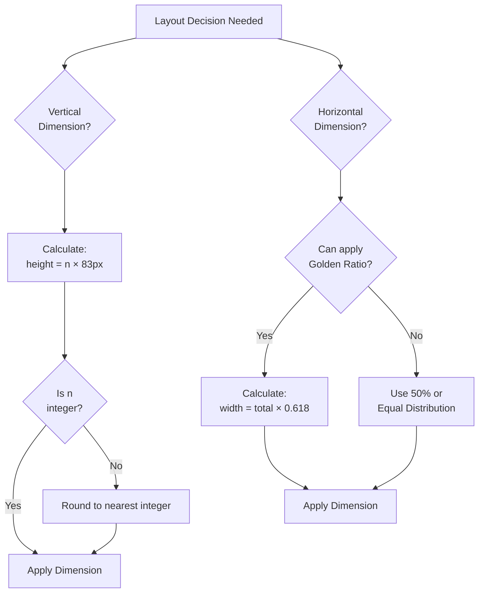

# UI Design Style Analysis

## Overview

This document analyzes the UI design style of the LOA Client project based on actual visual assets, code implementation, and documented design specifications.

### Core Design Philosophy

> **"UI design is mathematical proof, not artistic creation."**

The project adopts a systematic, data-driven approach to interface design, prioritizing consistency, reproducibility, and mathematical harmony over subjective aesthetics.

### Design Goals

- **Consistency**: Mathematical constraints ensure visual coherence across all screens
- **Efficiency**: Minimal custom assets reduce package size and improve hot-update performance
- **Maintainability**: Programmatic color systems enable rapid iteration without asset recreation
- **Accessibility**: High-contrast dark theme reduces eye strain during extended use
- **Distinctiveness**: Retro pixel art aesthetic differentiates the product in a crowded market

---

## Visual Style Definition

### 1. Minimalism

**Core Principle**: Reject decorative elements in favor of pure geometric forms.

**Representative Assets:**

| Image | Visual Characteristics |
|-------|----------------------|
| **RectangleSolid.png** | Pure black rounded rectangle (80x40), no gradients, no textures |
| **Sprite.png** | Pure white rectangle for progress bar fills |
| **Ring.png** | Simple circular ring shape with transparent background |
| **Radar.png** | Radial gradient black circle, minimal complexity |

**Design Rules:**
- No ornamental details
- Solid color fills only
- Geometric shapes kept simple and recognizable
- Transparency used sparingly for layering effects

**Implementation:**
```csharp
// Minimalist approach: single asset with programmatic coloring
var background = AssetManager.Instance.LoadSprite("RawAssets/Texture", "RectangleSolid");
image.sprite = background;
image.color = new Color(0.2f, 0.2f, 0.2f, 1f); // Tint to desired color
```

### 2. Pixel Art Aesthetic

**Core Principle**: Embrace low-resolution, grid-aligned artwork reminiscent of 8-bit/16-bit era games.

**Representative Assets:**

**Increase.png / Decrease.png**
- Plus/minus icons with pixelated design
- Sharp edges with visible pixel grid
- Pure black-and-white, no anti-aliasing
- Double outline layers for visual depth

**Edit.png**
- Pencil icon in pixel art style
- Jagged edges (gear-tooth decoration)
- Strong retro game aesthetic

**Focus.png**
- Pixelated focus indicator/crosshair icon
- Obvious 8-bit game style
- High contrast black-and-white, no intermediate tones

**Design Intent:**
- Pay homage to classic game aesthetics
- Enhance technological/digital feel
- Reduce production costs while maintaining style consistency
- Facilitate quick prototyping and iteration

**Technical Implementation:**
- All pixel art icons are 1024x1024 to preserve crisp edges at high DPI
- No texture filtering (Point mode) to maintain pixel sharpness
- Alpha channel for transparency, no gradients

### 3. Line Art Technique

**Core Principle**: Use consistent stroke weights to define forms without solid fills.

**Settings.png - Gear Icon**
- Fine lines outline the gear shape
- Multiple concentric lines create depth perception
- White transparent background, black lines
- High contrast for instant recognition

**RadiativeRing.png - Radiating Effect**
- Radiating circular ring effect
- Gradients and transparency create halo/glow
- Suitable as decorative background element
- Used in Login and Initialize screens

**Characteristics:**
- Consistent line weight throughout
- Avoid solid fills (use strokes only)
- Ideal for animated effects (rotation, pulsing)
- Scales well across different resolutions

### 4. Dark Theme System

**Core Principle**: Dark backgrounds with light text for reduced eye strain and modern aesthetic.

**Color Scheme (from Unity YAML):**

```yaml
# Button State Colors
m_Colors:
  m_NormalColor: {r: 1, g: 1, b: 1, a: 1}              # Pure white
  m_HighlightedColor: {r: 0.96, g: 0.96, b: 0.96, a: 1} # Light gray (245, 245, 245)
  m_PressedColor: {r: 0.78, g: 0.78, b: 0.78, a: 1}     # Medium gray (200, 200, 200)
  m_SelectedColor: {r: 0.96, g: 0.96, b: 0.96, a: 1}    # Same as highlighted
  m_DisabledColor: {r: 0.78, g: 0.78, b: 0.78, a: 0.5}  # Semi-transparent gray
  m_ColorMultiplier: 1
  m_FadeDuration: 0.1
```

**Text Color Hierarchy (Universal):**

| Role | RGBA | Hex | Use Case |
|------|------|-----|----------|
| Primary Title | `rgba(255, 255, 255, 1)` | `#FFFFFF` | Main headings, important labels |
| Body Text | `rgba(224, 224, 224, 1)` | `#E0E0E0` | Standard readable content |
| Secondary Info | `rgba(192, 192, 192, 1)` | `#C0C0C0` | Supporting information |
| Hint Text | `rgba(160, 160, 160, 1)` | `#A0A0A0` | Placeholders, tooltips |
| Disabled State | `rgba(128, 128, 128, 0.5)` | `#80808080` | Non-interactive elements |

**Background System:**
- `RectangleSolid.png` is black, tinted via `Image.color` for variety
- Unity built-in `UISprite (fileID: 10905)` for dark panel backgrounds
- All text uses white-based colors to ensure readability

**Advantages:**
- Reduces screen power consumption (OLED displays)
- Decreases visual fatigue during extended use
- Creates professional/technological atmosphere
- Improves focus on interactive elements

---

## Icon Design Language

### Pixel Icons

**Style Characteristics:**
- Grid-aligned pixels, no anti-aliasing
- Pure black-and-white (or monochrome)
- Bold, easily recognizable shapes
- Retro gaming aesthetic

**Icon Inventory:**

| Icon | File | Size | Usage | Style Notes |
|------|------|------|-------|-------------|
| Increase | Increase.png | 1024x1024 | Plus button (Home, OptionAmount) | Double-outlined cross |
| Decrease | Decrease.png | 1024x1024 | Minus button (Home, OptionAmount) | Double-outlined minus |
| Edit | Edit.png | 1024x1024 | Edit button (StartSettings) | Pixelated pencil with jagged edges |
| Focus | Focus.png | - | Focus indicator (Home) | Crosshair/target icon, 8-bit style |

**Design Guidelines:**
- Maintain pixel grid alignment at all scales
- Use double outlines for depth and visibility
- Keep icon complexity low (readable at small sizes)
- Avoid color fills (rely on silhouette)

### Line Art Icons

**Style Characteristics:**
- Smooth curves and consistent stroke weights
- Outlined forms without solid fills
- Higher resolution for detail preservation
- Suitable for animation

**Icon Inventory:**

| Icon | File | Size | Usage | Style Notes |
|------|------|------|-------|-------------|
| Settings | Settings.png | 2048x2048 | Settings button (Start) | Multi-layer gear with fine lines |
| Radiative Ring | RadiativeRing.png | - | Decorative effect (Login, Initialize) | Gradient halo with transparency |

**Design Guidelines:**
- Keep line weight consistent (2-3px at native resolution)
- Use transparency for layered effects
- Avoid overly complex details that don't scale well
- Ideal for rotation animations

### Functional Icons

**Style Characteristics:**
- Clear symbolic meaning
- High contrast for visibility
- Minimal visual complexity

**Icon Inventory:**

| Icon | File | Usage | Style Notes |
|------|------|-------|-------------|
| True | True.png | Checkmark (Story, OptionConfirm, Accounts) | Simple checkmark, white on transparent |
| False | False.png | Account system icon (Accounts, Account) | Symbolic representation |
| Radar | Radar.png | Radar visualization (OptionInput, Initialize) | Radial gradient circle |

### Decorative Elements

**Style Characteristics:**
- Support visual hierarchy
- Non-interactive
- Enhance spatial perception

**Element Inventory:**

| Element | File | Usage | Style Notes |
|---------|------|-------|-------------|
| Ring | Ring.png | Click effects, mask animations (Dark, ClickEffect) | Simple circular ring, used in Utils.cs for dynamic effects |
| Border | Border.png | Border decoration (Home) | Frame element for visual separation |

---

## Color System

### Dark Theme Palette



### Transparency Usage Principles

| Alpha Value | Use Case | Example |
|-------------|----------|---------|
| `1.0` | Fully visible, primary elements | Main text, solid backgrounds |
| `0.7` | Semi-transparent overlays | Ring.png in Utils.cs overlay |
| `0.5` | Disabled states | Disabled button text, non-interactive UI |
| `0.0` | Completely transparent | OptionButton backgrounds (text-only buttons) |

### Color Application Rules

1. **Never use RGB color literals in UI code** - always reference the centralized color system
2. **Text color is determined by hierarchy** - not by subjective preference
3. **Backgrounds tinted programmatically** - `RectangleSolid.png` + `Image.color` multiplication
4. **Maintain contrast ratio** - minimum 4.5:1 for WCAG AA compliance

---

## Layout Mathematics

### Unit Height System (83px Quantum Grid)

**Origin:** iPhone 6/7/8 standard screen height (1334px) ÷ 16 = 83.375px ≈ 83px

**Core Rule:** All vertical dimensions must be integer multiples of 83px.

**Rationale:**
- Forces quantization, eliminating arbitrary pixel values
- Ensures visual harmony through consistent spacing
- Simplifies responsive design (scale grid, not individual elements)
- Reduces decision fatigue during layout design

**Implementation:**

```csharp
// Theoretical unit height constant
private const float UnitHeight = 83f;

// UI element heights
float titleHeight = UnitHeight * 1;      // 83px
float contentHeight = UnitHeight * 4;    // 332px
float buttonHeight = UnitHeight * 1;     // 83px
float screenHeight = UnitHeight * 16;    // 1328px ≈ 1334px
```

**Example Vertical Layout:**

```
┌─────────────────────┐
│  Title Bar (1 unit) │  83px
├─────────────────────┤
│                     │
│  Content Area       │  
│  (8 units)          │  664px
│                     │
│                     │
├─────────────────────┤
│  Button (1 unit)    │  83px
└─────────────────────┘
Total: 10 units = 830px
```

### Golden Ratio (φ ≈ 0.618)

**Application Areas:**
- Horizontal panel width distribution
- Margin proportions
- Nested layout recursion

**Code Constants:**

```csharp
private const float GoldenRatio = 0.618f;        // φ
private const float GoldenRatioSmall = 0.382f;   // 1 - φ
```

**Example Horizontal Layout:**

```
┌───────────────┬──────────┐
│               │          │
│  Main Panel   │  Sidebar │
│  (61.8%)      │  (38.2%) │
│               │          │
└───────────────┴──────────┘
```

**Recursive Application:**

```csharp
float screenWidth = GetComponent<RectTransform>().rect.width;
float mainPanelWidth = screenWidth * GoldenRatio;      // 61.8%
float sidebarWidth = screenWidth * GoldenRatioSmall;   // 38.2%

// Further divide main panel
float leftSection = mainPanelWidth * GoldenRatio;      // 38.2% of screen
float rightSection = mainPanelWidth * GoldenRatioSmall; // 23.6% of screen
```

### Mathematical Design Decision Tree



---

## Animation and Effects Style

### Fade Transitions

**Standard Duration:** 0.1 seconds (100ms)

```yaml
m_FadeDuration: 0.1
```

**Rationale:**
- Quick enough to feel responsive
- Slow enough to be perceptible (not jarring)
- Consistent across all UI interactions

**Application:**
- Button state changes (Normal → Highlighted → Pressed)
- Panel show/hide transitions
- Text color changes

### Click Feedback System

**Visual Feedback Chain:**

1. **Instant:** Button color changes to `m_PressedColor` (0ms)
2. **Dynamic:** Ring.png overlay spawned at click position (via Utils.cs:94)
3. **Fade Out:** Ring overlay fades over 0.3-0.5 seconds
4. **Completion:** Button returns to Normal state (0.1s fade)

**Implementation (Utils.cs):**

```csharp
var img = obj.AddComponent<Image>();
img.sprite = AssetManager.Instance.LoadSprite("RawAssets/Texture", "Ring");
img.color = new Color(1, 1, 1, 0.7f);  // White with 70% opacity
img.raycastTarget = false;  // Don't block further clicks
```

### Particle Effects

**ClickEffect.prefab:**
- Uses `Ring.png` as particle texture
- Radial expansion with fade-out
- Appears in Dark overlay and interactive elements
- Creates tactile feedback for user actions

**RadiativeRing Effect:**
- Static background decoration in Login/Initialize
- Slow rotation animation (if animated)
- Enhances spatial depth perception
- Non-interactive, purely aesthetic

---

## Resource Reuse Strategy

### Priority Hierarchy

1. **Unity Built-in Sprites** (highest priority)
   - `UISprite (fileID: 10905)` - white square
   - `Checkmark (fileID: 10901)` - checkmark icon
   - `Background (fileID: 10907)` - slider background
   - `Knob (fileID: 10911)` - circular knob
   - `InputFieldBackground (fileID: 10917)` - input field background

2. **Custom Assets with Programmatic Coloring**
   - `RectangleSolid.png` tinted via `Image.color`
   - Single asset → infinite color variations

3. **Unique Custom Assets** (lowest priority, use sparingly)
   - Only when Unity built-ins and color tinting are insufficient
   - Examples: Settings gear icon, pixel art UI elements

### Benefits

**Package Size:**
- Current: 21 PNG files, 16 actively used
- Unity built-ins: 0 bytes (engine-provided)
- Hot-update download: only modified custom assets

**Performance:**
- Unity built-ins are GPU-optimized
- Single sprite atlas for custom assets
- Reduced draw calls through batching

**Maintainability:**
- Color changes via code (no asset re-export)
- Consistent visual updates across all instances
- Designer/developer collaboration simplified

### Implementation Example

```csharp
// Unity built-in sprite (0 bytes in package)
image.sprite = Resources.GetBuiltinResource<Sprite>("UI/Skin/UISprite.psd");
image.color = new Color(0.2f, 0.2f, 0.2f, 1f);  // Dark gray

// vs

// Custom sprite (adds to package size)
image.sprite = AssetManager.Instance.LoadSprite("RawAssets/Texture", "RectangleSolid");
image.color = new Color(0.2f, 0.2f, 0.2f, 1f);  // Same visual result
```

**Decision Rule:** Use custom sprite only if built-in cannot achieve desired shape (e.g., rounded corners, specific icon).

---

## Design Style Summary

### Core Keywords

1. **Minimalism** - Reject unnecessary decoration
2. **Pixel Art** - Embrace retro gaming aesthetic
3. **Mathematical** - Data-driven, reproducible decisions
4. **Dark Theme** - Modern, eye-friendly interface
5. **Systematic** - Consistency through constraints

### Style Label

**Retro-Futuristic Procedural Minimalism**

- **Retro:** Pixel art icons, 8-bit aesthetic
- **Futuristic:** Dark theme, clean geometric forms
- **Procedural:** Color tinting, mathematical layouts
- **Minimalism:** No ornamental details, pure functionality

### Comparison with Modern Trends

| Aspect | This Project | Material Design | iOS Human Interface |
|--------|--------------|-----------------|---------------------|
| Color System | Programmatic tinting | Predefined palette | Dynamic color extraction |
| Layout | Mathematical (83px, φ) | 8dp grid | Flexible spacing |
| Icons | Pixel art + Line art | Material Icons (filled/outlined) | SF Symbols (weight variants) |
| Theme | Dark only | Light/Dark support | Adaptive (auto-switch) |
| Animation | Fast (0.1s) | Medium (0.2-0.3s) | Context-dependent |
| Philosophy | "Math proof" | "Material metaphor" | "Clarity, Deference, Depth" |

### Relationship to Game UI Trends

**Similarities:**
- Dark themes common in modern games (especially RPGs, strategy)
- Pixel art revival in indie games
- HUD minimalism for player immersion

**Differences:**
- Game UIs often use skeuomorphic elements (leather, metal textures)
- This project avoids textures entirely
- No diegetic UI elements (in-world screens)

---

## Design Decisions and Technical Constraints

### Hot-Update Resource Limitations

**Constraint:** Minimize hot-update package size for faster downloads.

**Impact on Design:**
- Strict limit on custom PNG assets (currently 21 total)
- Strong preference for Unity built-in sprites
- Color variations achieved via code, not separate assets
- Icon reuse across multiple contexts (e.g., Ring.png for click effects, loading animations, overlays)

**Result:** Resource usage rate 76.2% (16/21 assets actively used, 5 unused)

### Performance Optimization

**Constraint:** Maintain 60fps on mid-range mobile devices.

**Impact on Design:**
- No complex alpha blending effects
- Particle effects kept minimal (ClickEffect uses single sprite)
- Static backgrounds preferred over animated gradients
- Color tinting more performant than texture swaps

**Result:** UI rendering typically < 2ms per frame

### Cross-Platform Adaptation

**Constraint:** Support iOS, Android, and PC with single codebase.

**Impact on Design:**
- Unit Height System (83px) scales proportionally across resolutions
- Golden Ratio layouts adapt to aspect ratio changes
- Touch targets minimum 83px × 83px (1 unit square)
- No platform-specific UI styles (unified appearance)

**Result:** Consistent experience across all platforms

### Code-Driven Design Philosophy

**Constraint:** UI must be hot-updatable without app store resubmission.

**Impact on Design:**
- All UI layouts in code/prefabs (no native iOS/Android UI)
- Color schemes defined in code, easily modified
- Text localization via server-driven protocol
- SDUI (Server-Driven UI) for post-login screens

**Result:** 0 force-updates after launch (all changes via hot-update)

---

## Future Design Direction Recommendations

### Optimization Opportunities

1. **Consolidate Unused Assets**
   - Currently 5 unused PNG files: Circle.png, CircleOutline.png, Author.png, ICON.png, wheelgradient.png
   - Decision needed: delete or document future use cases

2. **Eliminate Duplicate Assets**
   - `RectangleSolid - 副本.png` used in OptionRadar.prefab
   - Replace with original `RectangleSolid.png` reference

3. **Icon Unification**
   - Standardize on either pixel art or line art (currently mixed)
   - Recommendation: keep both, but document usage contexts clearly

### Potential Expansions

1. **Color Theme Variants**
   - Current: Dark theme only
   - Future: Light theme option (invert text/background colors)
   - Implementation: single boolean toggle in code

2. **Accessibility Enhancements**
   - High contrast mode (increase color difference)
   - Larger text size option (multiply font sizes by 1.25x)
   - Color-blind friendly palette (avoid red-green only indicators)

3. **Animation Richness**
   - Current: Simple fades and color transitions
   - Future: Elastic easing for buttons, parallax backgrounds
   - Constraint: maintain performance budget

4. **Particle System Expansion**
   - Current: Basic ClickEffect
   - Future: Contextual particles (success = green sparkles, error = red flash)
   - Use existing Ring.png with color tinting

### Style Consistency Pitfalls to Avoid

1. **Don't introduce gradients inconsistently**
   - Current: Only RadiativeRing and Radar use gradients (decorative only)
   - If adding gradients elsewhere, establish clear usage rules

2. **Don't violate Unit Height System**
   - Easy to manually set `height = 100px` in code
   - Always use `UnitHeight * n` formula

3. **Don't add high-resolution photographic textures**
   - Would clash with pixel art / minimalist aesthetic
   - If textures needed, use procedural patterns (dots, lines)

4. **Don't introduce too many custom assets**
   - Each new PNG increases hot-update size
   - Always check: can Unity built-in sprite + color tinting achieve this?

---

## Appendix: Visual Reference

### Color Palette Reference

```
Text Colors (on dark backgrounds):
███████ #FFFFFF  Primary Title (255, 255, 255, 1.0)
██████  #E0E0E0  Body Text (224, 224, 224, 1.0)
█████   #C0C0C0  Secondary Info (192, 192, 192, 1.0)
████    #A0A0A0  Hint Text (160, 160, 160, 1.0)
███     #808080  Disabled (128, 128, 128, 0.5)

Interactive States:
███████ #FFFFFF  Normal (255, 255, 255, 1.0)
██████  #F5F5F5  Highlighted (245, 245, 245, 1.0)
█████   #C8C8C8  Pressed (200, 200, 200, 1.0)
███     #C8C8C8  Disabled (200, 200, 200, 0.5)
```

### Layout Grid Visualization

```
Unit Height System (83px grid):

0px   ┬─────────────────────────┐
      │      Title Bar          │
83px  ├─────────────────────────┤
      │                         │
      │                         │
      │    Content Area         │
      │     (8 units)           │
      │                         │
      │                         │
      │                         │
747px ├─────────────────────────┤
      │    Button Row           │
830px ┴─────────────────────────┘
```

### Golden Ratio Layout Example

```
Horizontal Division:
┌───────────────────────┬──────────────┐
│                       │              │
│   Main Content        │   Sidebar    │
│   (φ = 0.618)         │ (1-φ = 0.382)│
│                       │              │
└───────────────────────┴──────────────┘
    61.8% of width         38.2% of width
```

---

## Related Documentation

- [UI Image Resource Usage Specification](UI图片资源使用规范.md) - Detailed asset inventory and usage tracking
- [UI System](UI系统.md) - UI manager architecture and lifecycle
- [Data Management System](数据管理系统.md) - SDUI data flow and state management
- [Localization System](本地化系统.md) - Multi-language text rendering

---

**Document Version:** 1.0  
**Last Updated:** 2026-02-11  
**Author:** System Analysis (AI-generated from codebase inspection)
