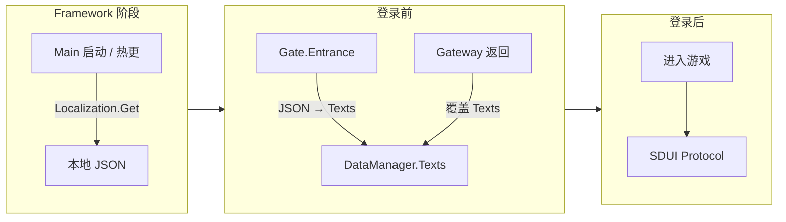

# 多语言系统

运行时只有两个核心文本源：**本地化文本**（`DataManager.Instance.Texts`）和**服务器文本**（SDUI Protocol）。本地 JSON 仅作为启动引导，在热更完成后立即写入 `DataManager.Instance.Texts`，后续被 Gateway 数据覆盖。

---

## 一、本地化文本（DataManager.Texts）

- **类型**：`Dictionary<string, string>`
- **取值**：`DataManager.Instance.GetText(key)`
- **生命周期**：
  1. **引导填充** — `Gate.Entrance` 调用 `Localization.Instance.GetAll()` 将本地 JSON 数据写入 `DataManager.Instance.Texts`，使热更代码在 Gateway 返回前即可取到 fallback 文案。
  2. **Gateway 覆盖** — Gateway 响应后，服务端按 `Accept-Language` 返回的 `texts` 字段整体覆盖 `DataManager.Instance.Texts`。
  3. **语言切换** — 用户在设置中切换语言时，先用 `Localization.Instance.Init(lang)` 重新加载 JSON，再写入 Texts，随后触发 Gateway 重新请求以获取服务端对应语言数据。
- **覆盖范围**：从 Gate.Entrance 开始直到登录成功之间的所有界面文案（Start、设置、账号弹窗、错误提示等）。

### 1. 本地 JSON（引导数据）

- **位置**：`Assets/Resources/Localization_{Language}.json`
- **定位**：纯引导数据，仅用于在 Gateway 尚未返回时提供 fallback。
- **使用者**：
  - `Framework.Main`（AOT 阶段）通过 `Localization.Instance.Get(key)` 直接读取。
  - `Gate.Entrance`（热更入口）通过 `Localization.Instance.GetAll()` 批量写入 `DataManager.Instance.Texts`。
- **约束**：热更代码**不直接**调用 `Localization.Instance.Get()`，统一走 `DataManager.Instance.GetText()`。

---

## 二、服务器文本（SDUI Protocol）

- **来源**：服务端通过各业务 Protocol 推送的界面数据（如 `Protocol.Home`、`Protocol.Option` 中的文案字段）。
- **覆盖范围**：登录后游戏内所有 UI 文本，客户端不硬编码，只渲染服务端下发的数据。
- **使用**：各界面在 `OnEnter` 等回调里从协议参数或 Data 层取文案并赋给 UI 组件。
