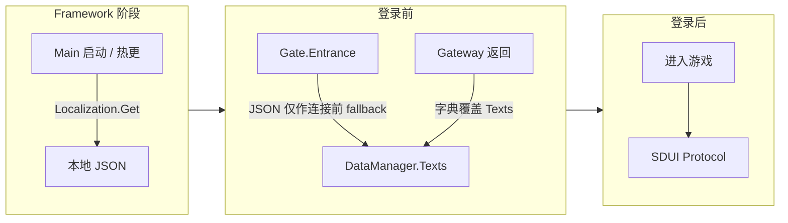

# 多语言系统（Localization）

多语言系统为登录前界面与游戏内 UI 提供运行时文案。运行时**以字典数据为准**：服务端下发的 **Texts**（`DataManager.Instance.Texts`）及 SDUI Protocol 为权威来源。**本地 JSON**（`Localization_{Language}.json`）仅提供客户端与服务器**连接之前**就需要的极少数多语言文本（如「载入中」「连接中」「解析错误」等），不作为主数据源。

**文本字典**（Texts）即服务端按语种下发的 key-value 集合，Gateway 返回后覆盖客户端持有的字典，登录后由各协议继续补充或覆盖。

**本地 JSON** 即 `Assets/Resources/Localization_{Language}.json`，仅在 Gateway 未返回前作为 fallback，热更代码不直接读取，统一通过 `DataManager.Instance.GetText(key)` 取文案。

---

## 一、本地化文本（DataManager.Texts）

登录前界面（Start、设置、账号弹窗等）的文案来源为 **Texts**。类型为 `Dictionary<string, string>`，通过 **取值方法**（GetText）即 `DataManager.Instance.GetText(key)` 获取。数据源以服务端为准：Gateway 按 `Accept-Language` 返回的 `texts` 覆盖客户端字典；语言切换时重新请求 Gateway，用新语种字典覆盖后再刷新界面。

### 1. 生命周期

1. **连接前 fallback** — **入口方法**（Gate.Entrance）用 **批量获取**（Localization.Instance.GetAll）将本地 JSON 写入 `DataManager.Instance.Texts`，仅在 Gateway 返回前显示极少数必要文案。
2. **Gateway 覆盖** — Gateway 响应后，服务端返回的 `texts` 整体覆盖 `DataManager.Instance.Texts`，此后以该字典为准。
3. **语言切换** — 用户切换语言时，触发 Gateway 重新请求（带新 `Accept-Language`），用服务端返回的新语种字典覆盖 **Texts**，再刷新界面。

### 2. 本地 JSON（连接前极少量数据）

- **位置**：`Assets/Resources/Localization_{Language}.json`
- **定位**：仅提供客户端与服务器连接之前就需要的极少数多语言文本，不作为主数据源。
- **使用者**：Framework 阶段由 **Main** 通过 `Localization.Instance.Get(key)` 直接读取；**Gate.Entrance** 通过 **批量获取**（GetAll）写入 **Texts**，仅在 Gateway 返回前作为 fallback。
- **约束**：热更代码不直接调用 `Localization.Instance.Get()`，统一走 `DataManager.Instance.GetText()`。

---

## 二、服务器文本（SDUI Protocol）

登录后游戏内所有 UI 文本以服务端下发的数据为准。服务端通过各业务 Protocol（如 **Protocol.Home**、**Protocol.Option**）推送界面数据中的文案字段；客户端不硬编码，在 **OnEnter** 等回调里从协议参数或 Data 层取文案并赋给 UI 组件。
