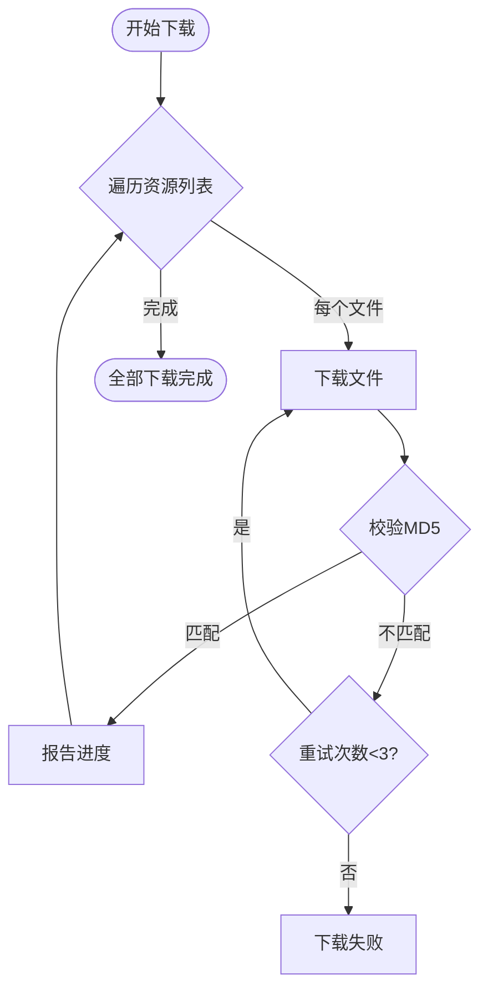

# 热更新系统（HotUpdate）

负责客户端的热更新功能，实现 0 强更（无需重新下载整个应用）。基于 HybridCLR 实现 C# 代码的动态加载。

## 系统概述

热更新系统提供完整的版本管理和资源更新能力，包括：
- 版本检查：对比本地与服务器版本
- 资源下载：增量下载 DLL 和资源
- 程序集加载：动态加载热更新代码
- 元数据管理：补充 AOT 泛型元数据

**核心文件**：
- `Assets/Framework/Hot.cs`：热更新管理器
- `Assets/Basic/Main.cs`：启动入口
- `Assets/Game/Scripts/Basic/Gate.cs`：热更新代码入口

---

## 版本检查（VersionCheck）

**版本检查**（Begin）是热更新流程的第一步，通过对比本地版本号和服务器版本号，决定是否需要下载更新。

### Begin 方法

```csharp
public void Begin(Action<bool, string, Dictionary<string, string>> callback)
{
    string versionUrl = $"{Url}/api/hot/version";
    Http.Instance.RequestGet(versionUrl, (success, content) =>
    {
        if (!success)
        {
            callback(false, "network_error", null);
            return;
        }

        try
        {
            var data = JsonUtility.FromJson<VersionResponse>(content);
            
            // 保存服务器版本
            PlayerPrefs.SetString("HOT_VERSION", data.version);
            PlayerPrefs.Save();
            
            // 对比版本
            callback(LocalVersion != data.version, null, texts);
        }
        catch (System.Exception ex)
        {
            Debug.LogError($"[Hot] Failed to parse version response: {ex.Message}");
            callback(false, "parse_error", null);
        }
    });
}
```

### 版本对比逻辑

**版本号存储**：
- `config.hotVersion`：打包时的本地版本号（硬编码在 Config.asset 中）
- `HOT_VERSION`：PlayerPrefs 中存储的服务器版本号

**对比规则**：
```csharp
bool needUpdate = LocalVersion != data.version;
```

- `LocalVersion == HOT_VERSION`：无需更新
- `LocalVersion != HOT_VERSION`：需要更新

### 版本号格式

版本号采用语义化版本格式：`major.minor.patch`

示例：
- `1.0.0`：初始版本
- `1.0.1`：小bug修复
- `1.1.0`：新增功能
- `2.0.0`：大版本更新

---

## 资源检查（ResourceCheck）

**资源检查**（Check）是在版本检查后执行，获取服务器资源列表，对比本地资源，找出需要下载的文件。

### Check 方法

```csharp
public void Check(Action<bool, List<Res>, Dictionary<string, string>> callback)
{
    string checkUrl = $"{Url}/api/hot/check";
    Http.Instance.RequestGet(checkUrl, (success, content) =>
    {
        if (!success)
        {
            Debug.LogError($"[Hot] Resource check request failed");
            callback(false, null, null);
            return;
        }

        try
        {
            var data = JsonUtility.FromJson<CheckResponse>(content);
            var allFiles = ParseResList(data.files);
            
            // 对比本地文件
            var resList = new List<Res>();
            foreach (var r in allFiles)
            {
                string localPath = GetLocalPath(r.name);
                if (!System.IO.File.Exists(localPath))
                {
                    resList.Add(r);  // 文件不存在，需要下载
                }
                else
                {
                    string localMd5 = File.GetFileMd5(localPath);
                    if (localMd5 != r.md5.ToLowerInvariant())
                    {
                        resList.Add(r);  // MD5不匹配，需要下载
                    }
                }
            }

            callback(resList.Count > 0, resList, texts);
        }
        catch (System.Exception ex)
        {
            Debug.LogError($"[Hot] Failed to parse check response: {ex.Message}");
            callback(false, null, null);
        }
    });
}
```

### 资源列表格式

服务器返回的资源列表（`files`字段）格式：

```
game.dll.bytes|a1b2c3d4e5f6|1024567
game.dll.pdb.bytes|b2c3d4e5f6a1|2048123
resdepend.txt|c3d4e5f6a1b2|512
mscorlib.dll.bytes|d4e5f6a1b2c3|3072456
```

每行格式：`文件名|MD5|大小（字节）`

### Res 类

**Res**（Resource）表示一个需要下载的资源文件：

```csharp
public class Res
{
    public string name;  // 文件名
    public string md5;   // MD5校验码
    public int size;     // 文件大小（字节）

    public Res(string line)
    {
        var parts = line.Split('|');
        name = parts[0];
        md5 = parts[1];
        size = int.Parse(parts[2]);
    }
}
```

### MD5 校验

**MD5校验码**（MD5）用于验证文件完整性：

- 下载后计算本地文件的 MD5
- 对比服务器提供的 MD5
- 不匹配则删除并重新下载

**计算方法**（`File.GetFileMd5`）：
```csharp
string localMd5 = File.GetFileMd5(localPath);
if (localMd5 != r.md5.ToLowerInvariant())
{
    System.IO.File.Delete(path);  // 删除损坏的文件
    // 重新下载...
}
```

---

## 资源下载（ResourceDownload）

**资源下载**（Downloads）是增量下载需要更新的文件，支持断点续传和失败重试。

### Downloads 方法

```csharp
public void Downloads(List<Res> resList, Action<bool, int, string> progressCallback)
{
    StartCoroutine(DownloadCoroutine(resList, progressCallback));
}

private IEnumerator DownloadCoroutine(List<Res> reses, Action<bool, int, string> progress)
{
    int already = 0;
    int total = reses.Sum(r => r.size);
    const int maxRetry = 3;

    foreach (var res in reses)
    {
        string url = $"{Url}/{Platform}/{res.name}";
        string path = GetLocalPath(res.name);

        int attempts = 0;
        bool success = false;

        while (attempts < maxRetry && !success)
        {
            bool finished = false;
            string error = null;
            int downloaded = 0;

            // 下载文件
            Http.Instance.RequestDownload(url, path, (ok, size, err) =>
            {
                finished = true;
                downloaded = size;
                error = err;
            });

            while (!finished) yield return null;

            if (!string.IsNullOrEmpty(error))
            {
                attempts++;
                yield return new WaitForSeconds(1f);
            }
            else
            {
                // 校验MD5
                string localMd5 = File.GetFileMd5(path);
                if (localMd5 != res.md5.ToLowerInvariant())
                {
                    System.IO.File.Delete(path);
                    attempts++;
                    yield return new WaitForSeconds(0.5f);
                }
                else
                {
                    already += downloaded;
                    progress(false, downloaded, null);  // 报告进度
                    success = true;
                }
            }
        }

        if (!success)
        {
            progress(false, 0, res.name);  // 下载失败
            yield break;
        }
    }

    progress(true, 0, null);  // 全部下载完成
}
```

### 下载流程图



### 下载特性

1. **失败重试**：
   - 最多重试 3 次
   - 每次重试间隔 1 秒

2. **MD5 校验**：
   - 下载后立即校验
   - 校验失败自动删除并重试

3. **进度报告**：
   ```csharp
   progress(false, downloaded, null);  // 单个文件下载完成
   progress(true, 0, null);            // 全部下载完成
   progress(false, 0, fileName);       // 下载失败
   ```

4. **平台区分**：
   - 下载 URL：`{Url}/{Platform}/{fileName}`
   - Platform：android、ios、windows

---

## 程序集加载（AssemblyLoad）

**程序集加载**（Load）是通过 HybridCLR 动态加载热更新代码（game.dll.bytes），并调用热更新入口。

### Load 方法

**位置**：`Assets/Basic/Main.cs`

```csharp
void StepLoad()
{
    SetDescription(_lang.Get("loading_game"));
    Hot.Instance.Load(config.Gateway, (success, error) =>
    {
        if (!success)
        {
            SetDescription(_lang.Get(error));
            return;
        }
        
        SetDescription(_lang.Get("initializing_game"));
        gameObject.SetActive(false);  // 隐藏启动界面
    });
}
```

### Hot.Load 实现

```csharp
public void Load(string gateway, Action<bool, string> callback)
{
    try
    {
        // 1. 加载元数据
        LoadMetadataForAOTAssembly("mscorlib.dll");
        LoadMetadataForAOTAssembly("System.dll");
        LoadMetadataForAOTAssembly("System.Core.dll");
        // ...更多元数据
        
        // 2. 加载 game.dll.bytes
        string dllPath = GetLocalPath("game.dll.bytes");
        byte[] dllBytes = System.IO.File.ReadAllBytes(dllPath);
        var assembly = System.Reflection.Assembly.Load(dllBytes);
        
        // 3. 反射调用 Gate.Entrance
        var gateType = assembly.GetType("Game.Gate");
        var entranceMethod = gateType.GetMethod("Entrance", 
            System.Reflection.BindingFlags.Public | System.Reflection.BindingFlags.Static);
        entranceMethod.Invoke(null, new object[] { gateway });
        
        callback(true, null);
    }
    catch (System.Exception ex)
    {
        Debug.LogError($"[Hot] Load failed: {ex.Message}");
        callback(false, "load_failed");
    }
}
```

### HybridCLR 工作原理

**HybridCLR** 是一个 Unity IL2CPP 的热更新解决方案：

1. **IL2CPP**：Unity 将 C# 代码编译为 C++，再编译为原生代码
2. **HybridCLR**：在 IL2CPP 基础上添加解释器，支持动态加载 DLL
3. **元数据补充**：补充 AOT 泛型元数据，支持反射和泛型

**加载过程**：
```
game.dll.bytes → Assembly.Load → 反射调用 Gate.Entrance → 热更新代码运行
```

---

## 元数据管理（MetadataManagement）

**元数据管理**（LoadMetadataForAOTAssembly）是 HybridCLR 的核心功能，用于补充 AOT 编译的元数据，支持泛型和反射。

### LoadMetadataForAOTAssembly 方法

```csharp
private void LoadMetadataForAOTAssembly(string dllName)
{
    string path = GetLocalPath(dllName + ".bytes");
    if (!System.IO.File.Exists(path))
    {
        Debug.LogWarning($"[Hot] Metadata file not found: {dllName}");
        return;
    }
    
    byte[] dllBytes = System.IO.File.ReadAllBytes(path);
    
    // 补充元数据
    HybridCLR.RuntimeApi.LoadMetadataForAOTAssembly(dllBytes, 
        HybridCLR.HomologousImageMode.SuperSet);
    
    Debug.Log($"[Hot] Loaded metadata: {dllName}");
}
```

### 需要加载的元数据

常见的元数据 DLL：
- `mscorlib.dll.bytes`：.NET 核心库
- `System.dll.bytes`：System 命名空间
- `System.Core.dll.bytes`：LINQ 等扩展
- `UnityEngine.CoreModule.dll.bytes`：Unity 核心模块
- `Google.Protobuf.dll.bytes`：Protobuf 库（如果使用泛型）

### 为什么需要元数据？

**AOT 编译的限制**：
- IL2CPP 在编译时生成 C++ 代码
- 泛型在编译时需要确定具体类型
- 运行时无法创建新的泛型实例

**元数据补充**：
- 提供泛型类型的元数据
- 支持运行时创建泛型实例
- 支持反射访问

**示例**：
```csharp
// 如果热更新代码中使用 List<CustomClass>
List<CustomClass> list = new List<CustomClass>();

// 需要加载 mscorlib.dll.bytes，提供 List<T> 的元数据
LoadMetadataForAOTAssembly("mscorlib.dll");
```

---

## 资源依赖管理

**资源依赖管理**（LoadAssetDependencies）是加载资源依赖关系文件（resdepend.txt），用于 AssetBundle 依赖管理。

### LoadAssetDependencies 方法

```csharp
public void LoadAssetDependencies()
{
    string path = GetLocalPath("resdepend.txt");
    if (System.IO.File.Exists(path))
    {
        string content = System.IO.File.ReadAllText(path);
        AssetManager.Instance.AddDependData(content);
    }
    else
    {
        Debug.LogWarning("resdepend.txt not found");
    }
}
```

### resdepend.txt 格式

资源依赖文件记录 AssetBundle 之间的依赖关系：

```
ui/home.bundle -> common/atlas.bundle
ui/home.bundle -> common/prefabs.bundle
ui/story.bundle -> common/atlas.bundle
```

格式：`依赖者 -> 被依赖者`

**作用**：
- AssetManager 在加载 AssetBundle 时，自动加载其依赖
- 避免资源丢失或加载失败

---

## 平台适配

### 平台识别

```csharp
private string Platform =>
#if UNITY_ANDROID
    "android";
#elif UNITY_IOS
    "ios";
#else
    "windows";
#endif
```

### 资源存储路径

**本地存储路径**：
```csharp
private string GetLocalPath(string fileName) => $"{FrameworkPath.Runtime}/{fileName}";
```

- Android：`/data/data/com.company.game/files/`
- iOS：`/var/mobile/Containers/Data/Application/.../Library/`
- Windows：`%USERPROFILE%\AppData\LocalLow\Company\Game\`

### 下载 URL

**服务器资源 URL**：
```
{BaseUrl}/{Platform}/{fileName}

示例：
http://example.com:8880/android/game.dll.bytes
http://example.com:8880/ios/game.dll.bytes
http://example.com:8880/windows/game.dll.bytes
```

---

## 错误处理

### 版本检查失败

**原因**：
- 网络连接失败
- 版本接口异常
- JSON 解析失败

**处理**：
```csharp
if (!success)
{
    callback(false, "network_error", null);
    return;
}

try
{
    var data = JsonUtility.FromJson<VersionResponse>(content);
    // ...
}
catch (System.Exception ex)
{
    Debug.LogError($"[Hot] Failed to parse version response: {ex.Message}");
    callback(false, "parse_error", null);
}
```

### 资源下载失败

**原因**：
- 网络连接中断
- 服务器不可用
- MD5 校验失败

**处理**：
```csharp
int attempts = 0;
const int maxRetry = 3;

while (attempts < maxRetry && !success)
{
    // 下载文件
    Http.Instance.RequestDownload(url, path, callback);
    
    // 校验MD5
    if (localMd5 != serverMd5)
    {
        System.IO.File.Delete(path);
        attempts++;
        yield return new WaitForSeconds(1f);  // 等待1秒后重试
    }
}

if (!success)
{
    progress(false, 0, fileName);  // 报告失败的文件名
}
```

### 程序集加载失败

**原因**：
- DLL 文件损坏
- 元数据缺失
- HybridCLR 配置错误
- 反射调用失败

**处理**：
```csharp
try
{
    // 加载元数据
    LoadMetadataForAOTAssembly("mscorlib.dll");
    
    // 加载程序集
    var assembly = System.Reflection.Assembly.Load(dllBytes);
    
    // 反射调用
    var entranceMethod = gateType.GetMethod("Entrance", ...);
    entranceMethod.Invoke(null, new object[] { gateway });
}
catch (System.Exception ex)
{
    Debug.LogError($"[Hot] Load failed: {ex.Message}\n{ex.StackTrace}");
    callback(false, "load_failed");
}
```

---

## 调试技巧

### 1. 跳过热更新（开发模式）

```csharp
#if UNITY_EDITOR
    // 在编辑器中直接加载本地 DLL
    Hot.Instance.LoadLocal();
#else
    // 在真机上执行热更新流程
    StepCheckVersion();
#endif
```

### 2. 查看热更新日志

```
[Hot] Begin: Checking version...
[Hot] LocalVersion: 1.0.0, ServerVersion: 1.0.1
[Hot] Check: Need update, 3 files
[Hot] Downloads: Downloading game.dll.bytes (1024567 bytes)
[Hot] Downloads: Downloaded game.dll.bytes (1024567/1024567)
[Hot] Load: Loading metadata...
[Hot] Load: Loaded metadata: mscorlib.dll
[Hot] Load: Loading assembly...
[Hot] Load: Calling Gate.Entrance...
```

### 3. 清除本地缓存

```csharp
// 清除 PlayerPrefs
PlayerPrefs.DeleteKey("HOT_VERSION");

// 清除本地文件
string runtimePath = FrameworkPath.Runtime;
if (System.IO.Directory.Exists(runtimePath))
{
    System.IO.Directory.Delete(runtimePath, true);
}
```

---

## 性能优化

### 1. 并行下载

当前是串行下载，可以改为并行提升速度：

```csharp
// 每次并行下载 5 个文件
for (int i = 0; i < downloadList.Count; i += 5)
{
    var batch = downloadList.Skip(i).Take(5);
    yield return DownloadBatch(batch);
}
```

### 2. 压缩传输

对 DLL 和资源进行 gzip 压缩，减少下载时间：

```csharp
// 服务器端压缩
byte[] compressedData = GZip.Compress(dllBytes);

// 客户端解压
byte[] dllBytes = GZip.Decompress(compressedData);
```

### 3. CDN 加速

将热更新资源部署到 CDN，提升全球访问速度。

---

## 总结

热更新系统通过以下模块实现 0 强更：

1. **版本检查**（Begin）：对比本地和服务器版本
2. **资源检查**（Check）：获取需要下载的文件列表
3. **资源下载**（Downloads）：增量下载 DLL 和资源
4. **程序集加载**（Load）：动态加载热更新代码
5. **元数据管理**（LoadMetadataForAOTAssembly）：补充 AOT 泛型元数据

整个流程通过 **Main.cs → Hot.cs → Gate.cs** 完成从启动到热更新代码执行的完整过渡。
