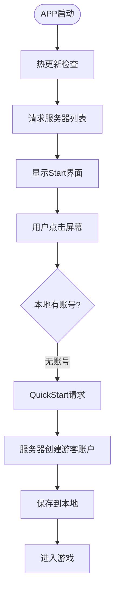
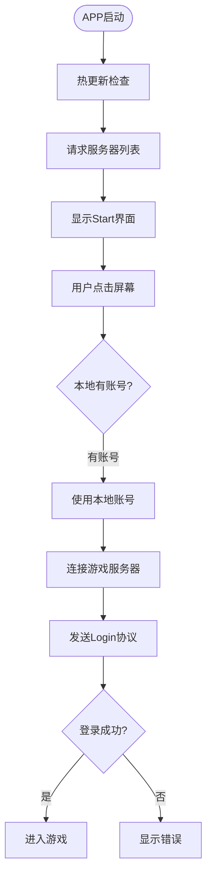
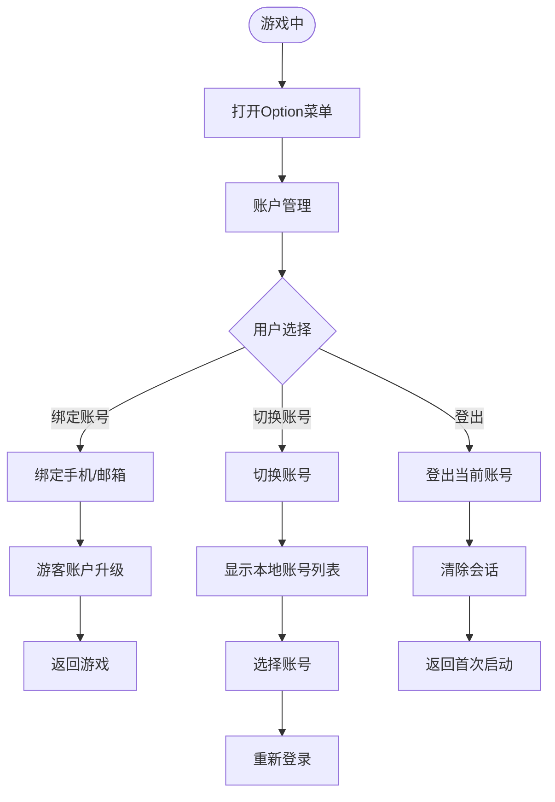
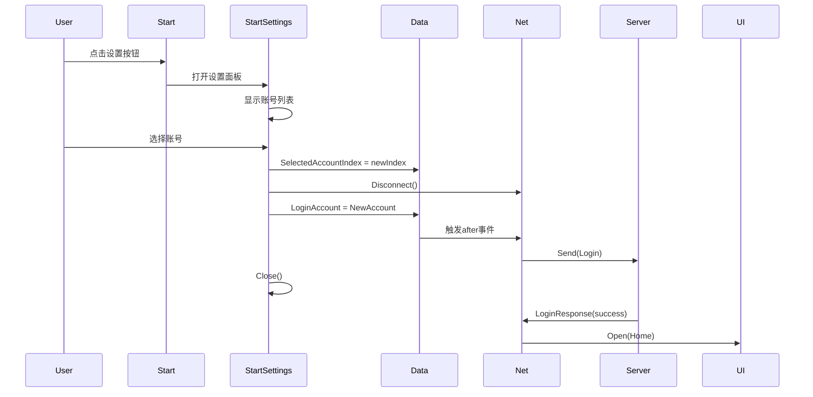
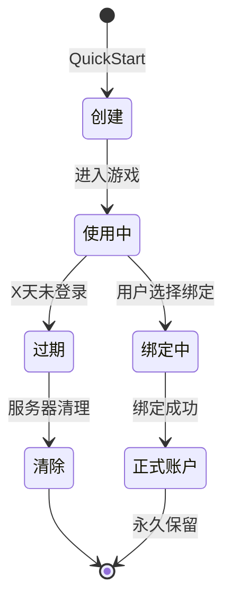
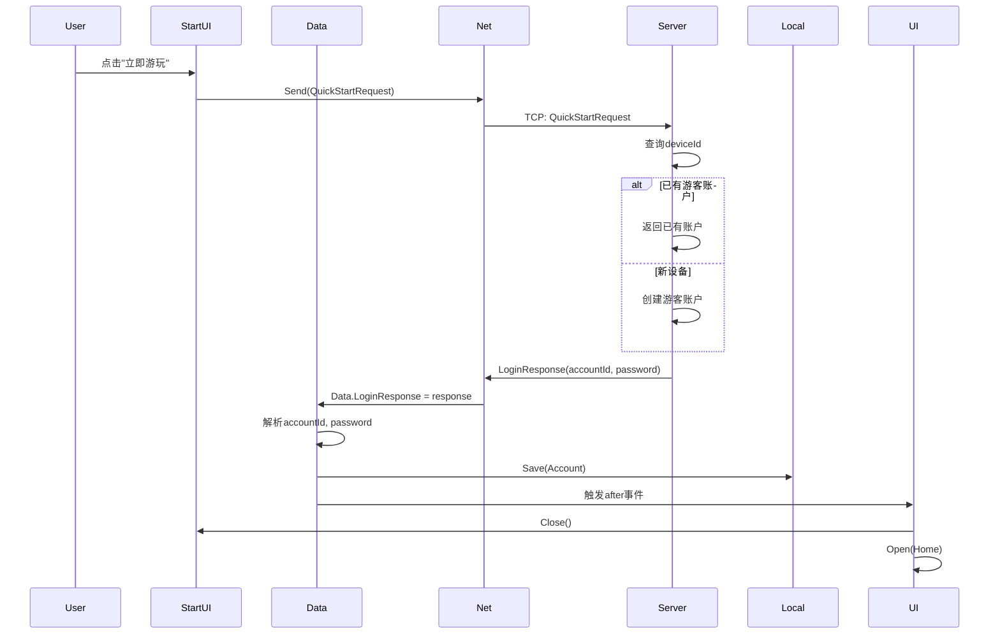
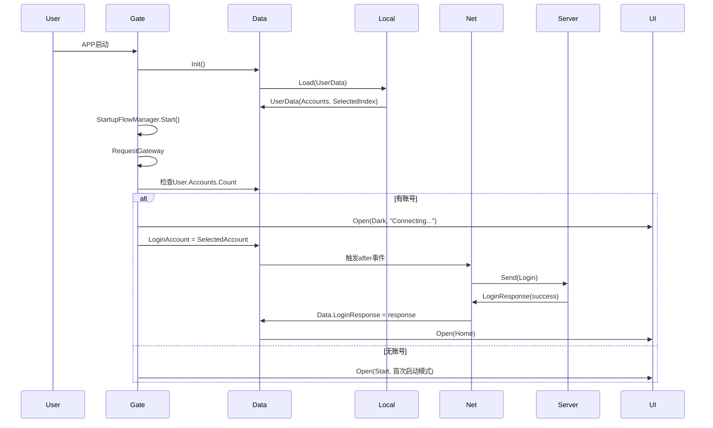

# 登录与启动系统

LOA客户端的登录与启动系统，采用"极致精简"的设计理念，通过游客账户快速登录和自动登录机制，让用户以最快速度进入游戏。

## 设计理念

### 核心原则

1. **极致精简**
   - 启动/登录界面只负责让用户尽快进入游戏
   - 减少用户在启动阶段的操作和决策
   - 优先自动化，避免手动输入

2. **账户管理后置**
   - 复杂的账户功能（切换账号、绑定手机）放在游戏内Option菜单
   - 启动界面不显示账号列表、不提供账号切换
   - 只有需要时才让用户接触账户管理功能

3. **自动化优先**
   - 总是显示Start界面，用户点击屏幕任意位置即可
   - 后台自动判断：有账号则Login，无账号则QuickStart
   - 首次和再次启动的用户体验完全一致

### 与英雄联盟手游等现代手游的对标

现代手游的启动体验标准：
- **首次启动**：点击屏幕任意位置，一键开始
- **再次启动**：同样点击屏幕，后台自动登录
- **账户管理**：隐藏在设置菜单深处，非高频功能

---

## 核心流程

### 首次启动流程

**适用场景**：本地无账号（`Data.Instance.User.Accounts.Count == 0`）



**关键步骤**：

1. **显示Start界面**
   - 总是显示Start界面，无论是否有本地账号
   - 只显示：游戏Logo、标题、服务器选择、"点击屏幕"提示
   - 不显示：账号列表、Login按钮、QuickStart按钮

2. **用户点击屏幕任意位置**
   - 触发`OnBlockClick()`方法
   - 检测本地账号：`Data.Instance.User.Accounts.Count`

3. **无账号分支：发送QuickStart**
   - 客户端发送`QuickStartRequest(deviceId, version, platform, language)`
   - 服务器根据`deviceId`查询或创建游客账户
   - 服务器返回游客账户信息（`accountId`, `password`）

4. **保存游客账户**
   - 客户端保存到`UserData.pb`
   - 下次启动时自动使用该账号登录

5. **进入游戏**
   - 关闭Start界面
   - 打开Home界面
   - 服务器推送UILock和Tutorial，开始新手引导

---

### 再次启动流程

**适用场景**：本地有账号（`Data.Instance.User.Accounts.Count > 0`）



**关键步骤**：

1. **显示Start界面**
   - 与首次启动相同，总是显示Start界面
   - 用户体验完全一致

2. **用户点击屏幕任意位置**
   - 触发`OnBlockClick()`方法
   - 检测本地账号：`Data.Instance.User.Accounts.Count > 0`

3. **有账号分支：使用本地账号**
   - 使用`Data.Instance.SelectedAccount`（上次使用的账号）
   - 设置`Data.Instance.LoginAccount`，触发登录流程
   - 显示"连接中..."过渡界面（Dark UI）

4. **登录成功**
   - 服务器返回`LoginResponse(success=true)`
   - 打开Home界面
   - 进入游戏

4. **登录失败**
   - 显示错误提示（账号密码错误、服务器维护等）
   - 返回首次启动流程，让用户重新操作
   - 或提供"重试"选项

**理想体验**：
```
APP启动 → 热更新（3秒） → 自动登录（2秒） → 进入Home
```

用户从点击APP图标到看到游戏界面，不超过5秒，且无需任何操作。

---

### 账户切换流程（后置）

**适用场景**：用户需要切换账号、绑定手机、登出



**关键设计**：

1. **账户管理功能双入口**
   - **Start界面快速切换**：多账号时显示设置按钮，方便快速切换
   - **Option菜单完整管理**：进入游戏后访问，提供完整账户管理功能
   - 根据使用场景提供不同层次的账户管理

2. **切换账号流程**
   - 在Option菜单或Start设置中显示本地账号列表
   - 用户选择账号后，触发重新登录
   - 断开当前连接，使用新账号登录
   - 成功后重新进入Home界面

3. **绑定账号流程**
   - 游客账户可升级为正式账户
   - 输入手机号/邮箱，发送验证码
   - 绑定成功后，账户数据永久保留
   - 可在其他设备通过手机号/邮箱登录

4. **登出流程**
   - 清除当前会话
   - 断开服务器连接
   - 返回首次启动流程（显示"立即游玩"或账号选择）

---

### Start界面设置功能

**设计目的**：提供多功能设置入口，包括账号切换、语言、音效等设置，保持界面简洁的同时提供必要功能

#### 显示策略

设置按钮**总是显示**在Start界面：

```csharp
// Always show settings button (for language, audio, and account management)
settingsButton.gameObject.SetActive(true);
```

**设计理念**：
- **总是可见**：设置按钮始终显示在右上角
- **功能多样**：不仅用于账号切换，还包含语言、音效、画质等设置
- **保持极简**：小尺寸齿轮图标，右上角位置，不干扰主要内容
- **渐进扩展**：当前实现账号切换，其他功能（语言、音效）预留扩展

#### UI布局

```
Start界面
┌─────────────────────┐
│          [⚙️]       │  ← 设置按钮（右上角）
│                     │
│    [游戏标题]        │
│                     │
│  点击屏幕开始游戏     │
│                     │
└─────────────────────┘
```

**布局参数**：
- **位置**：右上角
- **尺寸**：`UnitHeight * GoldenRatio` (约 51px)
- **边距**：`screenWidth * (1 - GoldenRatio) / 2` (黄金比例)

#### 设置面板功能

点击设置按钮后，打开 `StartSettings` 面板：

```
StartSettings面板
┌─────────────────────┐
│   Settings     [×]  │  ← 标题 + 关闭按钮
│─────────────────────│
│  Account List       │
│  ┌───────────────┐  │
│  │ [Guest_xxx]   │  │  ← 当前登录账号（高亮）
│  │ Guest Account │  │
│  ├───────────────┤  │
│  │ [user123]     │  │
│  │ Bound Account │  │
│  └───────────────┘  │
│                     │
│  (Other Settings)   │  ← 预留扩展区域
│  - Language         │     (语言、音效等)
│  - Audio            │
│─────────────────────│
└─────────────────────┘
```

**功能模块**：
1. **账号列表**：显示所有本地账号，当前账号高亮显示
2. **快速切换**：点击账号立即切换并重新登录
3. **预留扩展**：语言切换、音效开关、画质调整等（待实现）

#### 账号切换流程



**关键步骤**：
1. 用户点击设置按钮 → 打开 `StartSettings` 面板
2. 显示所有本地账号，当前账号高亮
3. 用户选择新账号
4. 更新 `SelectedAccountIndex` 并保存到本地
5. 断开当前连接（如果在线）
6. 设置 `LoginAccount`，触发登录流程
7. 关闭设置面板，显示"连接中..."
8. 登录成功后进入 Home 界面

#### 技术实现

**文件**：
- `Assets/Game/Scripts/UI/Start.cs` - 设置按钮初始化和布局
- `Assets/Game/Scripts/UI/StartSettings.cs` - 设置面板实现
- `Assets/Game/Scripts/Data/Config.cs` - UI 配置定义

**核心代码**：

```csharp
// Start.cs - 设置按钮初始化
private void InitializeSettingsButton()
{
    var settingsButton = transform.Find("Settings");
    if (Data.Instance.User.Accounts.Count > 1)
    {
        settingsButton.gameObject.SetActive(true);
        settingsButton.GetComponent<Button>().onClick.AddListener(OnSettingsClick);
    }
    else
    {
        settingsButton.gameObject.SetActive(false);
    }
}

// StartSettings.cs - 账号切换
private void OnAccountClick(int index)
{
    Data.Instance.User.SelectedAccountIndex = index;
    Local.Instance.Save(Data.Instance.User);
    
    if (Data.Instance.Online)
        Net.Instance.Disconnect();
    
    Data.Instance.LoginAccount = _accounts[index];
    Close();
}
```

#### 与 Option 菜单的区别

| 特性 | Start 设置按钮 | Option 菜单账户管理 |
|------|---------------|-------------------|
| **位置** | Start 界面右上角 | 游戏内 Option 菜单 |
| **显示条件** | 多账号时自动显示 | 始终可访问 |
| **功能范围** | 快速切换账号 + 基础设置 | 完整账户管理（添加、删除、绑定） |
| **使用场景** | 启动时快速切换 | 游戏内深度管理 |
| **设计目的** | 便利性 | 完整性 |

**互补关系**：
- Start 设置：高频场景（多账号用户启动时快速切换）
- Option 菜单：低频场景（账户绑定、添加新账号、删除账号）

---

## 游客账户设计

### 游客账户特点

游客账户是LOA快速登录体验的核心，具有以下特点：

1. **设备绑定**
   - 通过`deviceId`关联
   - 同一设备再次QuickStart，自动恢复原账户
   - 不同设备创建不同游客账户

2. **持久化**
   - 存储在服务器端，不是临时会话
   - 重装APP后，通过`deviceId`可恢复
   - 游戏数据不丢失

3. **可升级**
   - 可绑定手机号/邮箱，升级为正式账户
   - 升级后可跨设备登录
   - 游戏数据无缝迁移

4. **自动恢复**
   - 同设备多次QuickStart，返回同一账户
   - 服务器根据`deviceId`查询已有账户
   - 用户无感知，体验连贯

### 游客账户生命周期



**状态说明**：

- **创建**：服务器根据`deviceId`生成游客账户（`guest_{hash}`）
- **使用中**：游客账户正常登录和游戏
- **绑定中**：用户发起绑定手机/邮箱流程
- **正式账户**：绑定成功，账户升级，永久保留
- **过期**：X天（如90天）未登录，标记为过期
- **清除**：服务器定期清理过期游客账户，释放资源

**过期策略**：
- 未绑定游客账户：90天未登录 → 过期 → 清除
- 已绑定正式账户：永久保留
- 过期后再登录：创建新游客账户

### 游客账户结构

#### 服务器端数据结构

```typescript
interface GuestAccount {
    deviceId: string;         // 设备ID（唯一标识）
    accountId: string;        // 账户ID（格式：guest_{hash}）
    password: string;         // 自动生成的密码
    createTime: timestamp;    // 创建时间
    lastLoginTime: timestamp; // 最后登录时间
    isUpgraded: boolean;      // 是否已升级为正式账户
    bindInfo?: {              // 绑定信息（升级后）
        phone?: string;       // 手机号
        email?: string;       // 邮箱
        bindTime: timestamp;  // 绑定时间
    };
}
```

**字段说明**：

- `deviceId`：客户端设备ID，用于关联和恢复账户
- `accountId`：游客账户ID，格式如`guest_abc123`，便于识别
- `password`：服务器自动生成，客户端保存
- `createTime`：用于统计和过期判断
- `lastLoginTime`：每次登录更新，用于过期判断
- `isUpgraded`：标记是否已绑定，已绑定账户不会过期
- `bindInfo`：绑定的手机号或邮箱，用于跨设备登录

#### 客户端本地数据结构

**Protobuf定义**（`PBLocal.proto`）：

```protobuf
message Account {
    string id = 1;
    string password = 2;
    string note = 3;  // 如"游客账户"、"正式账户"
}

message UserData {
    repeated Account accounts = 1;
    int32 selectedServerIndex = 2;
    int32 selectedAccountIndex = 3;
    string language = 4;
}
```

**存储位置**：`Application.persistentDataPath/UserData.pb`

**游客账户示例**：
```csharp
Account {
    Id = "guest_abc123",
    Password = "auto_generated_pwd",
    Note = "Guest Account"
}
```

**正式账户示例**：
```csharp
Account {
    Id = "user@example.com",
    Password = "user_password",
    Note = "Bound Account"
}
```

---

## 协议设计

### QuickStartRequest

**客户端 → 服务器**

```csharp
public class QuickStartRequest : Base
{
    public string device;      // 设备ID
    public string version;     // APP版本
    public string platform;    // 平台（iOS/Android/Windows）
    public string language;    // 语言（ChineseSimplified等）
}
```

**发送时机**：
- 用户首次启动，点击"立即游玩"按钮
- 或用户在Option菜单选择"游客登录"

**字段说明**：
- `device`：客户端`Data.Instance.Device`，用于关联游客账户
- `version`：`Data.Instance.AppVersion`，用于版本控制
- `platform`：`Application.platform.ToString()`，用于统计和兼容性
- `language`：`Data.Instance.Language.ToString()`，用于多语言支持

### QuickStartResponse / LoginResponse

**服务器 → 客户端**

**推荐方案**：复用`LoginResponse`协议

```csharp
public class LoginResponse : Base
{
    public bool success;
    public string message;
    public string accountId;    // guest_xxx 或 正式账号
    public string password;     // 自动生成的密码
    public bool isGuest;        // true: 游客账户, false: 正式账户
    public bool isNewAccount;   // true: 新创建, false: 恢复已有账户
}
```

**服务器处理逻辑**：

```typescript
function handleQuickStart(request: QuickStartRequest): LoginResponse {
    // 1. 查询该deviceId是否已有游客账户
    let account = db.queryGuestAccount(request.device);
    
    if (account) {
        // 2. 已有账户，返回已有信息（自动恢复）
        return {
            success: true,
            message: "Welcome back!",
            accountId: account.accountId,
            password: account.password,
            isGuest: !account.isUpgraded,
            isNewAccount: false
        };
    } else {
        // 3. 没有账户，创建新游客账户
        const newAccount = {
            deviceId: request.device,
            accountId: `guest_${generateHash(request.device)}`,
            password: generateRandomPassword(),
            createTime: Date.now(),
            lastLoginTime: Date.now(),
            isUpgraded: false
        };
        
        db.saveGuestAccount(newAccount);
        
        return {
            success: true,
            message: "Account created!",
            accountId: newAccount.accountId,
            password: newAccount.password,
            isGuest: true,
            isNewAccount: true
        };
    }
}
```

**客户端处理逻辑**：

```csharp
public override void Processed()
{
    if (success)
    {
        // 保存游客账户到本地
        var account = new Account
        {
            Id = accountId,
            Password = password,
            Note = isGuest ? "Guest Account" : "Bound Account"
        };
        
        // 添加到账号列表
        if (!Data.Instance.User.Accounts.Contains(account))
        {
            Data.Instance.User.Accounts.Add(account);
            Data.Instance.User.SelectedAccountIndex = Data.Instance.User.Accounts.Count - 1;
            Local.Instance.Save(Data.Instance.User);
        }
        
        // 触发进入游戏
        Data.Instance.LoginResponse = this;
    }
    else
    {
        // 显示错误
        UI.Instance.Open(Config.UI.Dark, message);
    }
}
```

### Login

**传统登录协议**（已存在）

```csharp
public class Login : Base
{
    public string id;
    public string password;
    public string version;
    public string platform;
    public string device;
    public string language;
    
    public Login(Account account)
    {
        id = account.Id;
        password = account.Password;
        version = Data.Instance.AppVersion;
        platform = Application.platform.ToString();
        device = Data.Instance.Device;
        language = Data.Instance.Language.ToString();
    }
}
```

**使用场景**：
1. **再次启动自动登录**：使用上次登录的账号
2. **切换账号**：用户在Option菜单选择其他账号
3. **绑定后登录**：游客账户升级后的首次登录

**服务器验证**：
- 检查`id`和`password`是否匹配
- 检查账号是否被封禁
- 检查版本兼容性
- 返回`LoginResponse`

---

## Start界面设计

### 设计原则

**核心原则**：极致精简，减少用户决策

#### 禁止出现的元素

- ❌ **账号列表**（Account滚动列表）
  - 理由：启动阶段不应让用户选择账号
  - 替代：自动登录上次账号，切换账号放在Option菜单

- ❌ **切换账号按钮**
  - 理由：低频功能，不应占用启动界面
  - 替代：游戏内Option菜单提供账户管理

- ❌ **添加/删除账号按钮**
  - 理由：账号管理是复杂功能，不属于启动流程
  - 替代：游戏内账户管理界面

- ❌ **Login和QuickStart并列的选择**
  - 理由：让新手困惑，不知道该点哪个
  - 替代：首次启动只显示"立即游玩"，再次启动自动登录

#### 允许出现的元素

- ✅ **服务器列表**（必需）
  - 理由：多服务器架构，需要用户选择
  - 形式：滚轮或下拉选择，默认选中推荐服务器

- ✅ **游戏Logo、标题**
  - 理由：品牌展示，视觉吸引
  - 形式：居中大图，突出游戏名称

- ✅ **版本号、设备ID**（Footer信息）
  - 理由：调试和支持需要
  - 形式：底部小字，不干扰主流程

- ✅ **"立即游玩"大按钮**（首次启动）
  - 理由：引导新手快速开始
  - 形式：居中大按钮，明显的视觉引导

### 首次启动界面布局

```
┌─────────────────────────────┐
│                             │
│         [游戏Logo]          │
│         游戏标题            │
│                             │
│     ┌─────────────┐         │
│     │ 服务器选择  │         │ ← InfiniWheel滚轮
│     │   服务器1   │         │
│     │ > 服务器2 < │         │
│     │   服务器3   │         │
│     └─────────────┘         │
│                             │
│   ┌───────────────────┐     │
│   │   立即游玩 >>>    │     │ ← 大按钮，醒目
│   └───────────────────┘     │
│                             │
│  v1.0.0 | Device: xxx       │ ← Footer
└─────────────────────────────┘
```

**布局特点**：
- 纵向居中布局，符合移动端单手操作习惯
- "立即游玩"按钮占据1.5个单位高度（1.5 * 83px = 124.5px）
- 使用黄金比例分割空间
- 服务器选择器占据3个单位高度

### 再次启动界面

**理想情况**：不显示Start界面

```
APP启动 → 热更新 → Dark界面（"连接中..."） → 自动登录 → Home
```

**实际情况**：考虑服务器可能推送公告、活动

如果服务器在Gateway响应中包含Start界面配置：
```json
{
    "servers": [...],
    "UI": {
        "Name": "Start",
        "Data": {...}
    }
}
```

则显示Start界面，但：
- **不显示账号列表**
- **不显示Login按钮**
- **自动触发登录**（无需用户点击）
- 或显示"正在登录..."状态

**推荐**：服务器不推送Start界面配置，客户端直接自动登录。

### 界面生命周期

**首次启动**：
```
Gate.Entrance → StartupFlowManager.Start() 
→ RequestGateway → 检查本地账号（无）
→ 服务器推送Start界面 → 显示首次启动界面
→ 用户点击"立即游玩" → QuickStart → 进入Home
```

**再次启动**：
```
Gate.Entrance → StartupFlowManager.Start() 
→ RequestGateway → 检查本地账号（有）
→ 不显示Start界面 → 自动登录 → 进入Home
```

---

## 当前实现问题分析

### 问题1：Start界面过于复杂

**当前实现**（`Assets/Game/Scripts/UI/Start.cs`）：

```csharp
public override void OnCreate(params object[] args)
{
    // 显示账号列表
    transform.Find("Accounts").GetComponent<LoopListView2>().InitListView(
        Data.Instance.User.Accounts.Count, OnGetAccountByIndex);
    
    // 账号操作按钮
    transform.Find("Accounts/Delete").GetComponent<Button>()
        .onClick.AddListener(OnAccountsDeleteClick);
    transform.Find("Accounts/Add").GetComponent<Button>()
        .onClick.AddListener(OnAccountsAddClick);
    
    // Login和QuickStart并列
    transform.Find("Login").GetComponent<Button>()
        .onClick.AddListener(OnLoginClick);
    transform.Find("QuickStart")?.GetComponent<Button>()
        ?.onClick.AddListener(OnQuickStartClick);
}
```

**问题分析**：

1. **违反"极致精简"原则**
   - 显示账号列表、添加/删除按钮，界面复杂
   - 新手玩家面对3个账号操作按钮 + 2个登录按钮，决策疲劳
   - 启动界面承担了账户管理职责，职责混乱

2. **Login和QuickStart并列**
   - 两个按钮并排显示，用户不知道该点哪个
   - "QuickStart"命名不直观，新手不理解含义
   - 应该只有一个明显的"立即游玩"按钮

3. **没有区分首次/再次启动**
   - 无论是否有账号，都显示相同界面
   - 没有自动登录逻辑
   - 每次启动都要手动点击Login

**改进方向**：
- 移除账号列表和账号操作按钮
- 首次启动只显示"立即游玩"
- 再次启动不显示Start界面，自动登录

### 问题2：缺少首次启动检测

**当前流程**（`Assets/Game/Scripts/Basic/Gate.cs`）：

```csharp
private static void OnGatewayResponse(bool success, string response)
{
    // ...
    if (gatewayResponse.UI != null)
    {
        UI.Instance.Close(Config.UI.Dark);
        var uiConfig = typeof(Config.UI).GetField(gatewayResponse.UI.Name).GetValue(null);
        UI.Instance.Open(((string, string, int, bool))uiConfig, gatewayResponse.UI.Data);
    }
}
```

**问题分析**：

1. **无条件显示Start界面**
   - 服务器推送Start配置，客户端就显示
   - 没有判断本地是否有账号
   - 没有自动登录逻辑

2. **启动流程不灵活**
   - 完全由服务器控制显示哪个界面
   - 客户端无法根据本地状态做决策
   - 无法实现"再次启动自动登录"

**改进方向**：
```csharp
private static void OnGatewayResponse(bool success, string response)
{
    // ...
    
    // 检查本地账号
    if (Data.Instance.User.Accounts.Count > 0)
    {
        // 有账号，自动登录
        Data.Instance.LoginAccount = Data.Instance.SelectedAccount;
    }
    else
    {
        // 无账号，显示首次启动界面
        if (gatewayResponse.UI != null)
        {
            UI.Instance.Open(Config.UI.Start, gatewayResponse.UI.Data);
        }
    }
}
```

### 问题3：QuickStart实现不符合持久化设计

**当前实现**（`Assets/Game/Scripts/UI/Start.cs:319-333`）：

```csharp
private void OnQuickStartClick()
{
    Utils.Debug.Log("Start", "QuickStart button clicked");
    
    UI.Instance.Open(Config.UI.Dark, Localization.Instance.Get("connecting"));
    
    // 使用特殊标识 "__QuickStart__"
    Data.Instance.LoginAccount = new Account 
    { 
        Id = "__QuickStart__",
        Password = ""
    };
}
```

**当前Net.cs实现**（`Assets/Game/Scripts/Network/Net.cs:506-516`）：

```csharp
if (Data.Instance.LoginAccount.Id == "__QuickStart__")
{
    Utils.Debug.Log("Net", "QuickStart mode detected, sending QuickStartRequest");
    Send(new QuickStartRequest
    {
        device = Data.Instance.Device,
        version = Data.Instance.AppVersion,
        platform = Application.platform.ToString(),
        language = Data.Instance.Language.ToString()
    });
}
```

**问题分析**：

1. **使用魔法字符串`"__QuickStart__"`识别QuickStart模式**
   - 不符合设计规范，容易出错
   - 如果用户真的创建了ID为`"__QuickStart__"`的账号，会冲突
   - 代码可读性差，意图不明确

2. **不符合游客账户持久化设计**
   - `"__QuickStart__"`不是真正的账号ID
   - 服务器返回游客账户后，没有保存到本地
   - 重启后无法恢复游客账户，需要重新QuickStart

3. **缺少QuickStartResponse处理**
   - 服务器返回游客账户信息（accountId, password）
   - 客户端应该保存到本地，作为真正的账号使用
   - 当前实现缺少这一步

**改进方向**：
```csharp
private void OnQuickStartClick()
{
    // 发送QuickStart请求
    Net.Instance.Send(new QuickStartRequest
    {
        device = Data.Instance.Device,
        version = Data.Instance.AppVersion,
        platform = Application.platform.ToString(),
        language = Data.Instance.Language.ToString()
    });
}

// 在Protocol.cs的QuickStartResponse/LoginResponse中处理
public override void Processed()
{
    if (success)
    {
        // 保存游客账户到本地
        var account = new Account
        {
            Id = accountId,
            Password = password,
            Note = isGuest ? "Guest Account" : "Bound Account"
        };
        
        Data.Instance.User.Accounts.Add(account);
        Data.Instance.User.SelectedAccountIndex = Data.Instance.User.Accounts.Count - 1;
        Local.Instance.Save(Data.Instance.User);
        
        // 下次启动时，自动使用该账号登录
    }
}
```

### 问题4：启动流程缺少自动登录

**当前流程**：
```
Gate.Entrance → StartupFlowManager.Start() 
→ RequestGateway → 服务器推送Start → 显示Start界面
→ 用户点击Login → 连接服务器 → 发送Login → 进入Home
```

**问题分析**：

1. **每次启动都要手动登录**
   - 即使本地有账号，也要显示Start界面
   - 用户每次都要点击Login按钮
   - 用户体验差，不符合现代手游标准

2. **没有自动登录逻辑**
   - `StartupFlowManager`不检查本地账号
   - 不自动触发登录
   - 完全依赖用户操作

**改进方向**：
```csharp
private static void OnGatewayResponse(bool success, string response)
{
    // 解析服务器列表
    // ...
    
    // 检查本地账号
    if (Data.Instance.User.Accounts.Count > 0)
    {
        // 有账号，自动登录
        UI.Instance.Open(Config.UI.Dark, Localization.Instance.Get("connecting"));
        Data.Instance.LoginAccount = Data.Instance.SelectedAccount;
        // LoginAccount变化 → Net监听 → 自动连接服务器 → 发送Login
    }
    else
    {
        // 无账号，显示首次启动界面
        if (gatewayResponse.UI != null)
        {
            UI.Instance.Open(Config.UI.Start, gatewayResponse.UI.Data);
        }
    }
}
```

---

## 改进方案

### 短期改进（文档驱动）

**目标**：明确设计，对齐理解，规划实施

1. **创建本设计文档** ✅
   - 明确理想的启动/登录流程
   - 定义游客账户设计和生命周期
   - 分析当前实现问题

2. **与服务端对齐**
   - 确认QuickStart协议设计
   - 确认游客账户表结构（GuestAccount）
   - 确认LoginResponse复用方案
   - 确认数据流和安全策略

3. **规划UI改版**
   - 绘制首次启动界面原型
   - 简化Start界面，移除账号列表
   - 设计"立即游玩"按钮样式

4. **规划Option菜单扩展**
   - 添加"账户管理"子菜单
   - 实现切换账号功能
   - 实现绑定手机功能
   - 实现登出功能

### 长期实施（代码重构）

#### Phase 1：协议完善

**服务端**：
- [ ] 创建`GuestAccount`数据表
- [ ] 实现QuickStart处理逻辑（查询或创建游客账户）
- [ ] 修改LoginResponse，添加`isGuest`和`isNewAccount`字段
- [ ] 实现设备绑定查询（根据deviceId返回已有游客账户）

**客户端**：
- [ ] 修改`QuickStartRequest`协议（已有，可能需要调整）
- [ ] 实现QuickStartResponse处理（或复用LoginResponse）
- [ ] 保存游客账户到本地（`UserData.pb`）
- [ ] 移除`"__QuickStart__"`魔法字符串

#### Phase 2：启动流程重构

**目标**：实现首次启动检测和自动登录

- [ ] 修改`Gate.OnGatewayResponse`，添加本地账号检查
- [ ] 实现自动登录逻辑（有账号时直接登录）
- [ ] 修改`StartupFlowManager`，支持跳过Start界面
- [ ] 处理登录失败场景，返回首次启动流程

**关键代码**（`Gate.cs`）：
```csharp
private static void OnGatewayResponse(bool success, string response)
{
    // 解析服务器列表
    var gatewayResponse = JsonConvert.DeserializeObject<GatewayResponse>(response);
    Data.Instance.Servers = gatewayResponse.Servers;
    
    // 检查本地账号
    if (Data.Instance.User.Accounts.Count > 0)
    {
        // 有账号，自动登录
        UI.Instance.Open(Config.UI.Dark, Localization.Instance.Get("auto_login"));
        Data.Instance.LoginAccount = Data.Instance.SelectedAccount;
    }
    else
    {
        // 无账号，显示首次启动界面
        if (gatewayResponse.UI != null)
        {
            UI.Instance.Open(Config.UI.Start, gatewayResponse.UI.Data);
        }
    }
}
```

#### Phase 3：Start界面精简

**目标**：简化Start界面，只保留核心功能

- [ ] 移除账号列表（`Accounts` LoopListView2）
- [ ] 移除账号操作按钮（Add、Delete）
- [ ] 移除Login按钮（改为自动登录）
- [ ] 保留QuickStart按钮，改名为"立即游玩"
- [ ] 调整布局，使用黄金比例

**新的布局计算**（`Start.cs`）：
```csharp
private void ApplyAbsoluteLayout()
{
    const float GoldenRatio = 0.618f;
    float screenWidth = GetComponent<RectTransform>().rect.width;
    float screenHeight = GetComponent<RectTransform>().rect.height;
    
    float titleHeight = UnitHeight * 3;
    float serverHeight = UnitHeight * 3;
    float buttonHeight = UnitHeight * 1.5f;
    float footerHeight = UnitHeight;
    
    float totalFixedHeight = titleHeight + serverHeight + buttonHeight + footerHeight;
    float remainingHeight = screenHeight - totalFixedHeight;
    float topPadding = remainingHeight * GoldenRatio;
    float bottomPadding = remainingHeight * (1 - GoldenRatio);
    
    float currentY = bottomPadding;
    
    SetRect("Footer", 0, footerHeight, screenWidth);
    currentY += footerHeight + bottomPadding;
    
    SetRect("QuickStart", currentY, buttonHeight, screenWidth * 0.8f, screenWidth * 0.1f);
    currentY += buttonHeight + UnitHeight;
    
    SetRect("Servers", currentY, serverHeight, screenWidth * 0.6f, screenWidth * 0.2f);
    currentY += serverHeight + topPadding;
    
    SetRect("Title", currentY, titleHeight, screenWidth);
}
```

#### Phase 4：账户管理后置

**目标**：将账户管理功能移到Option菜单

- [ ] 在Option菜单添加"账户管理"Item
- [ ] 创建`AccountManage`界面（或复用Account界面）
- [ ] 实现账号列表显示（从`Data.Instance.User.Accounts`）
- [ ] 实现切换账号功能（选择账号 → 重新登录）
- [ ] 实现绑定手机功能（调用绑定接口 → 升级游客账户）
- [ ] 实现登出功能（清除会话 → 返回首次启动）

**Option配置**（服务器推送）：
```json
{
    "items": [
        // ... 其他Item
        {
            "id": "account_manage",
            "type": "button",
            "label": "Account Management",
            "action": "OpenAccountManage"
        }
    ]
}
```

---

## 数据流详解

### 首次QuickStart数据流



**关键步骤**：

1. **用户点击"立即游玩"**
   - Start界面的`OnQuickStartClick`方法
   - 发送`QuickStartRequest`到服务器

2. **服务器处理QuickStart请求**
   - 查询`deviceId`是否已有游客账户
   - 已有：返回已有账户信息（自动恢复）
   - 没有：创建新游客账户（`guest_{hash}`）

3. **服务器返回LoginResponse**
   - 包含`accountId`和`password`
   - 标记`isGuest=true`
   - 标记`isNewAccount`（true/false）

4. **客户端保存游客账户**
   - 创建`Account`对象
   - 添加到`Data.Instance.User.Accounts`
   - 保存到`UserData.pb`（`Local.Instance.Save`）

5. **进入游戏**
   - 关闭Start界面
   - 打开Home界面
   - 服务器推送UILock、Tutorial等协议

### 再次启动自动登录数据流



**关键步骤**：

1. **APP启动，初始化Data**
   - `Gate.Entrance` → `Data.Instance.Init()`
   - 从本地读取`UserData.pb`
   - 加载账号列表和选中索引

2. **检查本地账号**
   - `Data.Instance.User.Accounts.Count > 0`
   - 是：自动登录流程
   - 否：显示首次启动界面

3. **自动登录**
   - 设置`Data.Instance.LoginAccount = SelectedAccount`
   - Net监听`LoginAccount`变化，自动发送`Login`协议
   - 不显示Start界面，显示Dark界面（"连接中..."）

4. **服务器验证**
   - 验证`accountId`和`password`
   - 返回`LoginResponse(success=true)`

5. **进入游戏**
   - 关闭Dark界面
   - 打开Home界面
   - 用户体验：从点击APP到看到游戏，约5秒，无需操作

### 账户切换数据流（Option菜单）

```mermaid
sequenceDiagram
    participant User
    participant Option
    participant AccountManage
    participant Data
    participant Net
    participant Server
    
    User->>Option: 点击"账户管理"
    Option->>AccountManage: Open()
    AccountManage->>AccountManage: 显示账号列表
    User->>AccountManage: 选择账号
    AccountManage->>Data: SelectedAccountIndex = newIndex
    AccountManage->>Net: Disconnect()
    AccountManage->>Data: LoginAccount = NewAccount
    Data->>Net: 触发after事件
    Net->>Server: Send(Login)
    Server->>Net: LoginResponse(success)
    Net->>UI: Close(All)
    Net->>UI: Open(Home)
```

**关键步骤**：

1. **进入账户管理**
   - 游戏中，打开Option菜单
   - 点击"账户管理"Item
   - 打开AccountManage界面

2. **显示账号列表**
   - 从`Data.Instance.User.Accounts`读取
   - 显示所有本地账号
   - 标记当前登录账号

3. **切换账号**
   - 用户选择新账号
   - 更新`SelectedAccountIndex`
   - 断开当前连接（`Net.Disconnect()`）

4. **重新登录**
   - 设置`LoginAccount = NewAccount`
   - 触发Net监听，发送Login协议
   - 服务器验证，返回LoginResponse

5. **进入游戏**
   - 关闭所有UI（包括Option、AccountManage）
   - 打开Home界面
   - 使用新账号的游戏数据

---

## 与现有系统的集成

### 与UILock系统配合

游客账户首次登录，服务器应立即推送UILock协议：

```json
{
  "unlockedPanels": ["Home.Scene"]
}
```

**配合流程**：
```
QuickStart → 创建游客账户 → LoginResponse 
→ 推送UILock（只有Scene） → 推送Tutorial 
→ 新手教程开始 → 逐步解锁其他面板
```

**设计意图**：
- 新手只看到全屏Scene面板，降低认知负担
- 配合Tutorial，渐进式显示UI
- 完成教程后，解锁所有面板

详见：[UI渐进式显示系统.md](UI渐进式显示系统.md)

### 与Tutorial系统配合

游客账户首次登录（`isNewAccount=true`），服务器推送Tutorial协议：

```json
{
  "tutorialIndex": 0,
  "tutorialStep": 0,
  "dialogues": [...]
}
```

**配合流程**：
```
QuickStart → isNewAccount=true → 推送Tutorial 
→ 显示Tutorial引导 → 用户完成步骤 
→ 推送新的UILock → 解锁更多面板
```

**老玩家（`isNewAccount=false`）**：
- 不推送Tutorial
- 推送完整的UILock（所有面板解锁）
- 直接进入正常游戏

### 账户升级与数据迁移

游客账户绑定手机后，升级为正式账户：

**流程**：
```
Option菜单 → 账户管理 → 绑定手机 
→ 输入手机号 → 发送验证码 → 验证成功 
→ 服务器标记账户为"已升级" → 客户端更新本地Account
```

**服务器处理**：
```typescript
function bindPhone(accountId: string, phone: string) {
    let account = db.queryAccount(accountId);
    if (account.isGuest) {
        account.isUpgraded = true;
        account.bindInfo = {
            phone: phone,
            bindTime: Date.now()
        };
        db.updateAccount(account);
    }
}
```

**客户端处理**：
```csharp
// 绑定成功后，更新本地Account
var account = Data.Instance.User.Accounts.Find(a => a.Id == currentAccountId);
account.Note = "Bound Account";
Local.Instance.Save(Data.Instance.User);
```

**数据迁移**：
- 游戏数据存储在服务器（角色、等级、物品等）
- 账户升级只改变账户类型，不影响游戏数据
- 升级后，可在其他设备通过手机号登录，游戏数据无缝同步

---

## 安全性考虑

### 游客账户的安全风险

**风险1：换设备数据丢失**
- **描述**：游客账户只有设备绑定，换设备会创建新账户
- **影响**：用户换手机后，游戏数据丢失
- **缓解措施**：
  - 游戏内提示用户绑定手机（达到一定等级时弹窗）
  - 在Option菜单显著位置提示"绑定账号保护数据"
  - 教程完成后，引导绑定

**风险2：设备丢失/被盗**
- **描述**：他人拾取设备后，可直接进入游戏
- **影响**：游戏数据可能被滥用（消耗资源、删除角色等）
- **缓解措施**：
  - 重要操作（删除角色、大额消费）要求二次确认
  - 绑定后可设置支付密码
  - 异常登录检测（IP、设备变化）

**风险3：设备重置/重装APP**
- **描述**：设备恢复出厂设置，或重装APP，`deviceId`可能改变
- **影响**：无法恢复游客账户
- **缓解措施**：
  - iOS：使用`Keychain`存储deviceId，重装后可恢复
  - Android：使用`SharedPreferences`备份到Google Drive
  - 或：提示用户绑定账号，避免数据丢失

### 设备ID的生成与存储

**当前实现**（推测）：
```csharp
string Device
{
    get
    {
        if (!PlayerPrefs.HasKey("DEVICE"))
        {
            PlayerPrefs.SetString("DEVICE", Guid.NewGuid().ToString());
            PlayerPrefs.Save();
        }
        return PlayerPrefs.GetString("DEVICE");
    }
}
```

**问题**：
- 重装APP后，`PlayerPrefs`清空，GUID改变
- 无法恢复游客账户

**改进建议**：

**iOS平台**：
```csharp
#if UNITY_IOS
string Device
{
    get
    {
        // 优先使用Keychain（重装不丢失）
        string keychainDeviceId = KeychainHelper.GetDeviceId();
        if (!string.IsNullOrEmpty(keychainDeviceId))
            return keychainDeviceId;
        
        // 生成新GUID，保存到Keychain
        string newDeviceId = Guid.NewGuid().ToString();
        KeychainHelper.SaveDeviceId(newDeviceId);
        return newDeviceId;
    }
}
#endif
```

**Android平台**：
```csharp
#if UNITY_ANDROID
string Device
{
    get
    {
        // 优先使用Android ID（系统提供，重装不变）
        string androidId = SystemInfo.deviceUniqueIdentifier;
        if (!string.IsNullOrEmpty(androidId) && androidId != SystemInfo.unsupportedIdentifier)
            return androidId;
        
        // 备用方案：生成GUID，备份到Google Drive
        string savedDeviceId = PlayerPrefs.GetString("DEVICE");
        if (!string.IsNullOrEmpty(savedDeviceId))
            return savedDeviceId;
        
        string newDeviceId = Guid.NewGuid().ToString();
        PlayerPrefs.SetString("DEVICE", newDeviceId);
        PlayerPrefs.Save();
        // TODO: 备份到Google Drive
        return newDeviceId;
    }
}
#endif
```

**跨平台方案**：
- 使用`SystemInfo.deviceUniqueIdentifier`
- 注意：需要用户授权（iOS需要请求权限）
- 部分设备可能返回相同ID，需要加盐哈希

### 密码生成与存储

**游客账户密码生成**（服务器端）：
```typescript
function generateGuestPassword(): string {
    // 生成16位随机密码
    const chars = 'ABCDEFGHIJKLMNOPQRSTUVWXYZabcdefghijklmnopqrstuvwxyz0123456789';
    let password = '';
    for (let i = 0; i < 16; i++) {
        password += chars.charAt(Math.floor(Math.random() * chars.length));
    }
    return password;
}
```

**客户端密码存储**：
- 明文存储在`UserData.pb`（本地Protobuf）
- `Application.persistentDataPath`只有APP自身可访问
- iOS：受沙盒保护，安全
- Android：受权限保护，安全

**网络传输**：
- 使用TLS/SSL加密（HTTPS）
- 密码在网络层已加密，客户端无需额外加密

---

## 测试场景

### 首次启动测试

**前置条件**：
- 删除本地数据（清除`UserData.pb`）
- 确保设备有网络连接

**测试步骤**：
1. 启动APP
2. 等待热更新完成
3. 观察界面

**预期结果**：
- 显示首次启动界面
- 只有"立即游玩"按钮（或服务器推送的界面）
- 无账号列表、无Login按钮

**继续测试**：
1. 点击"立即游玩"
2. 观察日志

**预期结果**：
- 发送`QuickStartRequest`
- 服务器返回游客账户（`guest_xxx`）
- 保存到本地
- 进入Home界面
- 显示UILock（只有Scene面板）
- 显示Tutorial引导

### 再次启动测试

**前置条件**：
- 完成首次启动测试（本地已有游客账户）

**测试步骤**：
1. 关闭APP
2. 重新启动APP
3. 等待热更新完成

**预期结果**：
- 显示Start界面（与首次启动相同）
- 用户点击屏幕任意位置
- 显示"连接中..."（Dark界面）
- 自动使用本地账号登录
- 进入Home界面

**时间指标**：
- 从点击APP图标到进入Home，不超过5秒
- 用户只需点击屏幕一次

### QuickStart恢复测试

**前置条件**：
- 在设备A完成首次启动（创建游客账户A）

**测试步骤**：
1. 删除本地数据（模拟重装）
2. 重新启动APP
3. 点击"立即游玩"
4. 观察日志

**预期结果**：
- 服务器根据`deviceId`查询已有游客账户
- 返回已有账户A的信息（不是创建新账户）
- 游戏数据恢复（角色、等级等）

**验证点**：
- `LoginResponse.isNewAccount = false`
- 账户ID与之前相同
- 游戏数据与之前一致

### 换设备测试

**前置条件**：
- 在设备A创建游客账户（未绑定）

**测试步骤**：
1. 在设备B启动APP
2. 点击"立即游玩"
3. 观察账户信息

**预期结果**：
- 设备B的`deviceId`不同
- 创建新游客账户B（不同于账户A）
- 游戏数据为初始状态（无法恢复设备A的数据）

**后续测试（绑定）**：
1. 在设备A绑定手机
2. 在设备B登出游客账户B
3. 在设备B通过手机号登录
4. 观察游戏数据

**预期结果**：
- 成功登录账户A
- 游戏数据与设备A一致

### 网络异常测试

**场景1：QuickStart时断网**

**测试步骤**：
1. 首次启动，点击"立即游玩"
2. 立即断开网络
3. 观察界面

**预期结果**：
- 显示错误提示："网络连接失败"
- 提供"重试"按钮
- 点击"重试"，重新发送QuickStartRequest

**场景2：自动登录时断网**

**测试步骤**：
1. 再次启动（有账号）
2. 在自动登录前断网
3. 观察界面

**预期结果**：
- 显示错误提示："连接服务器失败"
- 提供"重试"按钮
- 或返回首次启动界面

**场景3：登录中网络波动**

**测试步骤**：
1. 登录过程中，模拟丢包或延迟
2. 观察超时处理

**预期结果**：
- 超时后显示错误
- 自动重试（或提示用户重试）
- 不卡在"连接中..."状态

### 账户切换测试

**前置条件**：
- 本地有2个账号（游客账户A、正式账户B）

**测试步骤**：
1. 使用账户A登录
2. 进入Option菜单 → 账户管理
3. 选择账户B
4. 观察流程

**预期结果**：
- 显示账号列表（A、B）
- 点击B，触发重新登录
- 断开当前连接
- 使用账户B登录
- 进入Home界面，显示账户B的游戏数据

### 绑定手机测试

**前置条件**：
- 使用游客账户登录

**测试步骤**：
1. 进入Option菜单 → 账户管理 → 绑定手机
2. 输入手机号
3. 点击"获取验证码"
4. 输入验证码
5. 点击"绑定"

**预期结果**：
- 发送验证码到手机
- 验证码正确，绑定成功
- 账户升级为正式账户
- 本地Account.Note更新为"Bound Account"
- 可在其他设备通过手机号登录

---

## 总结

### 核心设计

LOA客户端的登录与启动系统采用"极致精简"理念：

1. **首次启动**：一键"立即游玩"，自动创建游客账户
2. **再次启动**：自动登录，无需操作，5秒进入游戏
3. **账户管理**：后置到Option菜单，低频功能不干扰启动流程

### 关键特性

1. **游客账户持久化**
   - 设备绑定，重装可恢复
   - 可升级为正式账户
   - 游戏数据不丢失

2. **自动化优先**
   - 再次启动自动登录
   - 无需手动输入账号密码
   - 减少用户操作

3. **启动界面精简**
   - 首次启动只显示"立即游玩"
   - 不显示账号列表、切换账号
   - 用户决策最小化

### 当前问题

1. **Start界面过于复杂**：显示账号列表、Login/QuickStart并列
2. **缺少首次启动检测**：无论是否有账号，都显示Start界面
3. **QuickStart实现不符合设计**：使用魔法字符串，不持久化
4. **缺少自动登录**：每次启动都要手动点击Login

### 改进方向

1. **短期**：创建设计文档，与服务端对齐，规划实施
2. **长期**：分4个Phase实施（协议→流程→UI→账户管理）
3. **目标**：实现现代手游标准的启动体验

### 与服务端协作

需要服务端配合实现：
- `GuestAccount`数据表
- QuickStart处理逻辑（查询或创建）
- LoginResponse扩展（`isGuest`, `isNewAccount`）
- 绑定手机接口

### 后续行动

1. **与服务端对齐**：确认协议设计和实现计划
2. **评审当前实现**：列出问题清单，评估工作量
3. **制定实施计划**：分阶段实施，确保向后兼容
4. **补充测试文档**：更新测试指南，添加测试场景

---

**文档版本**：1.0
**创建日期**：2026-02-07
**作者**：LOA Client Team
**状态**：设计阶段，待服务端对齐
