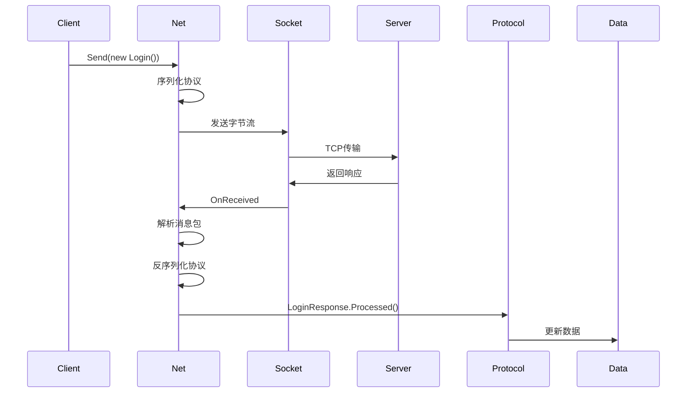

# 网络通信系统（Network）

负责客户端与服务器的网络通信，包括 TCP 连接管理、协议收发、断线重连、心跳保活等功能。

## 系统概述

网络通信系统提供：
- **连接管理**：TCP Socket 连接、断开、重连
- **消息收发**：发送协议、接收服务端消息
- **心跳机制**：Ping/Pong 保活
- **协议路由**：将消息分发到对应处理逻辑

**核心文件**：
- `Assets/Game/Scripts/Network/Net.cs`：网络管理器
- `Assets/Game/Scripts/Network/Protocol.cs`：协议定义

---

## Net（网络管理器）

**Net** 是网络通信的单例管理器，管理 Socket 连接和消息收发。

### Net 类定义

```csharp
public partial class Net : Singleton<Net>
{
    // Socket相关
    private Socket Socket { get; set; }
    private byte[] buffer = new byte[Config.Net.SocketBufferSize];
    private int startIndex = 0;
    private int usefulLen = 0;
    
    // 消息队列
    private Queue<Bytes> Writes { get; set; } = new Queue<Bytes>();
    private Queue<byte[]> ReceiveBytesQueue = new Queue<byte[]>();
    private Queue<Packet> PacketQueue = new Queue<Packet>();
    
    // 重连相关
    private int reconnectAttempts = 0;
    private bool isReconnecting = false;
    
    public bool IsReconnecting => isReconnecting;
}
```

### 核心功能

#### 1. 连接服务器（Connect）

```csharp
public void Connect(string ip, int port)
{
    try
    {
        Socket = new Socket(AddressFamily.InterNetwork, SocketType.Stream, ProtocolType.Tcp);
        Socket.BeginConnect(ip, port, OnConnected, null);
        
        Debug.Log($"[Net] Connecting to {ip}:{port}...");
    }
    catch (Exception ex)
    {
        Debug.LogError($"[Net] Connect failed: {ex.Message}");
        Data.Instance.Online = false;
    }
}

private void OnConnected(IAsyncResult ar)
{
    try
    {
        Socket.EndConnect(ar);
        Data.Instance.Online = true;
        
        Debug.Log("[Net] Connected successfully");
        
        // 开始接收数据
        BeginReceive();
    }
    catch (Exception ex)
    {
        Debug.LogError($"[Net] Connection failed: {ex.Message}");
        Data.Instance.Online = false;
    }
}
```

#### 2. 发送协议（Send）

```csharp
public void Send(Protocol.Base protocol)
{
    if (!Data.Instance.Online)
    {
        Debug.LogWarning("[Net] Cannot send: not online");
        return;
    }
    
    try
    {
        // 序列化协议
        string json = JsonUtility.ToJson(protocol);
        Packet packet = new Packet
        {
            Name = protocol.GetType().Name,
            Json = json
        };
        
        // 编码为字节
        string packetJson = JsonUtility.ToJson(packet);
        byte[] data = Encoding.UTF8.GetBytes(packetJson);
        byte[] lengthBytes = BitConverter.GetBytes(data.Length);
        
        // 发送长度和数据
        byte[] sendData = new byte[4 + data.Length];
        Array.Copy(lengthBytes, 0, sendData, 0, 4);
        Array.Copy(data, 0, sendData, 4, data.Length);
        
        Writes.Enqueue(new Bytes(sendData));
        
        // 尝试发送
        TrySend();
    }
    catch (Exception ex)
    {
        Debug.LogError($"[Net] Send failed: {ex.Message}");
    }
}
```

#### 3. 接收消息（Receive）

```csharp
private void BeginReceive()
{
    try
    {
        Socket.BeginReceive(buffer, startIndex + usefulLen, 
            buffer.Length - startIndex - usefulLen, 
            SocketFlags.None, OnReceived, null);
    }
    catch (Exception ex)
    {
        Debug.LogError($"[Net] BeginReceive failed: {ex.Message}");
        HandleConnectionLost();
    }
}

private void OnReceived(IAsyncResult ar)
{
    try
    {
        int count = Socket.EndReceive(ar);
        
        if (count == 0)
        {
            HandleConnectionLost();
            return;
        }
        
        usefulLen += count;
        
        // 解析消息包
        ParsePackets();
        
        // 继续接收
        BeginReceive();
    }
    catch (Exception ex)
    {
        Debug.LogError($"[Net] Receive failed: {ex.Message}");
        HandleConnectionLost();
    }
}
```

#### 4. 心跳机制（Heartbeat）

```csharp
private void StartHeartbeat()
{
    StopCoroutine(nameof(HeartbeatCoroutine));
    StartCoroutine(nameof(HeartbeatCoroutine));
}

private IEnumerator HeartbeatCoroutine()
{
    while (Data.Instance.Online)
    {
        // 发送Ping
        Data.Instance.Ping = DateTime.Now;
        Send(new Protocol.Ping());
        
        // 等待心跳间隔
        yield return new WaitForSeconds(Config.Net.HeartbeatInterval);
        
        // 检查是否超时
        TimeSpan elapsed = DateTime.Now - Data.Instance.Pong;
        if (elapsed.TotalSeconds > Config.Net.HeartbeatInterval * Config.Net.MaxMissedHeartbeats)
        {
            Debug.LogWarning("[Net] Heartbeat timeout");
            HandleConnectionLost();
            yield break;
        }
    }
}
```

#### 5. 断线重连（Reconnect）

```csharp
private void HandleConnectionLost()
{
    if (isReconnecting) return;
    
    Debug.LogWarning("[Net] Connection lost, attempting to reconnect...");
    
    Data.Instance.Online = false;
    Socket?.Close();
    Socket = null;
    
    isReconnecting = true;
    StartCoroutine(ReconnectCoroutine());
}

private IEnumerator ReconnectCoroutine()
{
    const int maxAttempts = 5;
    reconnectAttempts = 0;
    
    while (reconnectAttempts < maxAttempts)
    {
        reconnectAttempts++;
        yield return new WaitForSeconds(2f);
        
        Debug.Log($"[Net] Reconnect attempt {reconnectAttempts}/{maxAttempts}");
        
        Connect(Data.Instance.SelectedServer.Ip, Data.Instance.SelectedServer.Port);
        
        // 等待连接结果
        yield return new WaitForSeconds(3f);
        
        if (Data.Instance.Online)
        {
            Debug.Log("[Net] Reconnected successfully");
            isReconnecting = false;
            yield break;
        }
    }
    
    Debug.LogError("[Net] Reconnect failed after max attempts");
    isReconnecting = false;
    
    // 显示重连失败提示
    Data.Instance.Tip = (UI.Tips.Fly, Localization.Instance.Get("reconnect_failed"));
}
```

---

## Protocol（协议定义）

**Protocol** 定义客户端与服务器之间的通信协议，使用 Protobuf 或 JSON 序列化。

### 协议基类

```csharp
namespace Game.Protocol
{
    public abstract class Base
    {
        // 协议处理（子类实现）
        public virtual void Processed() { }
    }
}
```

### 常用协议

#### 1. Ping/Pong（心跳）

```csharp
// 客户端发送
public class Ping : Base
{
    public DateTime dateTime;
    
    public Ping()
    {
        dateTime = DateTime.Now;
    }
}

// 服务端返回
public class Pong : Base
{
    public DateTime dateTime;
    
    public override void Processed()
    {
        Data.Instance.Pong = dateTime;
    }
}
```

#### 2. Login（登录）

```csharp
public class Login : Base
{
    public string version;
    public string language;
    public Account account;
    
    public Login(Account account)
    {
        this.account = account;
        this.version = Data.Instance.AppVersion;
        this.language = Data.Instance.Language.ToString();
    }
}

public class LoginResponse : Base
{
    public int code;        // 0:成功, 1:失败
    public string message;
    
    public override void Processed()
    {
        Data.Instance.LoginResponse = code;
        Data.Instance.LoginResponseMessage = message;
    }
}
```

#### 3. Move（移动）

```csharp
public class Move : Base
{
    public int[] pos;
    
    public Move(int[] position)
    {
        pos = position;
    }
}
```

### 协议处理流程



---

## 消息格式

### 消息包结构

```
[4字节长度][协议JSON]
```

示例：
```json
{
    "Name": "Login",
    "Json": "{\"account\":{\"id\":\"123\",\"name\":\"Player\"}}"
}
```

### 编码流程

1. 将协议对象序列化为JSON
2. 构造Packet对象（Name + Json）
3. 将Packet序列化为JSON
4. 转换为UTF-8字节数组
5. 添加4字节长度头
6. 发送到Socket

### 解码流程

1. 从Socket接收字节流
2. 读取4字节长度
3. 读取对应长度的数据
4. 转换为字符串
5. 反序列化为Packet对象
6. 根据Name反射创建协议对象
7. 反序列化Json字段到协议对象
8. 调用Processed方法

---

## 数据监听

### Net 监听 Data 变化

```csharp
void Awake()
{
    // 监听登录账号变化
    Data.Instance.after.Register(Data.Type.LoginAccount, OnAfterLoginAccountChanged);
    
    // 监听在线状态变化
    Data.Instance.after.Register(Data.Type.Online, OnAfterOnlineChanged);
    
    // 监听选项返回
    Data.Instance.befor.Register(Data.Type.OptionReturn, OnBeforOptionReturnChanged);
    
    // 监听心跳丢失
    Data.Instance.befor.Register(Data.Type.SocketMissedHeartbeats, OnBeforeMissedHeartbeatsChanged);
}

private void OnAfterLoginAccountChanged(params object[] args)
{
    if (Data.Instance.Online)
        Send(new Login(Data.Instance.LoginAccount));
}

private void OnAfterOnlineChanged(params object[] args)
{
    bool online = (bool)args[0];
    if (online)
    {
        StartHeartbeat();
    }
    else
    {
        StopAllCoroutines();
    }
}
```

---

## 配置参数

### 网络配置（Config.Net）

```csharp
public static class Net
{
    public const int SocketBufferSize = 65536;        // Socket缓冲区大小（64KB）
    public const int MaxMissedHeartbeats = 3;         // 最大丢失心跳次数
    public const float HeartbeatInterval = 10f;       // 心跳间隔（秒）
}
```

---

## 错误处理

### 连接失败

```csharp
private void OnConnected(IAsyncResult ar)
{
    try
    {
        Socket.EndConnect(ar);
        Data.Instance.Online = true;
    }
    catch (SocketException ex)
    {
        Debug.LogError($"[Net] Connection failed: {ex.SocketErrorCode}");
        
        string errorKey = "connection_failed";
        if (ex.SocketErrorCode == SocketError.ConnectionRefused)
            errorKey = "connection_refused";
        
        Data.Instance.Tip = (UI.Tips.Fly, Localization.Instance.Get(errorKey));
        Data.Instance.Online = false;
    }
}
```

### 发送失败

```csharp
public void Send(Protocol.Base protocol)
{
    if (!Data.Instance.Online)
    {
        Debug.LogWarning("[Net] Cannot send: not online");
        return;
    }
    
    try
    {
        // 发送逻辑...
    }
    catch (Exception ex)
    {
        Debug.LogError($"[Net] Send failed: {ex.Message}");
        HandleConnectionLost();
    }
}
```

### 接收超时

```csharp
private IEnumerator HeartbeatCoroutine()
{
    while (Data.Instance.Online)
    {
        Data.Instance.Ping = DateTime.Now;
        Send(new Protocol.Ping());
        
        yield return new WaitForSeconds(Config.Net.HeartbeatInterval);
        
        // 检查超时
        TimeSpan elapsed = DateTime.Now - Data.Instance.Pong;
        if (elapsed.TotalSeconds > Config.Net.HeartbeatInterval * Config.Net.MaxMissedHeartbeats)
        {
            Debug.LogWarning("[Net] Heartbeat timeout");
            HandleConnectionLost();
            yield break;
        }
    }
}
```

---

## 最佳实践

### 1. 监听数据变化自动发送

```csharp
// ✅ 推荐：监听数据变化
Data.Instance.after.Register(Data.Type.Pos, (args) => {
    Send(new Move((int[])args[0]));
});

// ❌ 不推荐：直接调用
Data.Instance.Pos = newPos;
Net.Instance.Send(new Move(newPos));
```

### 2. 在Awake中注册监听

```csharp
void Awake()
{
    Data.Instance.after.Register(Data.Type.LoginAccount, OnAfterLoginAccountChanged);
}

void OnDestroy()
{
    Data.Instance.after.Unregister(Data.Type.LoginAccount, OnAfterLoginAccountChanged);
}
```

### 3. 协议处理在Processed中

```csharp
public class LoginResponse : Base
{
    public int code;
    public string message;
    
    public override void Processed()
    {
        // 处理逻辑放在这里
        Data.Instance.LoginResponse = code;
        Data.Instance.LoginResponseMessage = message;
    }
}
```

---

## 调试技巧

### 1. 打印协议日志

```csharp
public void Send(Protocol.Base protocol)
{
    Debug.Log($"[Net] Send: {protocol.GetType().Name}");
    // ...
}

public override void Processed()
{
    Debug.Log($"[Net] Received: {this.GetType().Name}");
    // ...
}
```

### 2. 模拟网络延迟

```csharp
public void Send(Protocol.Base protocol)
{
    StartCoroutine(SendWithDelay(protocol, 0.5f));  // 延迟0.5秒
}
```

### 3. 查看连接状态

```csharp
void Update()
{
    if (Input.GetKeyDown(KeyCode.F1))
    {
        Debug.Log($"[Net] Online: {Data.Instance.Online}");
        Debug.Log($"[Net] Socket: {Socket?.Connected}");
        Debug.Log($"[Net] Reconnecting: {IsReconnecting}");
    }
}
```

---

## 总结

网络通信系统通过以下模块实现完整的网络功能：

1. **Net**：网络管理器，管理连接和消息收发
2. **Protocol**：协议定义，定义客户端与服务器的通信格式

**核心特性**：
- 自动重连：连接断开后自动尝试重连
- 心跳保活：定时发送Ping保持连接
- 事件驱动：监听Data变化自动发送协议
- 异常处理：完善的错误处理和日志记录

这种设计确保了网络通信的稳定性和可靠性。
