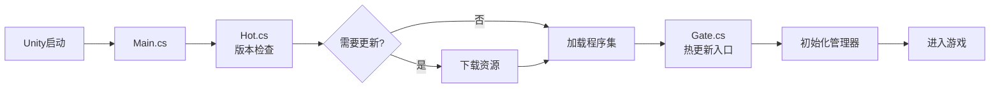

# LOA 客户端

LOA（Legend of Adventure）游戏客户端，基于 Unity 引擎开发，采用 HybridCLR 实现热更新功能。

## 技术栈

- **游戏引擎**：Unity 2021.3+
- **热更新方案**：HybridCLR
- **网络通信**：TCP Socket + Protobuf
- **UI框架**：Unity UGUI
- **资源管理**：AssetBundle + Addressable
- **本地化**：多语言JSON
- **第三方库**：DOTween、Newtonsoft.Json

## 架构特点

### 管理器协作架构

采用**管理器协作架构**，而非严格的垂直分层：

```
Unity引擎 + Framework程序集
  (Singleton, AssetManager, Http, Hot)
              ↓
      Basic层（游戏逻辑基础）
  (Gate, Flow, Monitor, Event)
              ↓
    ┌──────┬──────┬──────┬──────┐
    │ Data │ Net  │  UI  │Audio │  ← 平等的管理器
    └──────┴──────┴──────┴──────┘
           通过事件系统协作
```

**核心设计理念**：
- **数据驱动**：Data 是唯一数据源
- **事件驱动**：管理器通过事件系统通信
- **响应式**：管理器响应数据变化自动执行

详见：[管理器协作架构](Documents/Architecture/管理器协作架构.md)

### 热更新架构

采用 HybridCLR 实现 **0 强更**（无需重新下载整个应用）：

- **Assembly-CSharp**：Unity 启动引导（非热更新）
- **Framework**：基础设施（非热更新）
- **Game**：业务逻辑（可热更新）

详见：[热更新系统](Documents/System/热更新系统.md)

## 快速开始

### 环境要求

- **Unity 版本**：Unity 2021.3 LTS 或更高
- **操作系统**：Windows 10+ / macOS 12+ / Linux
- **开发工具**：Visual Studio 2022 / JetBrains Rider / VSCode
- **版本管理**：Git（由 SVN 迁移，见 [SVN-to-Git-Migration](Documents/SVN-to-Git-Migration.md)）

### 克隆项目

```bash
# 使用 Git 克隆
git clone [GIT_REPO_URL] LOA-Client-git
cd LOA-Client-git
```

### 打开项目

1. 启动 Unity Hub
2. 点击"添加项目"
3. 选择 `LOA-Client-git` 目录（即本仓库根目录）
4. 使用 Unity 2021.3+ 打开

### 首次运行

1. 配置服务器地址：
   - 编辑 `Assets/Basic/Config.asset`
   - 设置 `Gateway` 字段为测试服务器地址

2. 运行游戏：
   - 点击 Unity 编辑器的 Play 按钮
   - 等待资源加载
   - 进入游戏

详见：[开发环境搭建](Documents/开发环境搭建.md)

## 目录结构

```
LOA-Client-git/
├── Assets/                     # Unity 资源目录
│   ├── Basic/                  # Unity 主程序集
│   │   ├── Main.cs             # Unity 启动入口
│   │   └── Config.asset        # 配置文件
│   ├── Framework/              # Framework 程序集（基础设施）
│   │   ├── Singleton.cs        # MonoBehaviour 单例基类
│   │   ├── AssetManager.cs     # 资源管理
│   │   ├── Http.cs             # HTTP 请求
│   │   ├── Hot.cs              # 热更新管理
│   │   └── Localization.cs     # 本地化
│   ├── Game/                   # Game 程序集（可热更新）
│   │   ├── Scripts/
│   │   │   ├── Basic/          # 基础设施（Gate、Flow、Monitor）
│   │   │   ├── Data/           # 数据管理（Data、Config、Local）
│   │   │   ├── Network/        # 网络通信（Net、Protocol）
│   │   │   ├── UI/             # 表现层（界面、组件）
│   │   │   └── Utils/          # 工具类
│   │   ├── HotResources/       # 热更新资源
│   │   └── Res/                # 资源文件
│   ├── Resources/              # Unity Resources
│   ├── StreamingAssets/        # 流式资源
│   ├── Plugins/                # 第三方插件
│   └── Editor/                 # 编辑器工具
├── Documents/                  # 项目文档
│   ├── Architecture/           # 架构文档
│   ├── System/                 # 系统设计文档
│   └── Standard/               # 规范文档
├── ProjectSettings/            # Unity 项目设置
├── Packages/                   # Unity 包管理
└── README.md                   # 本文件
```

## 核心管理器

| 管理器 | 职责 | 文件位置 |
|--------|------|----------|
| **Data** | 数据存储和状态管理 | `Assets/Game/Scripts/Data/Data.cs` |
| **Net** | 网络通信和协议处理 | `Assets/Game/Scripts/Network/Net.cs` |
| **UI** | 界面显示和交互逻辑 | `Assets/Game/Scripts/UI/Core/UI.cs` |
| **Audio** | 音频播放和控制 | `Assets/Game/Scripts/Data/Audio.cs` |

详见：[数据管理系统](Documents/System/数据管理系统.md)、[网络通信系统](Documents/System/网络通信系统.md)、[UI系统](Documents/System/UI系统.md)

## 启动流程



详见：[启动流程详解](Documents/Architecture/启动流程详解.md)

## 文档导航

### 架构文档

- [管理器协作架构](Documents/Architecture/管理器协作架构.md) - 客户端架构模式说明
- [启动流程详解](Documents/Architecture/启动流程详解.md) - 从Unity启动到进入游戏的完整流程
- [事件通信机制](Documents/Architecture/事件通信机制.md) - Monitor、Event、Data监听三种通信机制

### 系统文档

- [热更新系统](Documents/System/热更新系统.md) - 版本检查、资源下载、程序集加载
- [数据管理系统](Documents/System/数据管理系统.md) - Data、Config、Local三大数据管理器
- [网络通信系统](Documents/System/网络通信系统.md) - TCP通信、协议定义、心跳保活
- [UI系统](Documents/System/UI系统.md) - 界面管理、生命周期、通用组件
- [本地化系统](Documents/System/本地化系统.md) - 多语言支持、语言检测

### 规范文档

- [Unity项目结构规范](Documents/Standard/Unity项目结构规范.md) - 程序集划分、目录组织、命名空间
- [资源命名与组织规范](Documents/Standard/资源命名与组织规范.md) - 资源命名、目录组织、Addressable规则
- [管理器开发规范](Documents/Standard/管理器开发规范.md) - 管理器定义、初始化、事件监听规范

### 开发指南

- [开发环境搭建](Documents/开发环境搭建.md) - 环境要求、项目导入、编辑器配置
- [构建与发布流程](Documents/构建与发布流程.md) - 构建流程、版本管理、热更新部署

### Cursor 规则

- `.cursor/rules/documents-structure.mdc` - 文档结构规范
- `.cursor/rules/system-doc-writing-rules.mdc` - 系统文档撰写规则
- `.cursor/rules/manager-architecture.mdc` - 管理器协作架构规则
- `.cursor/rules/game-layer-architecture.mdc` - Game 程序集分层规则
- `.cursor/rules/hotupdate-assemblies.mdc` - 热更新程序集架构规则
- `.cursor/rules/client-text-handling.mdc` - 客户端文本处理规则
- `.cursor/rules/client-ui-layout-mathematics.mdc` - UI 布局数学规则

## 构建命令

### 开发构建

```bash
# Unity 命令行构建
Unity -quit -batchmode -projectPath . -executeMethod BuildTools.BuildDevelopment
```

### 发布构建

```bash
# Unity 命令行构建
Unity -quit -batchmode -projectPath . -executeMethod BuildTools.BuildRelease
```

### 热更新资源构建

```bash
# 构建热更新 DLL 和资源
Unity -quit -batchmode -projectPath . -executeMethod BuildTools.BuildHotUpdate
```

详见：[构建与发布流程](Documents/构建与发布流程.md)

## 常见问题

### Q: 热更新失败怎么办？

A: 检查以下几点：
1. 网络连接是否正常
2. 服务器地址是否正确
3. 清除本地缓存重试：`PlayerPrefs.DeleteAll()`
4. 查看日志：`[Hot]` 标签

### Q: 如何跳过热更新直接进入游戏？

A: 在编辑器中运行时自动跳过热更新，直接加载本地 DLL。

### Q: 如何切换语言？

A: 
```csharp
Localization.Instance.ChangeLanguage("English");
```

### Q: 如何查看网络连接状态？

A:
```csharp
bool online = Data.Instance.Online;
Debug.Log($"[Net] Online: {online}");
```

## 贡献指南

### 代码规范

- 遵循 C# 编码规范
- 命名空间反映目录结构
- 使用事件系统解耦
- 避免在代码中使用中文（注释除外）

详见：[.cursor/rules/](/.cursor/rules/)

### 提交规范

- 提交前确保无编译错误
- 提交前确保热更新功能正常
- 提交信息使用中文，格式：`[分类] 简短描述`

### 文档维护

- 代码变更同步更新文档
- 新增系统补充系统文档
- 遵循文档撰写规则

详见：[.cursor/rules/system-doc-writing-rules.mdc](/.cursor/rules/system-doc-writing-rules.mdc)

## 相关链接

- **服务端项目**：`LOA-Server/trunk/`（若服务端已迁 Git 则对应仓库路径）
- **设计文档**：`Documents/`
- **技术支持**：[内部Wiki]

## 许可证

LOA 是私有项目，版权所有。
